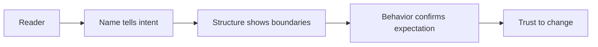

# Clean code

> **Learning Path:** Architect's Developer Foundation
> **Section:** 1.1.1 — 1. Programming mastery

**Clean Code**

### The problem

A working system is not the problem. A system that cannot be changed safely is.

When a codebase grows, the cost shifts from writing new code to reading, modifying, and reasoning about existing code. A feature takes weeks not because the idea is complex, but because developers spend time decoding intent, fearing side effects, and re-testing the same paths.

The constraint is human, not technical. Working memory holds ~7 items. Code is read 10x more than it is written. When names lie, functions do multiple things, and dependencies are hidden, every change requires rebuilding the whole model in your head.

The problem clean code solves is not style. It is expensive comprehension and risky change.

### Mental model

Code is a communication medium first, instruction set second. The compiler only needs syntactic correctness. The next engineer needs to understand intent quickly and safely change it.

Think of code as a story with a predictable structure:

If the name is honest, the structure is small, and behavior matches expectation, the reader can skim instead of trace. That is the whole point.

### How it works

Clean code reduces cognitive load through three forces.

**Names as contracts.** A name should make the reader's prediction correct. `calculateTax` is better than `calc`. `isEligibleForRefund` is better than `check1`. Bad names force reading implementation to understand purpose.

**Small, single-purpose units.** A function or class should do one thing, do it well, and be named after that thing. Small units are testable, replaceable, and composable. Large units hide multiple responsibilities and create coupling.

**Locality and clarity over cleverness.** Important decisions should be visible at the call site, not hidden behind indirection. Prefer explicit, boring code over clever abstractions. Comments explain why, not what. If you need a comment to explain what code does, rename it or restructure it.

These are not rules. They are ways to keep the cost of understanding constant as the system grows.

### Architectural reasoning

Clean code is not aesthetics. It is an architectural enabler.

When code is readable, architecture becomes discoverable. You can see bounded contexts, seams, and dependencies because they are not buried under incidental complexity. Refactoring is possible without rewrite. Teams can work in parallel with less merge conflict.

When it helps: long-lived systems, systems with multiple teams, systems where change is the norm. It helps most where the cost of a mistake is high - payments, compliance, AI pipelines where data transformations must be auditable.

Alternatives: extensive documentation, heavy process, code review gates. Documentation drifts. Process slows. Clean code makes the system self-documenting and reviewable.

Choose it when you optimize for change velocity and team scalability over short-term delivery speed.

### Trade-offs and failure modes

Clean code costs time up front. The trade-off is immediate speed vs future change cost. In a throwaway prototype, strict cleanliness is waste. In a core domain that will live for years, it is cheap insurance.

Failure modes architects see:

* **Over-abstraction.** Clean does not mean generic. Premature abstraction creates indirection that hides intent. A simple loop is cleaner than a framework.
* **Naming churn.** Renaming without understanding domain leads to technically clean but semantically wrong names.
* **Local cleanliness, global mess.** A module can be clean internally but still have tangled dependencies. Clean code needs clean boundaries.
* **Consistency tax.** Enforcing style across teams costs coordination. The value is real, but the cost must be managed.

### Example

Enterprise payment service. Two teams ship features. Original code had `process()` methods 300 lines long, names like `handle()` and `doWork()`, and shared mutable state.

Change to support a new tax rule required tracing 12 files and manual tests. After cleanup: `TaxCalculator.calculate(order)` and `RefundPolicy.isEligible(order)`. Each function <20 lines, inputs explicit, outputs explicit. New rule added in one isolated unit with one test.

The architecture did not change. The ability to change architecture safely did.

### Reasoning challenge

You inherit a working microservice with 40% test coverage, 800-line handlers, and comments everywhere explaining what the code does. Product wants a new feature in 2 weeks.

Do you first add the feature with minimal changes, or invest time cleaning the handler before touching it? What signals would make you choose one over the other?

### Key takeaway

* Clean code exists to reduce the cost of reading and changing, not to please a linter.
* Names, small units, and locality are the levers that keep comprehension cheap.
* Cleanliness enables architectural evolution; architecture without readable code is invisible.
* Trade speed now for safety later only when the system will live long enough to pay it back.
