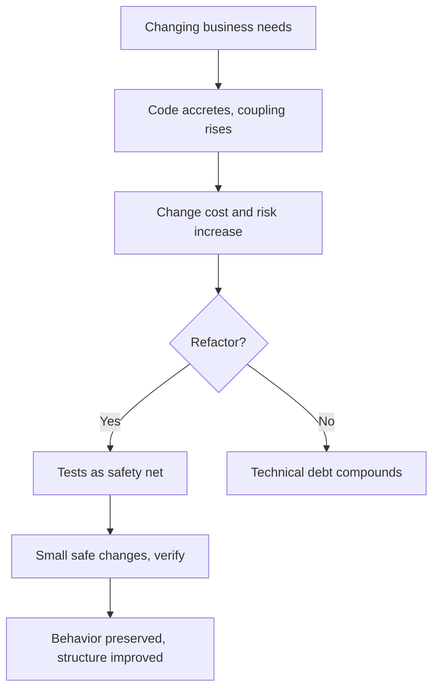

# Refactoring

> **Learning Path:** Architect's Developer Foundation
> **Section:** 1.1.11 — 1. Programming mastery

### The problem

Business needs change. Code doesn't get thrown away, it accretes.

New features are layered on top of old decisions. Duplication appears. Responsibilities blur. The same logic lives in three places. A small change requires touching five files and a prayer.

The constraint is not bad code. The constraint is **change cost**. When code is tangled, the cost and risk of change rises non-linearly. Velocity drops, defects rise, and the team starts avoiding the area entirely.

That is the problem refactoring solves.

### Mental model

Refactoring is deliberate structural improvement with **zero behavior change**.

It is not feature work. It is not rewriting. It is paying down technical debt while keeping the system running.

Think of it as moving load-bearing walls in a house while people are still living in it. You need scaffolding, small moves, and verification that nothing collapsed.

### How it works

The mechanism is small, safe, reversible steps protected by tests.

1. **Safety net first.** Tests capture current behavior. Without them you are guessing.
2. **Make the change.** One improvement at a time: extract method, rename, split class, introduce interface, move responsibility.
3. **Verify.** Tests pass, behavior is unchanged.
4. Repeat.

The architectural value is not the individual transformation. It is the ability to compound improvements without introducing risk.

### Architectural reasoning

Refactoring enables architectural decisions later. You cannot evolve a monolith into services, add observability, or introduce domain boundaries if the code is a tangled graph.

When it helps:
* Change is frequent in a bounded area and friction is high
* You need to isolate a capability for reuse, extraction, or replacement
* Tests exist or can be added cheaply

Alternatives:
* **Leave it.** Accept the debt if the area is stable and will be retired.
* **Rewrite.** High risk, high cost, usually loses implicit behavior. Only viable for small, well-understood scopes.

Refactoring is the choice when you need to keep the system alive while improving its shape. It preserves institutional knowledge encoded in working code.

### Trade-offs and failure modes

* **No tests = no refactor.** Refactoring without a safety net is gambling. The architect's job is to make tests a prerequisite.
* **Refactoring is not free.** It consumes capacity now for speed later. The trade-off is short-term velocity vs long-term change cost.
* **Big bang refactor fails.** Large, heroic refactors introduce bugs and stall features. Small steps beat grand plans.
* **Refactoring for purity.** Refactoring should serve a concrete architectural goal: reduce coupling, enable testability, prepare extraction. Aesthetics alone creates waste.
* **Stopping condition.** Refactor until the next change is easy, not until code is perfect.

### Example

Enterprise payment processing module. 8 years old. `processPayment()` is 400 lines. It validates, hits DB, calls fraud check, writes audit, sends email. New regulation requires async audit and a new fraud provider.

Without refactoring, the change touches the whole method, high risk, low confidence.

With refactoring:
* Tests added around current behavior.
* Extract `Validate`, `Charge`, `Audit`, `Notify`.
* Introduce `FraudProvider` interface. Existing provider stays.
* `Audit` becomes a queue write, not synchronous DB.

Behavior unchanged. The module now has seams. New provider can be plugged in, audit can be made async, and the change is contained.

### Reasoning challenge

You inherit a 200k LOC monolith. A critical path has no tests, high churn, and is business critical. A new compliance requirement needs a 2-week change in that path. Options: write characterization tests then refactor incrementally, or freeze the path and build a parallel service for new flows.

What do you choose, what constraints drive you, and what is the failure mode of the wrong choice?

### Key takeaway

* Refactoring exists to lower the cost and risk of future change, not to make code pretty.
* It is safe only with tests and small steps. Behavior preservation is non-negotiable.
* Use it to create seams for architecture evolution; avoid it where code is stable and will be retired.
* The biggest architectural risk is refactoring without a safety net or refactoring without a concrete purpose.
