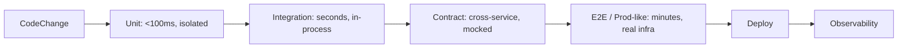

# Testing

> **Learning Path:** Architect's Developer Foundation
> **Section:** 1.1.12 — 1. Programming mastery

**Testing**

### The problem

Code changes constantly. The risk isn't that code is wrong today, it's that a change in service A silently breaks service B, a model degrades on real data, or a production deploy fails under load. You need confidence to change fast without breaking the business.

The constraints are conflicting: fast feedback is cheap but shallow, realistic feedback is expensive and slow. An architect must allocate testing budget to the highest-risk failure modes, not maximize coverage.

### Mental model

Think of tests as executable risk contracts, not a checklist.

A test answers: *Under this assumption, will the system preserve this invariant?* The value is not the green checkmark. It's the speed at which you learn about a violation and the cost of maintaining that signal over time.

For an AI Solution Architect this extends to non-determinism: you are not testing for exact output, you are testing for statistical properties, data contracts, and safety boundaries.

### How it works

Testing is a feedback funnel. Each layer trades isolation for realism and speed for fidelity.

* Unit: logic correctness, fast, cheap. No I/O.
* Integration: component wiring, DB, queues, in same process.
* Contract: producer/consumer schema and semantics. Critical in microservices.
* E2E: critical user journeys on a realistic environment.
* Production: real traffic, chaos, and model evaluation are the final tests.

For AI systems add evaluation layers: golden datasets, property-based tests, and drift monitors. You test data contracts, feature pipelines, and model invariants, not single outputs.

### Architectural reasoning

When does each layer help?

Choose unit when logic is complex and changes often. It gives immediate feedback to developers.

Choose integration when failure modes are at boundaries: serialization, DB transactions, idempotency.

Choose contract tests when teams are decoupled. A consumer-driven contract prevents silent breaking changes without full E2E.

Choose E2E sparingly for high-value paths. They are expensive to maintain and flaky.

Architectural decision: push risk left. If a risk can be caught with a cheap fast test, do not pay for an expensive slow test to catch it. Reserve expensive tests for risks that only emerge with real interactions.

### Trade-offs and failure modes

* Speed vs fidelity. Fast tests encourage frequent runs. Slow tests get skipped. A 40-minute suite is a dead suite.
* Isolation vs realism. Over-mocked tests give false confidence. Under-isolated tests are flaky.
* Coverage vs confidence. 100% line coverage does not mean correct behavior. Brittle tests create test debt and slow delivery.

Common failure modes architects see: flaky tests erode trust; tests that mirror implementation instead of behavior; test environments that diverge from prod; and for AI, evaluation sets that overfit to a snapshot and miss drift.

Cost is the real constraint. Every test has maintenance cost. The architect's job is to keep the signal-to-noise ratio high.

### Example

Payment service in an e-commerce platform.

Unit tests cover tax calculation and idempotency key handling. Integration tests verify Postgres transaction rollback and outbox pattern. Contract tests ensure the Order service and Payment service agree on `CreatePayment` schema and error codes. One E2E test exercises checkout → payment → confirmation on a staging cluster that mirrors prod networking.

When the team adds Apple Pay, the contract test fails immediately if the event shape changes. No need to run full E2E for every PR. E2E runs nightly on the critical path only. Model-based fraud scoring is evaluated against a frozen golden set and monitored for latency and distribution drift in production.

### Reasoning challenge

Your CI pipeline takes 55 minutes because E2E tests spin up the full Kubernetes stack for every PR. Developers merge with tests skipped. A recent incident was caused by a breaking change in a gRPC contract that unit tests couldn't catch.

What do you change first, and what do you measure to know it worked?

### Key takeaway

* Tests are risk allocation, not completeness. Invest where failure cost is highest.
* Fast feedback beats exhaustive coverage. If tests are slow, they won't run.
* Decoupling requires contracts. In distributed and AI systems, test interfaces and data, not just code.
* Maintain signal quality. Flaky or brittle tests are worse than no tests.

You should be able to reason: *What failure am I preventing, how fast do I need to know, and what's the cheapest test that gives me that signal?*
