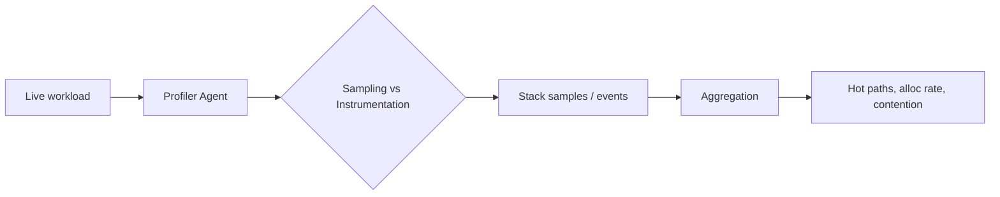

# Profiling

> **Learning Path:** Architect's Developer Foundation
> **Section:** 1.1.13 — 1. Programming mastery

**Profiling**

### 1. The problem

You have a service that is slow, expensive, or unstable. Logs tell you *what* happened. Metrics tell you *when* it happened. Neither tells you *why*.

Without measurement you optimize by guess. You add caching because "it must be DB". You increase replicas because "CPU is high". That works until it doesn't, and you pay for it in wasted capacity and regressions.

Profiling exists to turn performance from opinion into evidence. It answers: where is time and memory actually spent under real load?

### 2. Mental model

A profiler is an instrument panel, not a debugger.

A debugger stops the world to inspect state. A profiler observes the running system continuously and aggregates where resources go: CPU cycles, allocations, I/O wait, lock contention.

Think of it as a flight data recorder for code execution. You don't need every instruction, you need the distribution.

### 3. How it works

Two core mechanisms:

* **Sampling**: The runtime interrupts the process at regular intervals, e.g. every 10ms, and records the call stack. Over time you get a statistical heat map of where CPU is spent. Low overhead, production safe.
* **Instrumentation**: Instrument code or runtime to count entries/exits, allocations, etc. Precise but invasive. Changes behavior and adds overhead.

Modern profilers combine both: sampling for CPU, eBPF/alloc tracing for memory and I/O, and continuous collection with aggregation.

### 4. Architectural reasoning

Profiling enables decisions that cannot be made from dashboards alone.

* **When it helps:** Latency exists but CPU/memory look normal. You suspect lock contention, garbage collection pauses, or hot code paths. You are optimizing cost in cloud. You need to prove a change helped.
* **What it solves:** Locates the true bottleneck, not the assumed one. Distinguishes CPU bound vs I/O bound vs allocation bound.
* **Alternatives:** Logging with timers is coarse and manual. A/B testing is expensive and slow. Profiling gives causal signal faster.

Architecturally, treat profiling as observability tier 2. Metrics = what. Traces = where in request. Profiles = why it costs.

Choose sampling profilers for production continuous profiling, e.g. py-spy, async-profiler, pprof. Reserve instrumentation for dev deep dives.

### 5. Trade-offs and failure modes

* **Observer effect.** Instrumentation can slow code enough to hide the bug. Sampling is safer but statistically noisy.
* **Wrong environment.** Profiling in staging with synthetic load misses real data skew and traffic patterns. Profile where the problem occurs.
* **Averaging hides tails.** Mean CPU is fine, P99 latency is not. Need per-request profiling and flamegraphs correlated with load.
* **Actionability.** A profile shows a hot function. If it's third-party library code you can't change, you need architectural mitigation, not micro-optimization.
* **Data retention and cost.** Continuous profiling generates large data. You need sampling retention and aggregation, not raw dumps forever.

Failure mode: profiling one service in isolation while the bottleneck is downstream. Always profile the request path end to end.

### 6. Example

Payment API P99 latency spikes to 800ms at peak, CPU 45%, memory stable.

Metrics point to service but not why. Continuous CPU sampling shows 60% of samples in `json.Marshal` inside the response builder, and allocation rate spikes 3x during peak.

Deeper allocation profiling shows repeated allocation of large intermediate slices for the same response. Fix: reuse buffers and stream response.

Result: P99 drops to 180ms, and you avoid adding 40% more replicas.

Without profiling you would have scaled horizontally and increased cost.

### 7. Reasoning challenge

Your AI inference service shows intermittent 2s latency spikes. CPU is steady at 60%, GPU utilization is flat, memory is stable, traces show the spike inside the pre-processing step. Request volume is constant.

Do you reach for a CPU profiler, an allocation profiler, or an I/O / lock profiler first, and why? What production constraint would change your choice?

### 8. Key takeaway

* Profile from a hypothesis, not from curiosity. Start with a symptom: latency, cost, or instability.
* Sampling is the default for production; instrumentation is for targeted dev investigation.
* A hot path is an architectural signal. Sometimes the fix is code, sometimes it is data flow, caching, or batching.
* Correlate profiles with load and traces. Profiles without context create misleading optimizations.
