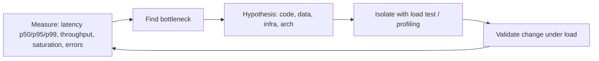

# Performance engineering

> **Learning Path:** Architect's Developer Foundation
> **Section:** 1.1.14 — 1. Programming mastery

### Performance Engineering

**The problem**
A system works fine with 10 users and fails with 10,000. Latency spikes, errors climb, costs explode. The code is correct, but the architecture is not sustainable under real load.

Performance engineering is not about making code fast. It is about understanding where a system saturates and deciding how to move the bottleneck.

**Mental model**
Performance is constraint management.

Every system has a bottleneck. The bottleneck is the resource that saturates first: CPU, memory, I/O, network, locks, database connections, queue length. Throughput is limited by the bottleneck, latency is amplified by it.

Think in terms of the four variables you can actually change:
* **Work**: how much work per request
* **Rate**: how many requests per second
* **Resources**: CPU, memory, I/O capacity
* **Architecture**: how work is distributed

You cannot improve all four at once. Performance engineering is choosing which to trade.

**How it works**
Measure first, then reason.

The loop is: observe golden signals → localize hot spot → form hypothesis → test under realistic load → verify.

Essential signals: latency distribution not average, throughput ceiling, CPU/memory/disk/network saturation, queue length and error rate. Tail latency matters more than mean.

**Architectural reasoning**
Performance engineering enables architectural decisions before they become incidents.

When it helps:
* You have a SLO for latency or throughput that is business critical
* Costs scale with compute and you need efficiency
* You are designing for burst traffic, not steady state

Decision tree an architect uses:
* **Can you reduce work per request?** Cache, precompute, batch, remove unnecessary joins. Cheapest win.
* **Can you move work?** Async processing, read replicas, CQRS, offload to edge.
* **Can you scale the bottleneck?** Horizontal scale for stateless services, vertical for memory-bound.
* **Must you redesign?** When contention is fundamental: lock convoy, N+1 queries, single writer DB.

You choose code optimization when the hot path is clear and measured. You choose architectural change when the constraint is systemic: data access pattern, synchronous coupling, or single point of contention.

**Trade-offs and failure modes**

* **Latency vs throughput.** Optimizing for low latency often reduces max throughput. Queues smooth bursts but add latency.
* **Cost vs performance.** Faster hardware, caching layers, and replicas cost money. Performance engineering is cost engineering.
* **Local vs global optimum.** Micro-optimizing a service hides a downstream bottleneck. The system bottleneck moves.
* **Premature optimization.** Optimizing without measurements wastes time and adds complexity.

Common failure modes:
* **Tail latency explosion.** p99 degrades due to GC pauses, lock contention, or slow downstream. Averages hide it.
* **Cascading failure.** One slow service backs up thread pools, causing resource exhaustion upstream.
* **Noisy neighbor / saturation.** Shared resources like DB connections or network bandwidth saturate unpredictably.
* **Amdahl's law.** Parallelizing 90% of work gives at most 10x speedup. The serial portion dominates.

**Example**
E-commerce checkout during a flash sale.

Measurements show p95 latency jumps from 200ms to 4s at 2k RPS. CPU is fine, DB CPU is 95%. Profiling shows each checkout does 17 sequential DB queries including an N+1 product lookup.

Options: add read replica, increase DB size, cache product catalog, batch queries.
Reasoning: product data is read-heavy and changes rarely. Cache at edge reduces work per request. Replica reduces read contention on primary. Both cheaper than vertical DB scale and address root cause, not symptom.

After caching catalog and batching lookups, p95 drops to 350ms at 5k RPS on same DB size.

**Reasoning challenge**
You have a real-time recommendation service with SLO p99 < 100ms. Under load, p99 is 350ms. CPU is 40%, memory 60%, network 30%. DB query time is stable at 20ms. Latency increases linearly with request rate.

Where do you look first, and what architectural options do you consider before adding more instances?

**Key takeaway**
* Performance is about system constraints, not micro-optimizations. Find the bottleneck first.
* Measure latency distribution, throughput, saturation and errors under realistic load. Never optimize from averages.
* Architectural changes beat code tweaks when the constraint is data access, coupling, or contention.
* Every performance gain trades cost, complexity, or consistency. Validate changes with load tests, not intuition.
