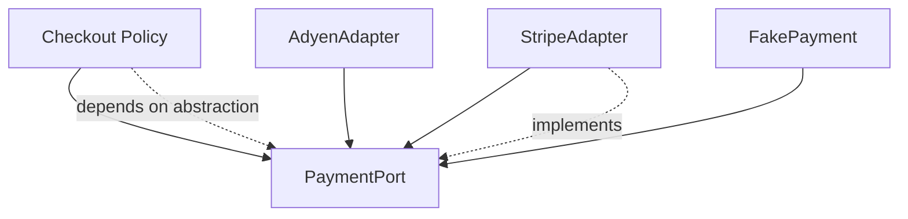

# SOLID

> **Learning Path:** Architect's Developer Foundation
> **Section:** 1.1.2 — 1. Programming mastery

**SOLID**

### 1. The problem

You ship a service. Six months later a new requirement arrives: add a payment provider, change a discount rule, add a new notification channel.

The change touches 5 classes. Tests break in unrelated modules. A teammate’s PR conflicts with yours. Deploy is risky.

The problem is not bad developers. It is **change coupling**. As a system grows, responsibilities pile up in the same units, behaviors leak across boundaries, and abstractions are reused in ways they were never designed for.

SOLID is a set of design contracts to make change cheaper and safer.

### 2. Mental model

Think of a codebase as a city plan.

SOLID says:
* One class = one reason to change. One neighborhood for one purpose.
* Extend behavior without editing existing streets.
* Subtypes must be drop-in replacements.
* Clients should not depend on capabilities they don’t use.
* High-level modules depend on abstractions, not concrete implementations.

It’s not about OOP purity. It’s about isolating the impact of change.

### 3. How it works

**Single Responsibility Principle**
One reason to change. A class owns one axis of variability.

Problem it solves: a change to logging breaks billing logic.

**Open/Closed Principle**
Open for extension, closed for modification.

Problem it solves: you add a new payment provider without editing the checkout core.

**Liskov Substitution Principle**
A subclass must be usable wherever the parent is expected.

Problem it solves: `PremiumUser extends User` should not throw new exceptions or require different preconditions, otherwise polymorphism breaks.

**Interface Segregation Principle**
No client forced to depend on methods it doesn’t use.

Problem it solves: a `Printer` interface with `print()` and `fax()` forces a simple printer to implement fax.

**Dependency Inversion Principle**
High-level policy depends on abstractions. Low-level details depend on the same abstractions.

Problem it solves: business logic is not welded to a specific DB, queue, or LLM client. You can swap implementations for testing, multi-region, or cost.

### 4. Architectural reasoning

When it helps:
* Long-lived services with frequent feature work
* Teams working in parallel on the same domain
* Systems that must evolve without big-bang rewrites
* Code that needs testability and safe rollout

Alternatives:
* Big ball of mud: fast initially, change cost grows exponentially.
* Strict microservices: isolates teams but adds operational overhead.

SOLID is the *inside-the-service* strategy that makes the service independently changeable. It complements microservices, not replaces them.

Decision rule: use SOLID when change is the primary risk. Skip ceremonial abstraction when the code is throwaway or stable forever.

### 5. Trade-offs and failure modes

* Over-modularization. Too many tiny interfaces create navigation tax and indirection.
* Interface explosion from Interface Segregation done literally. Prefer cohesive, role-based interfaces.
* Liskov violations are silent. A subclass that changes semantics breaks callers far away.
* Dependency Inversion can become abstraction for its own sake. If there is only one implementation and no test need, the abstraction adds cost.

Architectural smell: a PR that touches 3+ unrelated concerns. That’s a Single Responsibility violation.

### 6. Example

Payment processing in an e-commerce platform.

Before: `OrderService` creates Stripe client directly, applies discount, sends email, logs.

After SOLID:

* `OrderService` depends on `PaymentPort`, `PricingPolicy`, `NotificationPort`. Single Responsibility.
* New provider = new adapter implementing `PaymentPort`. Open/Closed.
* `PricingPolicy` is an interface with `StandardPricing` and `PromoPricing`. Clients depend only on the methods they need.
* Tests inject `FakePayment` without network calls. Dependency Inversion.

Result: a provider switch is a new class, not a diff in core checkout.

### 7. Reasoning challenge

You have a `LLMClient` interface with `chat()`, `embed()`, `fineTune()`.

Two services need it: `RAGService` only needs `embed()` and `chat()`. `ModelOpsService` needs all three.

Do you keep one fat interface or split it? What breaks if you don’t?

### 8. Key takeaway

* SOLID is about containing change, not about clean code aesthetics.
* One reason to change per unit reduces accidental coupling.
* Depend on abstractions so high-level policy is stable while implementations vary.
* Subtypes must be true substitutes or your polymorphism is a lie.
* Interfaces should be client-specific; don’t force unused capabilities.

You should be able to look at a module and answer: what changes would force this to change, and who else would break?
