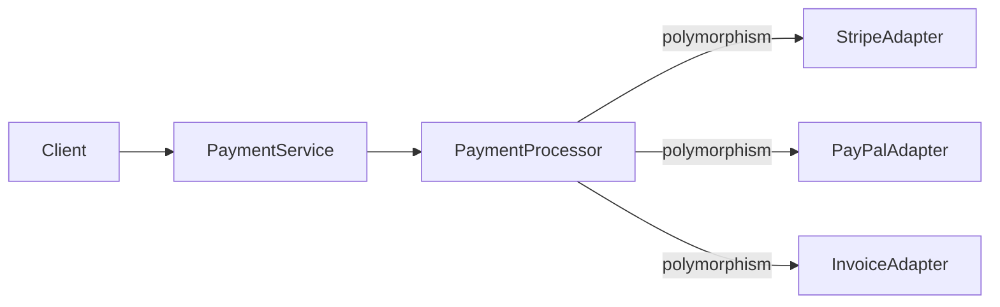

# OOP

> **Learning Path:** Architect's Developer Foundation
> **Section:** 1.1.3 — 1. Programming mastery

**OOP**

### 1. The problem

What happens when a system grows past a few thousand lines?

Procedural code spreads state across global structures and behavior across unrelated functions. A change to "what a payment is" touches validation, persistence, reporting, and API formatting in different places. Duplication appears. New developers cannot reason about the system locally.

Constraints for an architect: evolving domain, multiple teams, need for testability, and the cost of change. You need a way to localize state and behavior so changes are bounded.

OOP is one answer to that problem: group data with the operations that meaningfully act on it.

### 2. Mental model

Think of an object as a small bounded context with a public contract and private invariants.

An object owns state, enforces rules about that state, and exposes behavior. Other parts of the system interact through the contract, not by reaching into the internals.

Analogy: a bank account. You don't manipulate the ledger directly. You call `deposit`, `withdraw`, `getBalance`. The object guarantees balance never goes negative.

### 3. How it works

The mechanism is not syntax, it's four architectural levers:

* **Encapsulation:** Hide implementation behind an interface. This isolates change. You can refactor persistence or calculations without breaking callers.
* **Abstraction:** Expose only the relevant concept. A `Payment` hides card tokenization, retry logic, and provider details.
* **Polymorphism:** Same message, different behavior. Call `process()` on any payment provider and get correct execution.
* **Composition over inheritance:** Prefer assembling small objects rather than deep type hierarchies. Composition gives you flexible, testable reuse.

The service doesn't know the concrete type, only the contract.

### 4. Architectural reasoning

When it helps:
* Domain has entities with lifecycle and invariants, e.g., Order, Account, Reservation.
* You need extensibility points. New payment providers, notification channels, tax rules can be added without modifying core flow.
* Teams need clear ownership boundaries. An object maps well to a bounded context owned by one team.

Alternatives:
* Procedural / data-oriented: better for high-performance numeric pipelines where data locality matters.
* Functional: better for stateless transformations and immutable data flows.

Decision rule: Choose OOP when the problem is modeling a domain with stateful entities that evolve over time and need protected invariants. Choose FP/data-oriented when the problem is transformation of data with minimal shared mutable state.

OOP enables architectures like Domain-Driven Design, where the model mirrors business concepts, and makes testing easier because you can isolate an object and its collaborators.

### 5. Trade-offs and failure modes

* **Inheritance abuse:** Deep hierarchies create fragile base classes. A change high up breaks many leaves. Prefer composition.
* **Anemic domain model:** Objects become dumb data bags with services doing all work. You lose encapsulation and invariants leak.
* **Tight coupling via inheritance:** Subclasses are coupled to parent implementation details. Refactoring becomes risky.
* **Over-engineering:** Not every struct needs to be an object. Modeling everything as entities creates complexity tax.
* **Testability cost:** Objects with hidden state require careful design for deterministic tests.

Architecturally, OOP makes change cheaper inside a boundary but more expensive across boundaries if contracts are violated.

### 6. Example

Enterprise billing system. Requirements: support Stripe, PayPal, and invoice payments; apply different tax rules per region; retry failed payments.

With OOP: `PaymentProcessor` depends on `PaymentProvider` interface with `process(amount, metadata)`. Each provider implements its own retry and idempotency. `TaxCalculator` is composed into `Invoice`. Business rules like "invoice cannot be paid after void" live inside `Invoice`, not in a service.

New provider = new class implementing interface, no core changes. Tests target each object in isolation.

### 7. Reasoning challenge

You are designing a notification service that must deliver to Email, SMS, Push, and Slack. Delivery preferences per user, plus rate limits per channel, plus fallback logic.

Would you model this as an inheritance hierarchy `NotificationSender` with subclasses, or as a composition of `ChannelStrategy` objects selected at runtime? What breaks first when you need to add a channel that requires both SMS and Email in one message?

Don't answer immediately. Ask: where will state live, who enforces rate limits, and how painful is adding the next channel?

### 8. Key takeaway

* OOP exists to localize state and behavior so change is bounded and understandable.
* Encapsulation and composition are architectural tools for managing complexity and team boundaries, not just code style.
* Polymorphism buys extensibility; inheritance buys reuse but at coupling cost.
* Use OOP when domain entities have invariants and lifecycles; avoid it when you are just transforming data.

You should be able to reason: where are the invariants, what is the contract, and what happens to change cost when this object grows.
