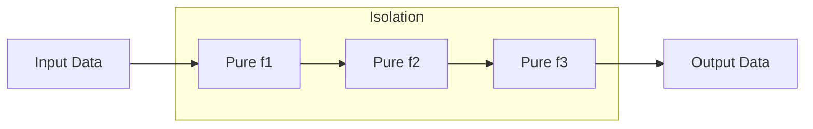

# Functional concepts

> **Learning Path:** Architect's Developer Foundation
> **Section:** 1.1.4 — 1. Programming mastery

**Functional concepts**

### 1. The problem

You have a large, long-lived system. State is mutated in place by many services, threads, and requests. The same input produces different outputs depending on when it runs. Bugs appear only under load, tests pass in isolation and fail in production, and reasoning about a request requires tracing every possible mutation path.

The root cause is shared mutable state. It creates coupling, temporal dependencies, and non-determinism. In distributed and AI systems this gets worse: pipelines replay events, models need reproducible features, and concurrent workers must not corrupt each other.

You need a way to make computation predictable and composable without locking the whole system.

### 2. Mental model

Think of computation as data flowing through transformations, not as steps that change a machine.

* Functions are values you can pass around
* Data is immutable; you create new versions instead of editing old ones
* A program is a pipeline of pure transformations

Analogy: a kitchen assembly line. You don't grab the same plate and keep adding ingredients. You take an input plate, produce an output plate, and hand it to the next station. Each station is inspectable and repeatable.

### 3. How it works

The core mechanism is purity.

A pure function:
* Same inputs → same outputs, always
* No side effects: no mutation, no I/O, no hidden state
* Referential transparency: you can replace the call with its result

Composition then becomes cheap. Small pure functions combine into larger ones with predictable behavior.

Side effects are isolated at the edges: read input, write output. The middle is a pure core.

### 4. Architectural reasoning

When it helps:
* **Concurrency and scale.** Immutable data needs no locks. Workers can process in parallel safely.
* **Reproducibility.** Same event replay → same result. Critical for event sourcing, feature stores, and model training.
* **Testability and reasoning.** Pure functions are trivial to unit test. No mocks for global state.
* **Composable pipelines.** Stream processing, ETL, and LLM/RAG pipelines are naturally chains of transformations.

Alternatives: imperative OOP with careful encapsulation, actor models, or transactional state. Those manage mutation explicitly. Functional concepts make the default safe instead of the exception.

Choose functional style when correctness, replayability, and parallel processing dominate over fine-grained memory control.

### 5. Trade-offs and failure modes

* **Performance cost.** Immutability creates new objects. In hot paths you pay allocation and GC. Use structural sharing and persistent data structures to mitigate.
* **Learning curve.** Teams accustomed to mutable state struggle with "create new vs modify".
* **Not a panacea.** I/O, databases, and clocks are inherently impure. You still need a boundary layer.
* **Over-abstraction.** Chaining many tiny functions can hurt readability if names and types are poor.

Failure mode: leaking mutation into the core. One shared mutable cache makes the whole pipeline non-deterministic again.

### 6. Example

Pricing service for an e-commerce platform.

Impure version mutates a `Cart` object while applying discounts, taxes, and promotions. Order of application changes the total and tests need full setup.

Functional version:
`cart -> applyDiscounts -> applyTax -> applyShipping -> total`

Each step is pure: `(cart, rules) -> newCart`. You can run the same cart through the pipeline in parallel for A/B tests, replay it for audit, and unit test each step with simple inputs/outputs.

In an AI system the same pattern appears in feature engineering: raw events → normalize → aggregate → vectorize. Pure transforms guarantee that retraining on the same raw data yields the same features.

### 7. Reasoning challenge

You are designing a user profile service with a hot read path and a write path that updates preferences. Reads must be low latency and eventually consistent. Writes come from multiple edge services.

Would you make the profile object mutable in memory with locks, or model updates as immutable events applied by pure reducers? What breaks if you choose the wrong model at 10x traffic?

### 8. Key takeaway

* Shared mutable state is the source of non-determinism; functional concepts eliminate it by default.
* Pure functions give you referential transparency, which enables safe parallelism, testing, and replay.
* Isolate side effects at system boundaries; keep the core transformation pure.
* Choose functional composition when reproducibility and composability outweigh allocation overhead.
