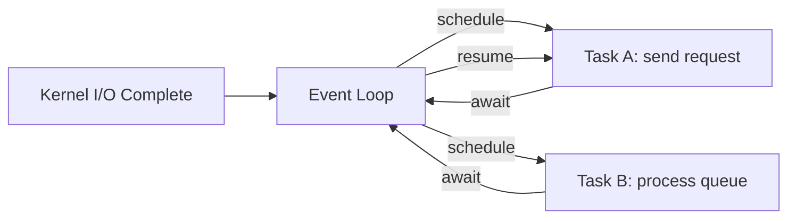

# Async programming

> **Learning Path:** Architect's Developer Foundation
> **Section:** 1.1.6 — 1. Programming mastery

### 1. The problem

What happens when a request needs to wait?

A thread-per-request server works until it doesn't. Each request blocks a thread while waiting for DB, HTTP, disk. Threads are cheap until they aren't: memory per thread ~MBs, context switches add up, and OS limits you to thousands, not millions.

The constraint is not CPU, it's **waiting**. You have many operations in flight, few doing useful work at any moment.

You need concurrency without paying for a thread per wait.

### 2. Mental model

Async programming is cooperative multitasking on one or a few threads.

Think of a single waiter in a restaurant. Instead of hiring a waiter per table and having them stand idle while food cooks, one waiter takes an order, hands it to the kitchen, moves to the next table, and comes back when the kitchen pings.

The waiter never blocks. Work is broken into `start -> wait -> resume`.

The event loop is the waiter. Tasks are coroutines that explicitly yield on I/O.

### 3. How it works

The essential mechanism is non-blocking I/O + explicit yielding.

1. Start an I/O operation in non-blocking mode.
2. Register a callback / promise / await point.
3. Yield control back to the loop.
4. Loop continues handling other ready tasks.
5. When I/O completes, the kernel notifies the loop, the task is resumed.

No preemption. You must not block the loop. A single `time.sleep()` or synchronous DB call stalls *everything*.

### 4. Architectural reasoning

Async helps when you are I/O bound with high fan-out and low CPU per request.

When it helps:
* Network services: API gateway, proxies, chat servers, webhook receivers
* Services that orchestrate multiple remote calls
* Readers/writers of queues, streams, and event buses

When it hurts:
* CPU-bound work. Async does not parallelize. You need threads/processes/GPUs.
* Codebases where blocking libraries dominate. You cannot `await` what isn't async.

Alternatives:
* Thread pool: simpler mental model, works with blocking code, costs memory and context switch.
* Process pool: true parallelism on multi-core, higher overhead.
* Async: max concurrency per core, minimal overhead, maximal complexity.

Choose async when the dominant cost is waiting and you control the I/O surface. Choose threads when you need to interoperate with blocking libraries or do CPU work.

### 5. Trade-offs and failure modes

* **One blocking call kills throughput.** Async is fragile by design. A single synchronous call blocks the whole loop. Architecturally you must audit all dependencies.
* **Complexity moves to control flow.** Errors propagate differently, stack traces are shallow, and reasoning about time becomes harder. Debugging requires understanding the event loop.
* **Starvation and ordering.** Long-running tasks or runaway coroutines can starve others. You need timeouts, backpressure, and careful scheduling.
* **Not parallelism.** Async scales connections, not CPU. CPU work must be offloaded to thread/process pools.

Failure mode to remember: mixing sync and async. Wrapping a blocking client in `run_in_executor` works but hides cost and can exhaust the executor pool under load.

### 6. Example

Enterprise API gateway handling 12k concurrent SSE connections to a trading feed.

Thread-per-connection would need 12k threads ~ 12GB RAM + context switch storms.

With async: one event loop per core handles all connections. On message arrival, `await` is hit, task yields. When the downstream market data service responds, the task resumes to push the event.

DB writes are offloaded to a small thread pool. CPU parsing is batched and offloaded.

Result: ~50MB per core, predictable latency under load, and the ability to add backpressure by shedding slow consumers.

If the gateway needed to run a Monte Carlo pricing model per request, async would be the wrong choice. That work is CPU-bound → process pool.

### 7. Reasoning challenge

You are designing a notification service. It needs to:
* Pull 500k messages/day from Kafka
* For each message, call 3 external REST APIs sequentially, then write to Postgres
* Latency SLA is 2s p95

Do you build the consumer async, threaded, or hybrid? What fails first if you pick purely async, and what do you need to guarantee?

### 8. Key takeaway

* Async solves waiting, not work. It increases concurrency per thread by yielding on I/O.
* The event loop is a single point of failure: never block it.
* Choose async for I/O-bound fan-out with controlled dependencies; offload CPU and legacy blocking code.
* Architectural cost is operability: debugging, timeouts, backpressure, and strict isolation of sync code become first-class design concerns.
