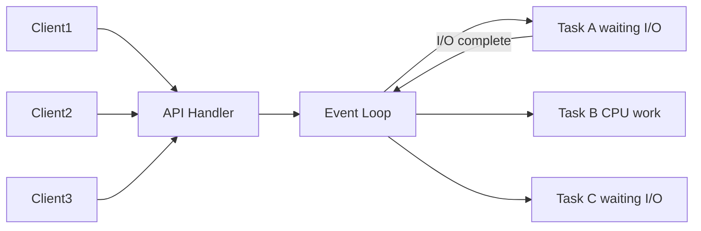

# Concurrency

> **Learning Path:** Architect's Developer Foundation
> **Section:** 1.1.7 — 1. Programming mastery

### The problem

A single execution path can only do one thing at a time. In real systems you have many things happening at once: requests arrive concurrently, I/O completes at unpredictable times, and the CPU sits idle while waiting.

The constraint is not the CPU alone. It is **latency hiding** and **resource utilization**. If one request blocks on a database or network call, the whole thread is wasted for tens of milliseconds. At scale that waste becomes throughput collapse.

You need a way to make progress on work B while work A is waiting.

### Mental model

Concurrency is overlapping work, not necessarily simultaneous work.

Think of a single chef with many orders. He cannot cook two dishes at exactly the same moment, but he can start one, start simmering while chopping for the next, and resume when the timer rings. The interleaving creates the illusion of parallelism.

In software the unit of interleaving is a task. The system schedules tasks onto threads or onto an event loop. Parallelism is the subset where you actually use multiple cores at once.

### How it works

Two broad families dominate architecture:

**Shared-memory concurrency** — threads/processes with preemptive scheduling. The OS switches tasks. Fast for CPU-bound work, dangerous for shared state.

**Cooperative/event-driven concurrency** — one thread, many tasks via async/await and a non-blocking I/O loop. Tasks explicitly yield on I/O. No preemption, no locks needed for the runtime, but you must never block the loop.

The essential mechanism is the same: a scheduler, a way to yield, and a way to resume.

With threads you get parallelism for free on multi-core. With async you get massive concurrency with minimal overhead, at the cost of never blocking.

### Architectural reasoning

When it helps:
* **I/O bound services**: APIs, web servers, ingestion pipelines, chat backends. Thousands of connections, most time spent waiting.
* **Throughput under latency variance**: Overlapping slow calls hides tail latency.
* **AI systems**: concurrent request fan-out, streaming token generation while waiting for vector search.

Alternatives:
* **Single threaded sequential**: simpler, correct by default. Works when request rate is low and latency is uniform.
* **Process per request**: isolation, no shared state. Expensive to spawn, wasteful for I/O bound work.
* **Batch / queue**: move concurrency to workers. Good for durability and backpressure, adds latency.

Choose threads/processes when you need true parallelism for CPU-bound work, e.g., inference, feature extraction, image transforms. Choose async/event-driven when the bottleneck is I/O and you need high concurrency per core.

### Trade-offs and failure modes

* **Complexity vs throughput.** Concurrency buys throughput at the cost of reasoning. Shared mutable state creates race conditions, deadlocks, and visibility bugs that only appear under load.
* **Coordinaton cost.** Locks, atomics, channels, and message passing add latency and cognitive overhead. Async code forces you to keep the hot path non-blocking.
* **Debugging and observability.** Stack traces lie, timing is non-deterministic. You need structured logging with request IDs and proper metrics for contention.
* **Resource limits.** Unbounded concurrency exhausts memory, file descriptors, and thread pools. Always bound concurrency with semaphores / pools and apply backpressure.

Common failures: blocking a thread in an async runtime kills all concurrency; lock ordering causing deadlocks; thundering herd on a cache miss; starvation of low-priority tasks.

### Example

Payment authorization service.

API receives 10k RPS. Each request needs: validate token, call fraud check, query ledger, publish event.

With a thread-per-request model you would need ~10k threads to keep up during a burst. Memory and context switch overhead explode.

Architectural decision: async event loop for the API layer, bounded worker pool for CPU-bound fraud scoring.

The API handler is non-blocking I/O only. Fraud scoring is dispatched to a fixed pool of processes to use all cores. The event is published via a queue so the response path never waits for downstream.

Throughput scales with cores + I/O concurrency, and the system degrades gracefully under load via queue length and timeouts.

### Reasoning challenge

You are designing an AI assistant backend. One endpoint streams text completions. Each request does: 1) vector search, 2) call LLM inference, 3) stream tokens back.

Vector search is I/O bound. LLM inference is CPU/GPU bound and blocks for 50-200ms per token.

Do you put the whole request on an async loop, move inference to a thread pool, or run inference in separate services? What happens to latency and tail latency if inference is CPU-bound and you allow unbounded concurrency?

### Key takeaway

* Concurrency exists to hide latency, not to make a single core faster. Parallelism uses cores; concurrency overlaps waiting.
* Choose model by workload: async/event-driven for I/O bound, threads/processes for CPU bound. Mixing both is common.
* Shared state is the cost. Prefer message passing, immutable data, and bounded concurrency to keep systems predictable.
* Architect for failure: bound pools, backpressure, timeouts, and observability from day one.
