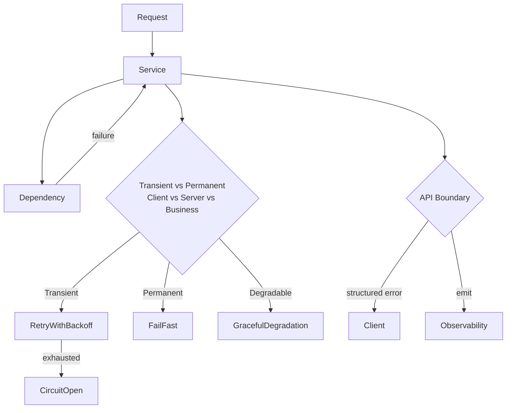

# Error handling

> **Learning Path:** Architect's Developer Foundation
> **Section:** 1.1.8 — 1. Programming mastery

**Error handling**

### 1. The problem

In a single process an exception is annoying. In a distributed system an error is normal.

Services call services, networks partition, disks fill, third-party APIs throttle. If every failure is treated as exceptional, the system either crashes constantly or hides failures until they become outages.

The real problem is not the error itself, it is **what the system does next** with an error that crosses a boundary. You need a consistent decision about visibility, recovery, and impact containment.

### 2. Mental model

Think of errors as data, not control flow.

An error is a signal about a contract violation: *I expected X, I got Y*. The architecture must decide:

* Is this my responsibility to fix, or to report?
* Is this transient or permanent?
* Who needs to know, and how quickly?

Errors propagate. Handling at the wrong layer either masks a systemic problem or creates a cascade.

### 3. How it works

Essentially: capture → classify → decide → respond → observe.

Capture at the boundary, classify by recoverability, respond with a policy, and always emit an observable signal.

Classification is the key:
* **Transient**: network timeout, 429 rate limit, temporary overload. May succeed later.
* **Permanent**: invalid input, not found, business rule violation. Retry is waste.
* **Business vs System**: a declined payment is a valid business outcome, not a bug.

### 4. Architectural reasoning

Handle errors at the boundary of a component, not deep inside it.

Inside a service you can use precise errors for control flow. At the service boundary you translate to a stable contract: status code, error code, retryability hint, and a correlation id.

When it helps:
* **Reliability**: retries with jitter + circuit breaker prevent retry storms.
* **Availability**: graceful degradation keeps core flows alive when non-critical dependencies fail.
* **Observability**: structured errors with error codes allow alerting on symptoms, not strings.

Alternatives:
* Fail-fast everywhere gives correctness but low availability.
* Swallow errors gives availability but hides systemic decay.

Decision rule: **propagate up if the caller can do something meaningful; absorb locally if you can provide a safe default and you can observe the degradation.**

### 5. Trade-offs and failure modes

* **Retry vs amplification.** Retries help transient failures, but without backoff and idempotency they create cascading overload. Use idempotency keys for non-safe operations.
* **Masking vs noise.** Too broad catch blocks hide bugs. Too granular error propagation leaks internal details to clients.
* **Latency vs correctness.** Waiting for a timeout increases tail latency. Short timeouts improve responsiveness but increase false failures.
* **Error budget.** Every error handling policy consumes resources. Aggressive retries cost compute and latency. Circuit breakers improve stability but introduce temporary unavailability.

Failure mode to remember: *error handling code fails*. Timeouts not configured, circuits never close, logs without context, retries without jitter. Test your failure paths as first-class.

### 6. Example

Payment service calling fraud check and ledger.

Fraud API returns 429. Classification: transient, external, idempotent read.

Policy: retry with exponential backoff + jitter, max 3 attempts, then degrade: approve with higher risk flag and emit metric `fraud_check_degraded`. Do not fail the payment.

If ledger returns 400 invalid account: permanent client error. Fail fast, return 400 with error code `INVALID_ACCOUNT` to caller. No retry.

Both errors are logged with correlation id, error code, and retry decision. Alerts fire only on rate of `fraud_check_degraded`, not on individual 429s.

### 7. Reasoning challenge

Your AI inference service calls a vector DB and an LLM provider. The LLM provider is returning 503s for 10% of requests during peak. You have a 2-second SLA for the endpoint.

Do you retry, fail fast, or degrade? What information do you need before deciding, and what do you expose to the client?

### 8. Key takeaway

* Errors are architectural signals. Design the policy, not just the catch block.
* Classify first: transient vs permanent, business vs system. The class dictates the response.
* Handle at boundaries, translate to stable contracts, and always make errors observable.
* Prefer explicit degradation over silent success, and prove your failure paths work.
