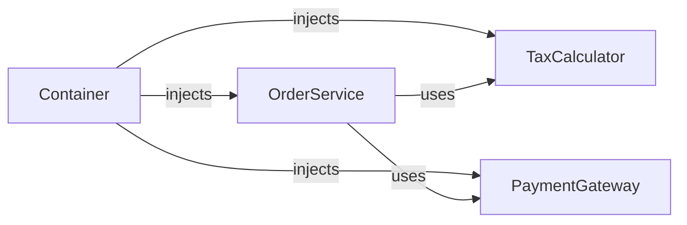

# Dependency injection

> **Learning Path:** Architect's Developer Foundation
> **Section:** 1.1.9 — 1. Programming mastery

## The problem

A class that creates its own dependencies is hard to change, test, and reason about.

When `OrderService` does `new TaxCalculator()` and `new PaymentGateway()` inside its constructor, you cannot:
- swap the implementation for a test double without modifying the class
- change the lifetime of the dependency, e.g. make it a singleton
- see the real requirements of the service by looking at its signature

The constraint is not the code. It is **control of instantiation**. The class controls its collaborators, so the class controls its own testability and variability.

## Mental model

Dependency injection is inversion of control for object creation.

Instead of a component pulling its dependencies, dependencies are pushed in from the outside. The component declares *what it needs*, not *how to build it*.

Think of an electrical appliance: it has terminals for power and data. You don't build the power plant inside the appliance, you plug it in. The wiring is done by the installer, not the appliance.

## How it works

The essential mechanism is three parts:

* **Declaration:** The component declares dependencies via constructor or interface parameters.
* **Composition:** A composer, often a container, is responsible for creating objects and wiring them.
* **Injection:** The composer supplies ready instances at construction time.



The service no longer knows how `TaxCalculator` is built. It only knows the contract it must satisfy.

Constructor injection is the default for architects: dependencies are immutable, required, and visible in the signature.

## Architectural reasoning

Use DI when variability and lifecycle matter more than brevity.

It helps when:
* You need testability. Inject a fake `PaymentGateway` in tests, real one in production.
* You need to swap implementations by environment. `EmbeddingProvider` = OpenAI in prod, local mock in dev.
* You have cross-cutting concerns with lifetimes. A DB connection pool is singleton, a request-scoped `UserContext` is transient.

Alternatives:
* **Static factories / Service Locator:** hides dependencies, makes tests harder, creates hidden coupling.
* **Manual new:** fine for leaf objects with no variability. Becomes unmanageable as graph grows.

The decision is about who owns the object graph. With DI, the application owns composition at startup, components own behavior at runtime.

## Trade-offs and failure modes

* **Indirection cost.** Wiring is moved to configuration. You gain flexibility but lose locality. A misconfigured container can fail at startup with opaque errors.
* **Lifetime mismatches.** Injecting a transient service into a singleton captures state incorrectly. This is a classic bug in web apps and AI pipelines where a long-lived orchestrator holds a short-lived client.
* **Over-injection.** Injecting everything makes components anemic. If a class has 8 constructor parameters, the design is likely wrong; it has too many responsibilities.
* **Circular dependencies.** A depends on B depends on A. DI containers can detect this, but it signals a design flaw.

## Example

AI pricing service in an enterprise order system.

`PricingService` needs `TaxCalculator`, `DiscountEngine`, `CurrencyConverter`, and `FeatureFlagService`.

Without DI, the service creates each, and you cannot test pricing without real tax APIs.

With DI:

```python
class PricingService:
    def __init__(self, tax: TaxCalculator, discount: DiscountEngine, fx: CurrencyConverter, flags: FeatureFlagService):
        self.tax, self.discount, self.fx, self.flags = tax, discount, fx, flags

    def price(self, order): ...
```

Composition root wires production implementations. Tests inject fakes. When the company expands to EU, you swap `TaxCalculator` implementation without touching `PricingService`. When you A/B test a new discount algorithm, you swap `DiscountEngine` via config.

## Reasoning challenge

You are designing an AI agent orchestrator that calls a `ModelClient`, a `RetrievalStore`, and a `ToolExecutor`. The orchestrator is long-lived as a singleton. The `ModelClient` holds a request-scoped API key from the current user.

Do you inject `ModelClient` directly into the singleton orchestrator, or inject a factory/provider for it? What breaks if you choose wrong?

## Key takeaway

* DI exists to separate *what a component needs* from *how to build it*.
* It makes systems testable, configurable, and evolvable at the cost of indirection and lifecycle discipline.
* Constructor injection makes dependencies explicit and immutable; prefer it over field or service locator injection.
* The real risk is not the pattern, it is mismatched lifetimes and hidden object graphs that become hard to operate.
