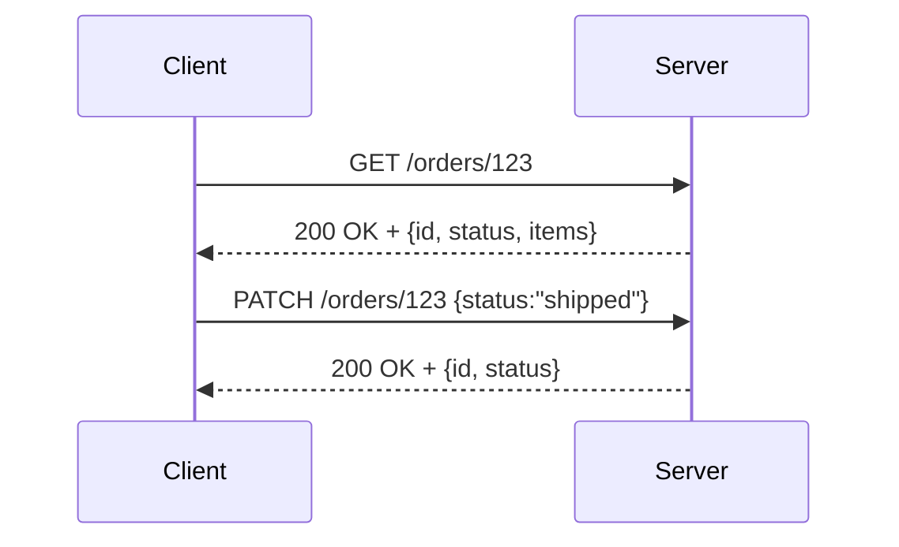

# REST

> **Learning Path:** Architect's Developer Foundation
> **Section:** 1.2.1 — 2. API engineering

**The problem**

You need an API that many independent clients can call reliably for years, across teams, languages, and network conditions. Early web APIs tried RPC over HTTP: custom verbs like `POST /api/execute` with a body `{action:"createOrder"}`. That couples clients to a specific operation set, forces a shared understanding of session state, and makes caching, load balancing, and evolution brittle.

Constraints created by the web itself:
* HTTP is stateless, cacheable, and has a uniform interface
* Clients and servers are decoupled by the network
* You want independent evolution of client and server without coordinated releases

**Mental model**

REST is not a framework. It is a constraint set for using HTTP as an application protocol.

Think resources, not remote procedures. A resource is a named thing with a lifecycle: `orders/123`, `users/me`, `inventory/sku-42`. You identify it with a URI, you interact with it using standard verbs, and you exchange representations.

The mental shift: stop asking "what can I do?" and start asking "what is the resource and what state transition am I requesting?"

**How it works**

The essential mechanism is a uniform interface on top of HTTP:

* **Resources as nouns.** `GET /orders/123` addresses one resource.
* **Verbs are standardized.** GET retrieves a representation, POST creates a sub-resource, PUT/PATCH updates, DELETE removes. No custom verbs.
* **Stateless.** Every request contains all information needed to process it. Server does not keep client session.
* **Representation independent.** Server chooses format, e.g., JSON, via Content-Type. Client does not need internal model.
* **Self-descriptive messages.** HTTP status codes and headers convey result. Hypermedia is ideal but rarely fully implemented.

No session, no custom RPC envelope. The network can cache GET responses, proxies can route by method, and any HTTP client works.

**Architectural reasoning**

REST helps when you need evolvable, distributed, web-scale APIs.

* Public APIs and partner integration: uniform HTTP means any client can call it.
* Scalability and caching: GET is cacheable by default. Stateless servers scale horizontally.
* Loose coupling: clients depend on resource identifiers and media types, not internal operations.
* Operability: standard verbs, status codes, and observability fit existing web infrastructure.

Alternatives: RPC/gRPC gives stronger contracts and efficient binary transport for internal services. Event-driven or GraphQL solves specific problems: fine-grained data fetching and real-time streams.

Choose REST when interoperability, caching, and long-lived evolution outweigh the need for strict schemas and low latency.

**Trade-offs and failure modes**

The most important trade-offs architects remember:

* **Uniformity vs expressiveness.** Standard verbs are simple but awkward for complex workflows. Teams often create RPC-in-REST clothing: `POST /orders/123/ship` or `POST /orders/action`.
* **Statelessness costs.** No server-side session means you repeat auth on every request and you cannot optimize with server memory. You pay with tokens and revalidation.
* **Over/under fetching.** Resources return whole representations. Clients either fetch too much or make chatty requests. This drives the later move to GraphQL.
* **No transactions.** REST is resource-oriented, not process-oriented. Multi-step sagas require orchestration outside the model.

Failure modes in practice: breaking changes via undocumented fields, ignoring idempotency of PUT/PATCH, using GET with side effects, and treating status codes as cosmetic.

**Example**

Enterprise order system exposed to web storefront, mobile app, and 3rd-party marketplace.

Design:
* `GET /orders?customerId=42&status=open`
* `GET /orders/123`
* `POST /orders` with `{customerId, items}`
* `PATCH /orders/123` with `{status}`

Each service is stateless, behind a CDN for GETs, and can evolve representations independently. The mobile app can cache order list for 60s via `Cache-Control`. A new field `estimatedDelivery` can be added without breaking old clients.

If the business later needs real-time shipment updates, you don't retrofit REST; you add an event stream alongside it.

**Reasoning challenge**

You are designing an internal microservice for payments that must process 10k TPS, enforce strict schema contracts, and be called only by services in your cluster. Would you choose REST over gRPC? What changes if the same API must also be exposed to external fintech partners?

**Key takeaway**

* REST is an architectural style for mapping application semantics to HTTP, not an API spec.
* It buys you decoupling, cacheability, and evolvability at the cost of expressiveness and chatty data transfer.
* Use it for public, web-facing, long-lived APIs; prefer RPC/GraphQL/events for internal high-performance or fine-grained needs.
* The biggest risk is not REST itself, but inconsistent application of its constraints leading to fragile, RPC-like APIs.
