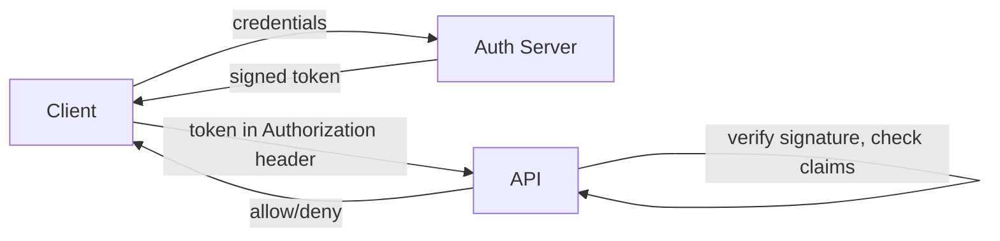

# Authentication

> **Learning Path:** Architect's Developer Foundation
> **Section:** 1.2.10 — 2. API engineering

### 1. The problem

You are building APIs that will be called by browsers, mobile apps, internal services, and third parties. HTTP is stateless. Without a mechanism to prove who is calling, you cannot enforce access control, audit actions, rate limit per tenant, or bill correctly. 

The problem is not "add a login". The problem is: **how do you establish identity for every request in a distributed, stateless system without creating a central bottleneck or trusting the client.**

### 2. Mental model

Authentication = proving *who you are*. Authorization = proving *what you are allowed to do*.

Think of it as a border crossing:
* Authentication is the passport check.
* Authorization is the visa check.

The passport must be verifiable without calling the issuing country on every request, and it must be revocable when compromised.

### 3. How it works

Modern API auth is a claim-based handshake.

1. Client authenticates once with an Auth Server.
2. Auth Server issues a cryptographically signed token containing claims: `sub`, `exp`, `aud`, `scope`.
3. API verifies signature with public key, checks expiry/audience, and trusts the claims. No DB lookup per request.

This is JWT bearer token auth. OAuth2/OIDC is the protocol that standardizes how tokens are issued, exchanged, and delegated.

### 4. Architectural reasoning

**When it helps:** Stateless APIs at scale, multiple client types, service-to-service calls.

**Options:**
* **Server sessions + cookies:** Server holds state. Simple revocation, but does not scale horizontally well and breaks for mobile/native and cross-domain APIs.
* **API keys:** Static secret per client. Fine for server-to-server with low risk, terrible for users, no expiration, hard to rotate.
* **Signed tokens:** Stateless verification, horizontally scalable, works across domains. Revocation is the hard part.
* **mTLS:** Strong machine identity for service mesh. Heavy operational cost.

**Decision rule:** 
* First-party apps → Authorization Code + PKCE with short-lived access token + refresh token.
* Third-party access → OAuth2/OIDC with scopes and client credentials.
* Internal services → mTLS or signed service tokens.

### 5. Trade-offs and failure modes

* **Stateless vs revocable.** Signed tokens cannot be individually revoked without a revocation list, which reintroduces state. Mitigation: short TTL access tokens ~5-15 min + refresh rotation.
* **Security vs latency.** Verifying signature locally is fast. Calling an introspection endpoint is secure for revocation but adds latency and coupling.
* **Scope creep.** Putting too much in the token bloats size and leaks data. Keep token minimal; fetch permissions on first use and cache.
* **Clock skew and key rotation.** Signature verification fails if clocks drift. Key rotation must be zero-downtime with overlapping keys.
* **Token theft.** Bearer tokens are stolen by XSS or logs. Use HttpOnly cookies for browsers, and never store tokens in URL.

### 6. Example

SaaS platform with web app, mobile app, and partner integrations.

* Web app uses Authorization Code + PKCE, access token in memory, refresh token in HttpOnly cookie. API verifies JWT signed by Auth Server.
* Mobile uses same flow, refresh token stored in secure storage.
* Partners use Client Credentials grant, get scoped JWT for `billing:read`. API validates `aud` = `api.saas.com` and `scope`.

Auth Server is isolated. All APIs are stateless and can be scaled independently. Audit logs use `sub` from token.

### 7. Reasoning challenge

You are designing an AI agent platform where internal agents call each other thousands of times per second. Do you use short-lived JWTs for every inter-service call, or mTLS with long-lived certificates? What breaks if a service is compromised?

### 8. Key takeaway

* Authentication is a trust boundary problem, not a login form problem.
* Stateless signed tokens enable horizontal scale; revocation requires short TTLs and refresh rotation.
* Choose the mechanism by client type and trust level: cookies for browsers, OAuth2/OIDC for users and third parties, mTLS for service mesh.
* Keep tokens small, signed not encrypted, and verify locally. Authorization data belongs in policy, not just in the token.
