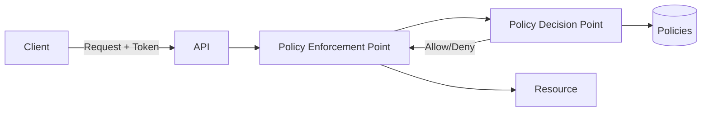

# Authorization

> **Learning Path:** Architect's Developer Foundation
> **Section:** 1.2.11 — 2. API engineering

**Authorization**

### 1. The problem

Authentication answers *who are you?* Authorization answers *what are you allowed to do here?*

The problem appears when an API is no longer used by one trusted client. You have:
- The same endpoint serving different users, tenants, and roles
- Resources that must be accessible only in specific contexts
- Policies that change faster than code deploys

Hard-coding `if user.role == 'admin'` across services creates drift, inconsistency, and security holes. You need a way to enforce access decisions consistently without coupling business logic to permission logic.

### 2. Mental model

Authorization is a gatekeeper decision: **Principal + Action + Resource + Context → Allow/Deny**.

Think of it as a bouncer with a list, not an ID checker. Authentication gives you the ID. Authorization checks the list against the door, the time, and the guest.

### 3. How it works

The essential mechanism is separation of enforcement from decision.

* PEP: The enforcement point in the API/service. It extracts identity from the token, identifies the resource and action, and asks for a decision.
* PDP: Evaluates policy. It is stateless and fast.
* Policy Store: Where policies live. Can be RBAC roles, ABAC attributes, or ReBAC relations.

The token carries *claims* about the principal. The PDP never trusts the client, only the verified claims + the policy.

### 4. Architectural reasoning

Centralized policy evaluation solves consistency and change velocity.

When it helps:
* Multiple services share the same permission model
* Permissions are fine-grained and dynamic: `user can edit document if owner or team member and document not locked`
* Audit and compliance require a single source of truth for decisions

Options:
* **In-process checks**: Fast, but duplicated and hard to audit. Good for a single service with stable rules.
* **Sidecar / API Gateway enforcement**: Central PEP, shared PDP. Good for platform-wide consistency.
* **Distributed PDP per service**: Lower latency, higher operational complexity.

Decision driver: If policy changes > code changes, centralize. If latency is critical and policy is simple, push down.

### 5. Trade-offs and failure modes

* **Latency vs consistency.** Every call to a remote PDP adds RTT. Caching decisions helps but risks stale deny/allow. Most architectures cache short-lived, signed decision tokens.
* **Centralization vs blast radius.** A centralized PDP is a critical path. Failure = deny-all or allow-all if misconfigured. Need health checks, fallback, and circuit breakers.
* **Expressiveness vs complexity.** RBAC is simple: `role → permissions`. ABAC is expressive: `attributes → conditions`. More expressiveness = harder to reason about, harder to audit.
* **Policy drift.** Policies diverge from business intent. Without versioning, testing, and audit logs, you get silent privilege escalation.

Common failure modes:
* Confused deputy: Service A calls Service B with its own token, B trusts it without verifying original principal.
* Missing context: Decision made without tenant, time, or resource state.
* Token over-privilege: Long-lived tokens with broad scopes.

### 6. Example

Enterprise SaaS billing API, multi-tenant.

Request: `POST /accounts/{accountId}/invoices`

PEP extracts JWT: `sub=user123, tenant=acme, roles=[billing_viewer]`
Resource: `accountId=acme-456`
Action: `create`

PDP evaluates ABAC policy:
`allow if tenant matches token.tenant AND role in [billing_admin] AND account.status == active`

Decision: Deny. `billing_viewer` cannot create. The service never implements that logic itself; it only asks PDP.

Policy change to allow viewers to create for trial accounts is a policy update, no deploy.

### 7. Reasoning challenge

You have a microservices platform with 50 services. Product wants per-field permissions: users can see `salary` only if they are manager of that employee *and* request is within business hours.

Do you embed checks in each service, add a sidecar PDP call per request, or push a policy engine into each service with replicated policy? What is the key constraint you would validate first?

### 8. Key takeaway

* Authorization is about policy enforcement, not identity proof.
* Separate enforcement from decision to keep services clean and policies auditable.
* Centralize policy when it changes often and is shared; push down when latency dominates and policy is simple.
* Design for failure: PDP down, stale cache, and token scope creep will bite you first.
* Prefer explicit, testable policies over scattered `if` statements.
