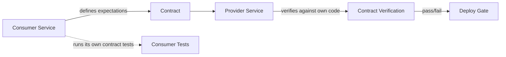

# Contract testing

> **Learning Path:** Architect's Developer Foundation
> **Section:** 1.2.13 — 2. API engineering

### The problem

You have two teams deploying independently. Team A owns the Provider API, Team B owns the Consumer service. A deploys 10x a day. B deploys 5x a day.

Integration tests that spin up both services are slow, flaky, and require a shared test environment. End-to-end tests catch breaks late, after merge.

Without a safety net, either you couple release cadences, or you accept production breakage. You need a way to prove compatibility without running both systems together every time.

### Mental model

Contract testing is a handshake with a test.

The consumer defines *what it needs* from the provider. The provider defines *what it can offer*. A contract test verifies those two statements match, independently.

Think of it as a legal contract, not an integration test. You are not testing the whole business flow, you are testing the interface agreement.

### How it works

Consumer-driven contract:

1. **Consumer defines expectations.** For a given request, what response shape, status codes, headers, and error cases must the provider return?
2. **Contract is published.** That expectation is serialized as a contract artifact.
3. **Provider verifies.** The provider runs the contract against its own implementation in CI, proving it can satisfy all consumers.
4. **Gate deployment.** If verification fails, provider cannot release.

The consumer also runs its tests against a mock generated from the contract, so it never needs a real provider to build.

This is decoupled verification. Both sides test locally.

### Architectural reasoning

**When it helps**
* Microservices with independent deploy cadences
* Public APIs with external consumers
* Teams that cannot coordinate releases
* You need fast feedback on breaking changes before merge

**What it solves**
It moves compatibility checks left, from integration environment to build time. You get confidence without coupling deployment pipelines.

**Alternatives**
* **Integration / E2E tests:** Accurate but slow, expensive, brittle. Requires both services up.
* **Schema validation only:** Checks shape, not behavior. Misses semantics like status codes or error handling.
* **Manual coordination:** Change review meetings and version freezes. Does not scale.

Contract testing sits between schema validation and full integration. It tests behavior of the interface, not the internal logic.

### Trade-offs and failure modes

* **Contracts are only as good as they are maintained.** If consumers don't update expectations, tests pass while real usage breaks. Contract drift is real.
* **False confidence.** A contract can be technically satisfied but semantically wrong. Provider returns 200 with empty body where consumer expects data. Tests pass, production fails.
* **Versioning complexity.** With many consumers, you get N contracts per provider. You must decide: version the API, support multiple contracts, or force consumers to upgrade.
* **Maintenance overhead.** Contracts are code. They need ownership, review, and cleanup. Teams often write them once and let them rot.

The most common failure mode is testing the contract, not the reality. The contract verifies "does provider return field X?" not "is field X correct for the business case?"

### Example

Payments Platform. Provider: `PaymentService` with `POST /payments`. Consumer: `CheckoutService`.

Checkout needs: POST with `{amount, currency, card_token}` returns 201 with `{payment_id, status}` within 200ms, and 400 with `{error_code}` on validation failure.

Checkout writes a Pact contract for that. Provider CI runs contract verification on every PR. If Provider changes response to return `transaction_id` instead of `payment_id`, verification fails before merge. Checkout can release without waiting for Payments.

If Checkout later needs `customer_id` in request, it updates its contract first. Provider sees failing verification and can decide to implement or negotiate.

### Reasoning challenge

Team A owns Provider. Team B owns Consumer. Provider wants to deprecate a field `legacy_discount` that is still used by Consumer in 2% of requests.

Do you:
A) Remove the field and break the contract immediately
B) Keep the field forever
C) Version the API and maintain both contracts

What information do you need before deciding, and what is the real risk contract testing does not cover?

### Key takeaway

* Contract testing trades integration runtime for build-time verification of interface compatibility.
* It enables independent deployment by making the API contract explicit and testable.
* It does not replace integration tests; it reduces the need for them on every change.
* Contracts must be owned, versioned, and kept in sync with real usage or they become liabilities.
