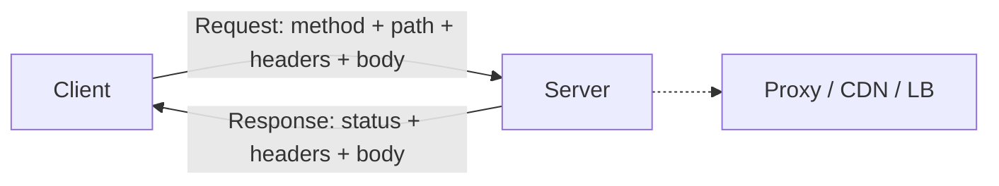

# HTTP

> **Learning Path:** Architect's Developer Foundation
> **Section:** 1.2.2 — 2. API engineering

**HTTP: The universal request-response contract**

### 1. The problem

You have services written in different languages, running on different machines, behind firewalls, proxies and CDNs. You need a way for a client to ask for something and get a response back, reliably enough to build systems on top of it.

Constraints:
* The network is unreliable and intermediaries must be able to inspect, cache and route traffic
* Systems must evolve independently without coordinated deploys
* You need observability, retries and access control at the edge

Custom binary RPC works inside one org. It breaks at the public internet boundary.

HTTP is the answer that trades efficiency for universality and operability.

### 2. Mental model

HTTP is a stateless conversation about resources, not a remote procedure call.

Client: `GET /orders/123` with an intent.
Server: `200 OK` with a representation, or `404 Not Found`.

The state lives in the resource, not the connection. Each request is self-contained.

The uniform interface means intermediaries can reason about traffic without knowing your business logic.

### 3. How it works

Essentially: method + target + headers -> status + headers + body.

* Methods encode intent: `GET` read, `POST` create, `PUT` replace, `PATCH` modify, `DELETE` remove. Idempotency is a contract, not an implementation detail.
* Status codes are a shared failure language. `4xx` client error, `5xx` server error. Retries and circuit breakers depend on this.
* Headers carry metadata: content negotiation, caching directives, auth, tracing.
* Statelessness: no server-side session by default. Scale out is trivial; state must be explicit via tokens or external store.
* Text-based and human readable. Verbose, but debuggable through proxies and logs.

HTTP/1.1 added persistent connections. HTTP/2 multiplexes streams over one TCP. HTTP/3 moves to QUIC over UDP. The model stays the same; transport improves latency and loss resilience.

### 4. Architectural reasoning

When it helps:
* Public APIs and edge integration. Firewalls allow port 443. Proxies, caches, API gateways understand HTTP natively.
* Evolvability. Add fields to a response without breaking old clients. Version via path, header or media type.
* Caching and CDN. `Cache-Control`, `ETag`, `Last-Modified` give you a distributed cache for free.

Alternatives:
* gRPC / custom binary: lower latency, smaller payloads, strong schemas. Great for internal, homogeneous services where you control both ends.
* Message queues: for async, fan-out, durable processing. Not request-response.

Why choose HTTP: you optimize for operability, interoperability and ecosystem. You accept overhead for the ability to route, log, cache, and secure at the edge without custom code.

### 5. Trade-offs and failure modes

* Statelessness scales but pushes complexity out. Sessions, rate limiting and auth state live in cookies/tokens or external stores.
* Request-response coupling. No backpressure. Clients time out, servers get overloaded. You need retries with idempotency keys, timeouts and backoff.
* Text overhead. JSON is readable and schemaless, but larger than protobuf. For high-throughput internal paths this matters.
* Keep-alive exhaustion. Too many idle connections = file descriptor pressure. Too few = latency.
* Caching correctness. Incorrect `Cache-Control` causes stale data. `GET` must be safe and idempotent or caches will serve wrong answers.

### 6. Example

Enterprise order API behind an API Gateway.

Client -> API Gateway -> Auth -> Rate Limit -> Service.

The gateway logs every request, enforces JWT, applies per-tenant quotas, and caches `GET /products/*` for 60s. The service itself stays simple and stateless; it can be scaled horizontally.

If the service returns `503` with `Retry-After`, the gateway and client know how to backoff. If it returns `201 Created` with `Location` header, clients can discover the new resource.

No shared session. Scaling is a config change.

### 7. Reasoning challenge

You have an internal recommendation service called 10k times/sec from 3 microservices, latency SLO 20ms p99.

Do you expose it over HTTP/JSON or gRPC? What changes if you later need to expose the same model to third-party partners?

### 8. Key takeaway

* HTTP is a stateless, uniform interface for resource exchange that optimizes for interoperability and operability, not raw efficiency.
* Methods and status codes encode intent and failure semantics that enable retries, caching and observability.
* Choose HTTP for public/edge boundaries and where ecosystem tooling matters; choose binary RPC for low-latency internal services you control.
* Design for idempotency, explicit caching contracts, and stateless scaling. The failures you get are timeouts, cache poisoning and connection exhaustion, not protocol complexity.
