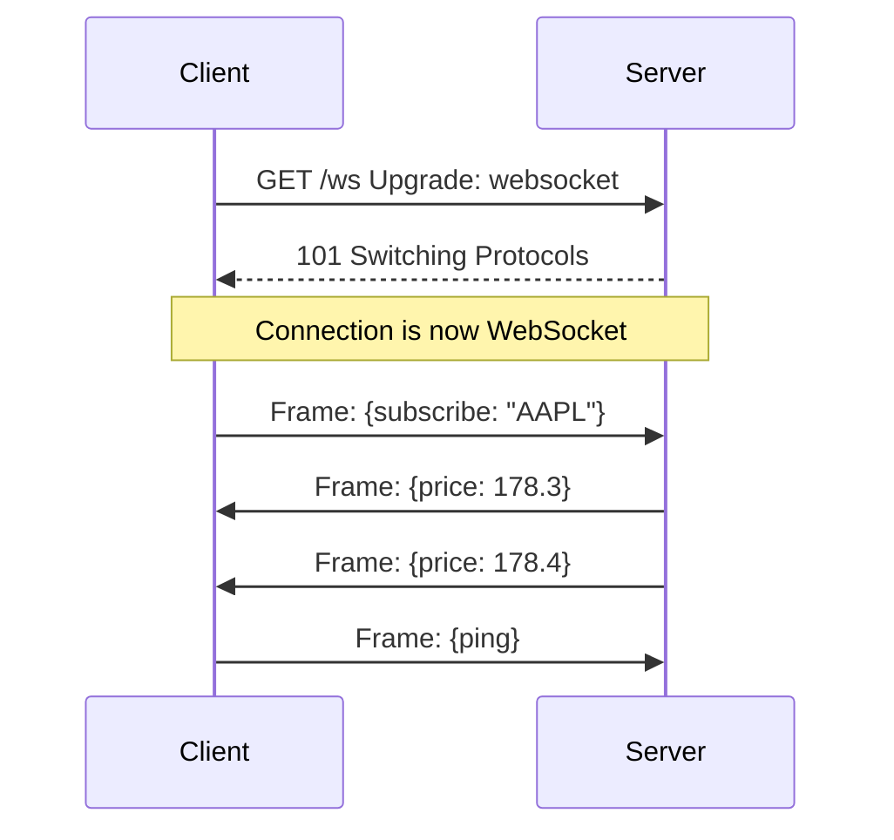

# WebSockets

> **Learning Path:** Architect's Developer Foundation
> **Section:** 1.2.4 — 2. API engineering

**The problem**

HTTP is pull-based and stateless. Client asks, server answers, connection closes.

When you need server-initiated updates — live prices, chat, multiplayer state, AI streaming — you are left with polling the server or holding a request open.

Polling creates waste: empty responses, battery drain, latency equal to poll interval. Long-polling reduces waste but still creates a new TCP/TLS handshake per message and forces the server to manage many half-open requests.

The constraint is: *low latency push from server to client, with occasional client-to-server messages, over a single long-lived connection.*

**Mental model**

WebSocket is one TCP connection upgraded from HTTP to a full-duplex byte-framed channel.

Think of it as HTTP opening the door, then replacing the request-response protocol with a persistent pipe. After the handshake both sides can send frames independently.

**How it works**

1. Client sends an HTTP request with `Upgrade: websocket` and a `Sec-WebSocket-Key`.
2. Server responds `101 Switching Protocols` if it accepts.
3. The TCP connection stays open. Messages are wrapped in lightweight frames with opcode, payload length, and masking from client to server.

No new HTTP headers per message, no re-authentication, no keep-alive polling.

**Architectural reasoning**

When it helps:
* Bidirectional, low-latency interaction where both sides send frequently.
* Server needs to push state changes to many clients without client coordination.
* You need message ordering per connection and backpressure visibility.

Alternatives:
* **Server-Sent Events**: unidirectional server→client over HTTP, auto-reconnect, simpler. Good for feeds.
* **Long-polling**: works everywhere, but high latency and connection churn.
* **HTTP/2 Server Push / streaming responses**: one-way, request scoped.

Choose WebSocket when you need true duplex and you can tolerate stateful connections. Choose SSE when you only need server push and want HTTP semantics, proxies, and easier scaling.

**Trade-offs and failure modes**

* **Stateful**. Each connection consumes memory and file descriptors on the server. Horizontal scaling needs connection affinity or a pub/sub backbone between nodes. A client connected to Node A must receive events published by Node B.
* **Operability**. Connections silently drop behind NATs, mobile networks, and proxies. You need heartbeats/pings, exponential backoff reconnect, and session resumption.
* **Browser limits**. ~6-8 concurrent sockets per origin. Mobile OS may kill background sockets.
* **Security**. Upgrade is still HTTP, so TLS, origin checks, and authentication must happen at handshake. Frame masking prevents some cache poisoning but does not replace authZ per message.
* **Backpressure**. If client is slow, frames queue in kernel/user space. Unbounded queues cause OOM. You need flow control and max connection limits per client.

**Example**

Real-time trading dashboard. Clients subscribe to symbols. Market data engine publishes ticks to a Redis channel. API tier maintains WebSocket connections, subscribes clients to symbol sets, and fans out ticks from Redis to the right connections.

Without WebSocket you would poll `/prices?symbols=AAPL` every 500ms → 2M clients × 2 req/s = 4M RPS of mostly duplicate data. With WebSocket you have 2M persistent connections, ~1 message per tick per subscribed client, and the server pushes only when data changes.

**Reasoning challenge**

You need to push price alerts to 2M mostly idle mobile clients. 95% of traffic is server→client, clients rarely send. Network is mobile with frequent drops. Would you choose WebSocket or SSE? What changes your decision?

**Key takeaway**

* WebSocket solves server-initiated, low-latency, bidirectional communication over one long-lived connection.
* It trades stateless scalability for latency and efficiency; you must design for connection lifecycle, reconnect, and fan-out.
* Prefer SSE for unidirectional streams; prefer WebSocket for true duplex interactive systems.
* Architect for failure: heartbeats, reconnect with backoff, pub/sub for multi-node fan-out, and bounded memory per connection.
