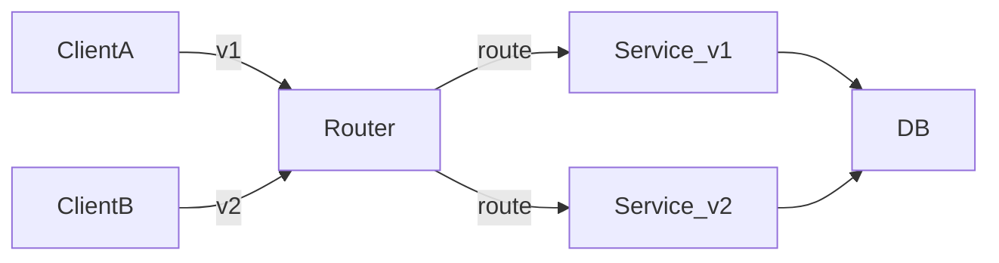

# API versioning

> **Learning Path:** Architect's Developer Foundation
> **Section:** 1.2.6 — 2. API engineering

**API versioning**

### 1. The problem

APIs are contracts. Once you ship `POST /orders` with fields `{item, qty}`, thousands of clients start depending on that exact shape.

Then product needs change: add `price`, rename `qty` to `quantity`, change error codes. You can’t update all clients at once. Mobile apps lag months, internal services deploy on different cadences, partners have SLAs.

Without a strategy, evolution = breakage. The constraint is: **ship new behavior while old clients keep working, without forking the codebase into unmaintainable copies.**

### 2. Mental model

Versioning is time travel for your contract.

You keep multiple versions of the contract alive in parallel, route callers to the version they understand, and retire old versions on a schedule. It is not about being nice to developers; it is about decoupling release cycles.

Think of it as: Client promises which contract it speaks → Gateway maps promise to implementation → Implementation can evolve.

### 3. How it works

The essential mechanism is explicit version identification + isolated implementation + routing.

The version is surfaced in the request, typically:
* **URI:** `GET /v1/orders`, `GET /v2/orders`
* **Header:** `Accept-Version: 2024-06-01`
* **Content negotiation:** `Accept: application/vnd.company.v2+json`

The service keeps the mapping and the implementations. New version is additive, old version is maintained until deprecation window ends.

Implementation is usually one of:
* **Branch per version:** separate code paths, shared domain model.
* **Adapter layer:** single model, version-specific serializers/deserializers.
* **Proxy/gateway:** version routing done at edge, services stay version-agnostic.

### 4. Architectural reasoning

When it helps:
* Public APIs with external consumers you don’t control.
* Long-lived clients like mobile apps or IoT firmware.
* Regulatory or financial domains where breaking changes are costly.
* Multi-team platforms with independent release cadences.

What it solves: independent evolution. Producer can ship v2 without coordinating every consumer.

Alternatives:
* **Strict backward compatibility only:** never remove/rename fields, only add optional ones. Works for small internal teams, fails at scale when semantics need to change.
* **Sunset + forced migration:** announce deprecation and break clients. Cheaper to build, expensive in trust and support.
* **Version via feature flags:** toggle behavior per client. Powerful but couples versioning to rollout system and creates combinatorial testing.

Choose URI versioning for public APIs. It is visible, cacheable, and easy to reason about in logs. Header versioning is cleaner aesthetically but harder to debug. Date-based versions `2024-06-01` work well for Stripe-style APIs where change is continuous.

### 5. Trade-offs and failure modes

* **Version explosion.** Every change creates a new version. Maintain 3+ versions and you multiply test matrix, docs, and bug surface. Mitigate with deprecation policy and version windows.
* **Data model drift.** v1 and v2 read/write same DB. Schema changes must remain backward compatible, or you need translation layer. This is the hidden cost.
* **Operational complexity.** Routing, monitoring per version, and sunset tracking add to platform ops. You need clear metrics: requests per version, error rate per version, % traffic on EOL versions.
* **False sense of safety.** Versioning does not fix poor design. If you version too early or version every field, you create churn.

### 6. Example

Enterprise payments platform. Internal services and external partners consume `/payments`.

v1 returns `{id, amount, currency, status}`. New fraud rules require `risk_score` and change `status` enum from `pending|done` to `pending|authorized|settled|canceled`.

You ship v2 with new schema and logic. Gateway routes:
* `Accept-Version: v1` → adapter maps v2 domain model back to v1 shape, omits `risk_score`, maps `authorized` → `pending`.
* `Accept-Version: v2` → native response.

You give partners 12 months deprecation notice, track v1 traffic, and retire when <1% of requests. Domain model evolves once; adapters contain the compatibility cost.

### 7. Reasoning challenge

You run a SaaS API with 2M mobile installs. 30% of users update within 30 days, 80% within 6 months. Product wants to rename a top-level field `user_id` → `customer_id` in the response.

Do you version the API, keep backward compatibility with an alias, or force a migration? What metrics would you watch to decide when to retire the old behavior?

### 8. Key takeaway

* Versioning exists to decouple producer and consumer release cycles, not to enable change for its own sake.
* Pick a visible, auditable version scheme early and enforce deprecation windows; version explosion is the real failure mode.
* Compatibility cost lives in data model and adapters, not just routing.
* Monitor usage per version and retire aggressively; keeping old versions is a liability.
