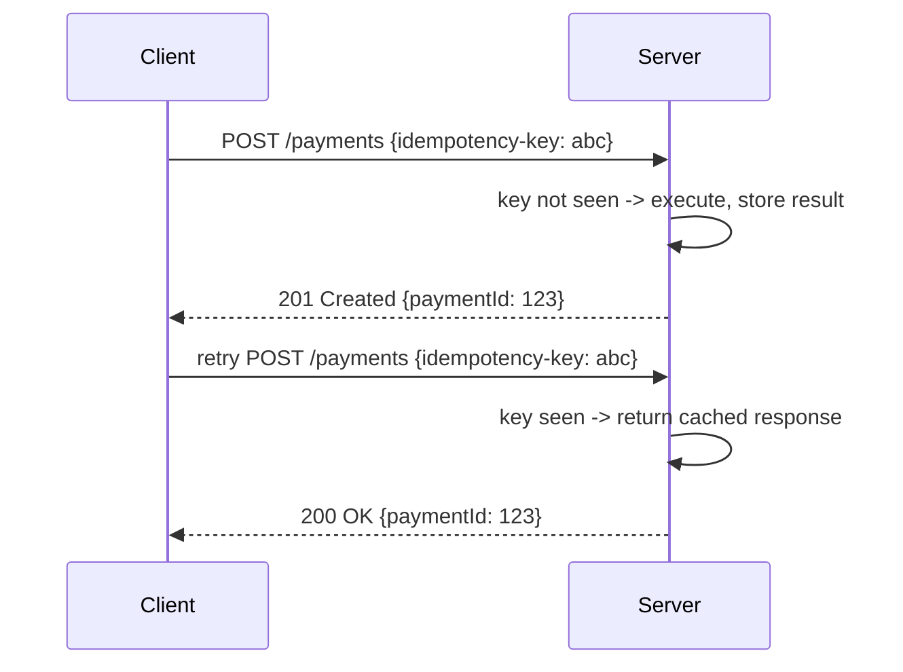

# Idempotency

> **Learning Path:** Architect's Developer Foundation
> **Section:** 1.2.7 — 2. API engineering

### The problem

APIs live on the internet. Networks drop packets, load balancers time out, clients retry on 5xx and network errors.

The result is the same logical request arriving at your service multiple times. Without protection, a `POST /orders` retried twice creates two orders, a `POST /charge` retried twice charges twice.

You cannot eliminate retries. You must make them safe.

### Mental model

Idempotency means applying an operation N times has the same effect as applying it once.

Think of a light switch vs a light dimmer. Flipping a switch on, on, on is idempotent - the light stays on. Turning a dimmer up three times is not.

For APIs, the question is not about HTTP semantics. It is about business effect: does repeating the request change the outcome?

### How it works

Idempotency is enforced by making the server recognize a repeated request and return the original result instead of re-executing.

The essential mechanism is a client-generated idempotency key scoped to the operation intent.

Server stores: `key -> {status, response body, timestamp}`. On a repeat, it returns the stored response without re-executing business logic. The key must be unique per intent, not per HTTP request.

HTTP already gives you safe methods: `GET`, `PUT`, `DELETE` are idempotent by convention. `POST` is not. That is why you add explicit idempotency for writes.

### Architectural reasoning

When it helps:
* Network retries, client SDKs, and at-least-once messaging make duplicates inevitable.
* Non-idempotent money-moving, provisioning, or creation operations where duplicates cause harm.
* Distributed systems where you cannot guarantee exactly-once delivery.

What it solves: you decouple reliability from correctness. Clients can retry aggressively without risking side effects.

Alternatives:
* Exactly-once delivery via transactional messaging. Expensive, rarely achievable end-to-end.
* Client-side de-duplication only. Fails when client crashes or multiple clients act.
* Accept duplicates and reconcile later. Works for some domains, painful for payments.

Idempotency is the pragmatic middle ground: keep the system at-least-once, make the operation behave as once.

### Trade-offs and failure modes

**State you must keep.** The server must store keys long enough to cover the retry window. That is stateful. Keys need TTL, garbage collection, and consistent storage across instances.

**Scope matters.** A key must identify the full intent: method + URL + body + auth context. Two different payloads with same key must not be treated as duplicate.

**Key lifecycle.** Clients must generate keys per business intent and reuse them on retries. Generating a new key each retry defeats the purpose. Keys must not be reused for different intents.

**Partial failure.** If the first request executes but the response is lost, the server must still return success on retry. That means you must persist the outcome before returning to client.

**Cost.** Storage and lookup per write. For high throughput, key store becomes a hotspot. Many systems use Redis/DynamoDB with TTL.

### Example

Payment creation API.

`POST /payments` with `{amount, card, idempotency-key}`.

First request: key not seen. Create payment record, charge card, store `key -> {201, paymentId}`.

Client times out, retries with same key. Server finds key, returns stored `201` with same `paymentId`. Card charged once.

Without this, retries cause double charge and support tickets. With it, retries become free.

Idempotency keys are typically required for POST and PATCH that create state. GET is naturally safe.

### Reasoning challenge

You are designing an order API. `POST /orders` creates an order and emits an event to fulfill it.

A client retries after timeout and receives a second order. The business says duplicate orders are unacceptable.

Do you:
A) Make the client generate a unique `client_order_id` and enforce uniqueness on that field.
B) Require an `idempotency-key` header and store server-side response.
C) Both.

Which is correct and what is the failure mode of the other?

### Key takeaway

* Idempotency is about safe retries in unreliable networks, not about HTTP purity.
* Make non-idempotent operations behave as idempotent by recognizing repeated intent via a client-supplied key and returning a cached outcome.
* You trade storage and operational complexity for correctness under at-least-once delivery.
* Design the key scope correctly, persist the result before responding, and set a sensible TTL for the key store.
