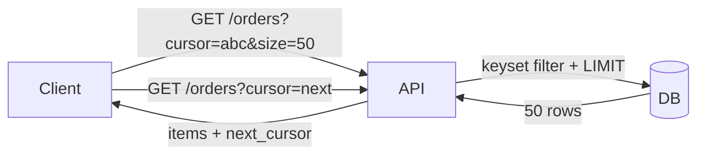

# Pagination

> **Learning Path:** Architect's Developer Foundation
> **Section:** 1.2.8 — 2. API engineering

**The problem**

A collection endpoint returns all rows. With 10 rows it's fine. With 10 million it's not.

The constraints pile up fast: DB query time grows, result set memory blows up, network transfer saturates, client parsing blocks, and timeouts kill the request. Even if you could return everything, the user can't consume it.

You need a way to deliver a bounded slice of data, repeatedly, without making the client hold the whole set in memory.

**Mental model**

Pagination is chunking a large ordered set into consumable pages.

Think of a book index: you don't read the entire library at once, you request page N with a fixed size. The server guarantees a consistent slice and a way to get the next slice.

**How it works**

The core mechanism is a bounded query with a stable ordering and a pointer to the next slice.

* Offset pagination: `page` + `size` → `LIMIT size OFFSET page*size`. Simple, stateless, page numbers map directly to UI.
* Cursor / keyset pagination: return a `next_cursor` derived from the last item's sort key, e.g. `WHERE id > last_id ORDER BY id LIMIT size`. The cursor is opaque to the client.

The response shape is always the same:
```
{
  items: [...],
  next_cursor: "eyJpZCI6MTAwMH0=",
  has_more: true
}
```

The server never returns the whole collection, only one window and a continuation token.

**Architectural reasoning**

Pagination exists to bound resource usage per request and to decouple producer speed from consumer speed.

Choose offset when:
* Random access to arbitrary pages is required, e.g. "go to page 37".
* Data is mostly static and page numbers are a UX expectation.

Choose cursor when:
* Data is append-only or mutating while being read.
* You need stable results under inserts/deletes.
* You care about deep pagination performance.

Alternatives: streaming / server-sent events for real-time feeds, full export jobs for bulk data. Pagination is for interactive, bounded browsing.



**Trade-offs and failure modes**

* Deep offset is expensive. `OFFSET 1_000_000` forces the DB to scan and discard a million rows. Latency and cost grow linearly with page depth.
* Offset is unstable. Inserts/deletes between requests cause duplicates or skips. Page 2 may contain items you already saw.
* Cursor is stable but not random-access. You can't jump to page 37 without walking the chain.
* Ordering must be unique and monotonic. Cursor pagination fails if `ORDER BY created_at` has ties. Use a composite key: `(created_at, id)`.
* Caching is harder with cursors. Offset pages are cacheable by `page,size`. Cursors are unique per user walk.
* Client state. The server is stateless, but the client must store and forward the cursor. Lose it and the walk restarts.

Failure modes architects hit: N+1 pagination in UI grids, exposing `OFFSET` directly to users leading to denial-of-service via deep pages, and inconsistent ordering causing missed records during long polling.

**Example**

Enterprise order listing API for support agents.

Requirements: 200M orders, agents filter by customer and date, need <200ms p95, data changes constantly.

Decision: cursor pagination with composite key `(customer_id, created_at DESC, order_id)`. Size capped at 100. `next_cursor` encodes the last triple.

Why: offset would time out on old customers. Cursor gives stable pages despite new orders arriving. The composite key prevents ties. API rejects `page` parameter entirely.

Operational guardrail: max `size` enforced, and a hard limit on cursor depth via a background job for export.

**Reasoning challenge**

You have a social feed endpoint `GET /feed?user_id=123&page=5&size=20`. Users complain about seeing the same post twice after someone posts a new item, and p95 latency spikes to 2s for power users.

What is the root cause and what would you change, without breaking existing clients that rely on page numbers?

**Key takeaway**

* Pagination bounds cost per request; it is a resource control mechanism, not a UI nicety.
* Offset = simple and random access, unstable and expensive at depth.
* Cursor = stable and efficient, sequential only and requires unique ordering.
* Choose based on mutability, depth, and access pattern, then enforce size caps and ordering guarantees.
* The architectural decision is about consistency vs. random access and cost at scale.
