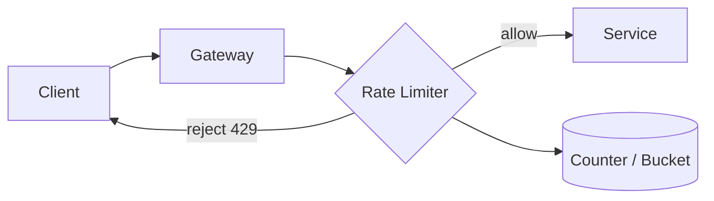

# Rate limiting

> **Learning Path:** Architect's Developer Foundation
> **Section:** 1.2.9 — 2. API engineering

**Rate limiting**

### 1. The problem

What happens when demand is unbounded and capacity is not?

An API, a database, an LLM inference endpoint can handle X requests per second. Clients can generate 100X. Without a control point, one noisy tenant, a retry storm, or a simple bug can saturate workers, increase latency for everyone, exhaust downstream quotas, and rack up cost.

You need a way to say: *you may use this resource, but only at a sustainable pace*.

Rate limiting is that control point. It is not about rejecting bad actors only. It is about making the system’s finite capacity predictable and fair.

### 2. Mental model

Think of a nightclub with a fixed number of bartenders.

The bouncer does not stop people from queuing. He admits them at a rate the bar can serve. He can give regulars a faster line, cap how many people a group brings in, and close the door for a few minutes if the kitchen backs up.

Rate limiting is the bouncer. The token bucket is his clicker. The policy is who gets in, how fast, and when to close.

### 3. How it works

Essentially: check, then allow or reject.

On each request, the limiter checks if the caller has budget left under a policy. If yes, decrement budget and forward. If no, return 429 Too Many Requests.

The budget is defined by two numbers: **rate** and **burst**.

Rate = sustained capacity, e.g. 100 req/min.
Burst = how much can be borrowed up front, e.g. 20.

The two common mechanisms are:

* **Token bucket:** tokens refill at the rate. A request consumes 1 token. Allows bursts up to bucket size, then smooths to rate.
* **Fixed / sliding window:** count requests in the last N seconds. Simpler, but can allow 2x burst at window edges.

In distributed systems the counter lives behind a fast store. Local in-memory is fast but inconsistent across instances. A shared store like Redis is consistent but adds latency. The choice is a trade-off.

### 4. Architectural reasoning

Rate limiting helps when you must protect a shared, finite resource and you want predictable behavior under load.

When to use it:
* Protect downstream services with limited throughput or cost, e.g. DB connections, 3rd party APIs, GPU inference.
* Enforce fairness and SLAs across tenants in multi-tenant SaaS.
* Prevent abuse and accidental retry storms.
* Meet contractual quotas.

Alternatives and why you might not choose them:
* **Backpressure / queueing:** good for latency-tolerant workloads, bad when you must reject fast.
* **Autoscaling:** handles average load, not spikes and cost. Rate limiting is cheaper than scaling forever.
* **Client-side throttling:** polite but untrusted. Must be enforced server-side.

Decision points:
* **Granularity:** global, per-IP, per-API key, per-tenant, per-user, per-endpoint. Finer granularity = fairer, more state.
* **Where:** edge gateway for cost and DDoS, service-level for business logic. Often both.
* **Response:** hard reject 429 vs shed load with 503 + Retry-After.

### 5. Trade-offs and failure modes

* **Strictness vs burst tolerance.** A hard fixed window is simple but penalizes legitimate bursts. Token bucket is more forgiving but harder to reason about.
* **Accuracy vs performance.** Distributed counters need coordination. Local counters are fast but allow overage across nodes. Most systems accept small overage for speed.
* **Fairness vs complexity.** Per-user limits are fair. Per-IP is simpler but breaks for NATs and mobile carriers.
* **State loss.** If the limiter store fails, you either fail-open and risk overload, or fail-closed and deny all traffic. Choose explicitly.

Common failures:
* Clock skew in distributed windows causes double counting.
* Retry without jitter + rate limit = thundering herd at reset.
* Returning 429 without Retry-After makes clients hammer harder.
* Only limiting at the edge lets a single tenant consume all internal resources between services.

### 6. Example

Payment processing API with 3rd party bank limits.

The bank allows 10 TPS sustained, 50 burst. Your service has 100 tenants.

You put a token bucket rate limiter in the API gateway per-tenant, e.g. 2 TPS sustained, and a global bucket at the bank client of 10 TPS sustained, 50 burst.

A tenant spike hits its per-tenant bucket and gets 429 with Retry-After. The global bucket protects the bank connection and your own worker pool. When the bank returns 429, you propagate backpressure with a short Retry-After and optionally queue idempotent requests for a few seconds.

Result: no bank bans, no cascade, tenants see clear limits.

### 7. Reasoning challenge

You are designing an AI inference gateway for multiple enterprise customers. Customer A has a contract for 1,000 RPM, Customer B for 10,000 RPM. A bug in Customer A’s SDK causes it to retry every failed request 5x immediately.

Do you rate limit per API key only, or also per IP and globally? What headers do you return on 429, and where do you enforce the limit?

### 8. Key takeaway

* Rate limiting exists to make finite capacity predictable and fair, not just to block attackers.
* Choose the granularity and location based on what you need to protect: cost, latency, downstream quotas, fairness.
* Token bucket gives burst tolerance; fixed window is simpler but harsher. Distributed enforcement trades accuracy for performance.
* Always return 429 with Retry-After and design clients to backoff with jitter.
