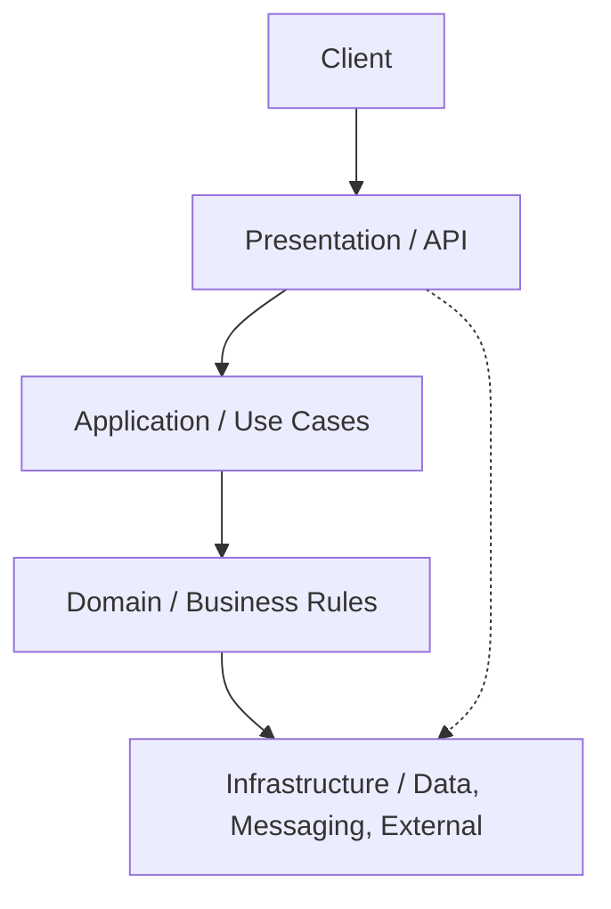

# Layered architecture

> **Learning Path:** Architect's Developer Foundation
> **Section:** 1.3.1 — 3. Application architecture

### The problem

Code that starts clean becomes tangled as requirements grow. Business logic ends up in controllers, data access leaks into UI, and a change to a database column forces edits across the whole codebase.

The constraint is not just cleanliness. It's **independent change and ownership**. Different concerns change for different reasons at different speeds: UI changes with UX, business rules change with the domain, persistence changes with the platform. When they are mixed, one team blocks another, tests become fragile, and a small change risks the whole system.

### Mental model

Layered architecture is the idea that an application is a stack of horizontal slices, each with a single responsibility, and dependencies only point inward.

Think of it as an onion where the core contains what is most stable and valuable.

### How it works

Four essential layers, with strict dependency direction:

* **Presentation:** Adapters for HTTP, CLI, UI. Translates external requests to application intents. No business logic.
* **Application:** Orchestrates use cases. Validates inputs, coordinates domain objects, handles transactions. No persistence details.
* **Domain:** Core business rules and entities. Pure logic, no framework code.
* **Infrastructure:** Concrete implementations for repositories, databases, email, queues. Depends on domain interfaces, never the other way around.

Data flows in, control flows out. A request enters Presentation, is mapped to an application use case, domain enforces invariants, infrastructure persists.

### Architectural reasoning

Layered architecture helps when you need **separation of concerns to enable parallel work and testability**.

When it helps:
* Large teams with distinct skills: front-end, backend, data
* Long-lived domain logic that must survive technology churn
* Need for fast feedback via unit tests on pure domain logic

Alternatives:
* **Monolithic procedural code:** Faster initially, collapses under change.
* **Hexagonal / Ports and Adapters:** Same separation intent, but emphasizes decoupling via interfaces rather than layers. Better for complex external integrations.
* **Clean Architecture:** Formalizes layered with dependency inversion.

Choose layered when the primary problem is internal complexity and change isolation, not external integration volatility. Choose hexagonal when you need to swap entire capabilities, e.g., multiple messaging systems.

### Trade-offs and failure modes

The most important trade-offs:

* **Latency and indirection.** Each layer adds mapping and calls. For high-throughput paths this matters. Mitigate with thin layers, not business logic duplication.
* **Coupling through leakage.** Developers inevitably call infrastructure from presentation or put persistence models in domain. This creates a leaky abstraction and defeats the model. Enforce via code reviews and architectural tests.
* **Anemic domain.** If domain only holds data and application contains all logic, you get a transaction script. The architecture is in place but value is lost.
* **Duplication temptation.** Teams copy logic across layers to avoid "going through" another layer. This re-introduces coupling.

Common failure mode: **circular dependencies** between layers. If Infrastructure knows about Application, you cannot test Application without a database.

### Example

Enterprise order placement.

Presentation receives `POST /orders`. It validates schema and calls `CreateOrderUseCase`.

Application loads customer, checks credit limit via domain policy, creates Order aggregate, publishes `OrderCreated` domain event.

Domain contains `Order` with invariant: `order.total > 0 && customer.isActive`. No HTTP, no SQL.

Infrastructure implements `OrderRepository` with Postgres and `EventPublisher` with Kafka. The domain only knows interfaces.

A UI redesign changes Presentation only. A switch from Postgres to DynamoDB changes Infrastructure only. Business rule change to allow pre-orders touches Domain and Application only.

### Reasoning challenge

You are designing a real-time pricing service that must compute price from 5 external pricing engines with different latencies, cache results for 30 seconds, and expose a gRPC API with <50ms p99.

Would you enforce a strict layered architecture here, or relax layer boundaries? What would you keep and what would you allow to leak?

### Key takeaway

* Layered architecture exists to isolate change, not to organize files.
* Dependencies must point inward toward domain; infrastructure is an implementation detail.
* The value is independent evolution and testability, paid for with indirection and discipline.
* Leaky layers and anemic domain are the failure modes to watch for, not layer count.
