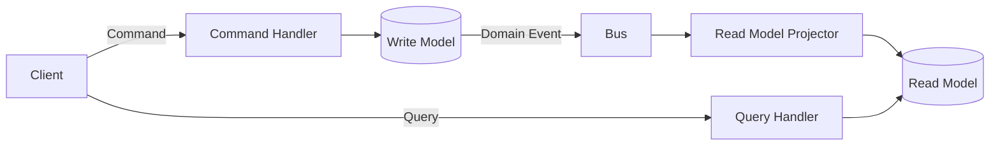

# CQRS

> **Learning Path:** Architect's Developer Foundation
> **Section:** 1.3.10 — 3. Application architecture

**CQRS — Command Query Responsibility Segregation**

### 1. The problem

A single model optimized for writes is a bad model for reads, and vice versa.

As a system grows you get two conflicting constraints:
* **Writes need integrity.** They must enforce invariants, business rules, authorization, and transactional consistency.
* **Reads need speed and shape.** They need low latency, denormalized projections, and views tailored to specific UIs/reports.

With a classic CRUD service the same model serves both. That forces compromises:
* Complex domain logic leaks into read endpoints to shape data.
* Read queries contend with writes on the same tables.
* Scaling reads requires scaling the whole service, writes included.
* Adding a new read view requires changing the write model or adding expensive joins.

CQRS appears when the read and write workloads diverge enough that one model is no longer acceptable.

### 2. Mental model

Separate the *intent to change state* from the *intent to observe state*.

* **Commands** change state. They are validated, go through business logic, and produce side effects. They return little or no data, often just success/failure.
* **Queries** retrieve state. They are read-only, optimized for the consumer, and have no side effects.

Think of a bank teller window vs the lobby display board. The window processes deposits and withdrawals with strict rules. The board shows balances, recent activity, and trends — different data, different performance needs, eventually consistent with the window.

### 3. How it works

Write side receives commands, enforces invariants, persists to the write model. The change is then made visible to the read side, usually via events or direct projection updates.

Key pieces:
* **Command Handler** validates and executes business logic.
* **Write Model** is the source of truth for state transitions. Often normalized, transactional.
* **Read Model** is a set of purpose-built views, denormalized for query patterns.
* **Projection** bridges them. It can be synchronous for strong consistency or asynchronous for scale.

CQRS does not require Event Sourcing, but they pair naturally: events become the contract between sides.

### 4. Architectural reasoning

When it helps:
* Read and write scale independently. You can scale read replicas, cache, or separate read services.
* Read models can be optimized per use case: different shape for mobile vs dashboard vs API.
* Write model stays clean, free of query concerns and presentation logic.
* Complex business workflows are easier to isolate behind commands.

Alternatives:
* **Single model with read replicas.** Works when read/write ratio is moderate and eventual consistency is acceptable.
* **Materialized views in DB.** Good for simple denormalization without splitting services.
* **CQRS without split deployment.** Same codebase, separate handlers, shared DB. Lower complexity, still separates concerns.

Choose CQRS when the cost of the split is justified by divergent scaling, query complexity, or team ownership boundaries. Not for a simple CRUD app.

### 5. Trade-offs and failure modes

* **Eventual consistency.** Reads may lag writes. You must design UX for that: show pending state, use read-your-writes patterns with sticky sessions or version checks.
* **Complexity.** Two models to maintain, two schemas, projection failures, replay logic. Operational surface doubles.
* **Testing.** Commands need domain tests; queries need projection tests. Consistency tests are harder.
* **Failure modes.** Projector lag or failure = stale reads. Duplicate events = idempotency required. Lost events = reconciliation needed.
* **Cost.** More infra, more monitoring, more code.

The most common failure is introducing CQRS too early and paying complexity without gaining scale.

### 6. Example

E-commerce order placement.

Write side:
`PlaceOrderCommand` validates cart, inventory, payment, creates Order aggregate in Postgres in a transaction. Emits `OrderPlaced` event.

Read side:
Projectors update:
* `orders_list_view` for customer order history
* `order_summary_view` for support dashboard
* `inventory_reserved_view` for fulfillment

Queries hit these read models via a separate read service with caching. A new mobile view needing a different shape? Add a new projection, no change to write model.

### 7. Reasoning challenge

Your SaaS has 5% writes, 95% reads. Reports require heavy aggregations that slow the OLTP DB. Team A owns writes, Team B owns analytics.

Do you split to CQRS with separate read models, or keep a single service with read replicas and materialized views? What consistency guarantees do you need for a user who just placed an order and then opens their order history?

### 8. Key takeaway

* CQRS separates the model for changing state from the model for reading state to resolve conflicting optimization needs.
* Commands enforce invariants; Queries are optimized, read-only projections.
* Value comes from independent scaling, cleaner domain logic, and tailored read views. Cost is eventual consistency and operational complexity.
* Use it when read/write workloads, SLAs, or team boundaries diverge. Avoid it when a single model is still sufficient.
