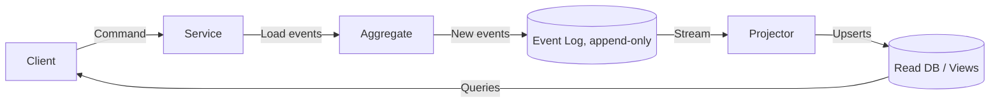

# Event sourcing

> **Learning Path:** Architect's Developer Foundation
> **Section:** 1.3.11 — 3. Application architecture

**The problem**

You need to answer questions about *what happened*, not just *what is*. 
With CRUD you store current state: `balance = 1024`. You lose the history of how you got there, why it changed, and what intermediate states existed.

That loss creates real constraints:
* Audit and compliance need a tamper-evident history
* Debugging production incidents requires replaying the exact sequence of user actions
* Multiple bounded contexts need the same facts but at different speeds and shapes
* Business rules depend on past state, not just current state

Overwriting rows also creates contention. Two writers fighting for the same row forces locks, and merging conflicting updates is hard.

**Mental model**

Event sourcing stores an append-only log of domain facts: immutable events that happened.

Think ledger, not snapshot. You never update a balance, you append `MoneyDeposited` and `MoneyWithdrawn`. Current state is a left-fold of the log.

The aggregate is the interpreter of the log, not the source of truth.

**How it works**

Commands are validated against the current aggregate state rebuilt from events. If valid, the aggregate emits new events. Events are appended to the event store in order. Projectors consume the log and build read models.

Implementation essentials:
* Event store with strong ordering per aggregate stream
* Idempotent append, no updates/deletes
* Snapshots to bound replay cost
* Separate read models for query performance

**Architectural reasoning**

When it helps:
* Auditability is a first-class requirement. Finance, healthcare, trading.
* Temporal queries: "what was the state on 2023-06-01?"
* Multiple views from same facts: one consumer builds a search index, another builds an analytics warehouse, another sends notifications. All from one log.
* Decoupling write and read. Writes are validated commands, reads are cheap projections.

Alternatives:
* CRUD + audit table. Simpler, but audit is secondary, schema changes are painful, and replay is manual.
* Change Data Capture. Captures *that* a row changed, not *why* it changed in domain terms.
* CQRS without event sourcing. You still separate read/write but keep mutable state.

Choose event sourcing when the history *is* the product. Don't choose it for static reference data or when you just need current state.

**Trade-offs and failure modes**

* Complexity. You trade simple CRUD for versioned events, replay, and eventual consistency.
* Schema evolution. Events are immutable. You need upcasting/migration strategies for old events. Breaking changes are expensive.
* Read model lag. Projections are eventually consistent. You must design for it.
* Replay cost. Rebuilding state from millions of events per aggregate is slow without snapshots and parallel projection.
* Debugging is harder. There is no single row to inspect, only a log and the projection logic.

Common failures:
* Lost ordering within a stream → invalid state. Requires per-aggregate sequencing.
* Projector crashes and skips events → stale read models. Need checkpointing and idempotent handlers.
* Event schema change without versioning → old readers break.

**Example**

Trading account.

Commands: `OpenAccount`, `Deposit`, `PlaceOrder`, `SettleOrder`.

Events appended: `AccountOpened {accountId, ts}`, `DepositRecorded {amount}`, `OrderPlaced {orderId, qty}`, `OrderSettled {orderId, pnl}`.

The write side validates invariants from the event stream. Projectors build:
* `AccountBalance` view for the API
* `RiskExposure` view for risk service
* `AuditTrail` for compliance

A regulator asks for the account state at a specific timestamp. You replay events up to that point. No separate audit DB needed.

**Reasoning challenge**

You are designing a user profile service. Reads are 1000x writes, schema changes weekly, and you need a full audit trail for GDPR deletion requests.

Would you use event sourcing for the profile aggregate? What would you store as events vs what would you keep as CRUD?

**Key takeaway**

* Event sourcing is about preserving *why* state changed, not just current state.
* State is a derived view; the event log is the source of truth.
* Choose it for audit, temporal queries, and fan-out to multiple consumers, not for simplicity.
* Pay for it with complexity in versioning, replay, and eventual consistency.
