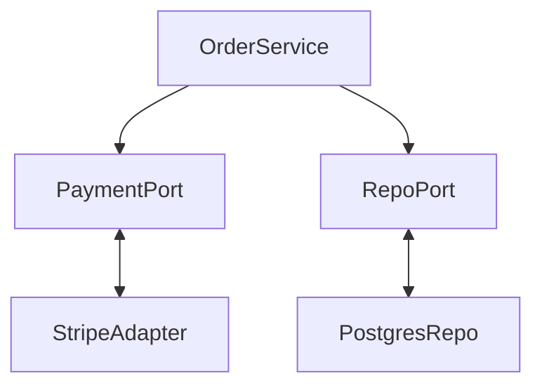

# Dependency inversion

> **Learning Path:** Architect's Developer Foundation
> **Section:** 1.3.12 — 3. Application architecture

**The problem**

A high-level business rule starts depending on low-level details. `OrderService` creates a `StripeClient`, opens a Postgres connection, formats SQL, and retries network calls. 

Now change the payment provider, switch databases, or add a test double, and the business logic changes too. You get ripple edits, slow tests that hit real services, and a release that touches code that should be stable.

The constraint is stability direction: business policy changes less often than infrastructure, and you need independent deployability and testability.

**Mental model**

Dependency Inversion is about who defines the contract.

Instead of high-level modules calling low-level modules directly, both depend on an abstraction owned by the high-level module.

High-level defines *what* it needs. Low-level provides *how* it does it.

Think of a power socket. The appliance defines the plug shape it needs. The wall provides electricity via that shape. You can swap the generator behind the wall without rewiring the appliance.

**How it works**

The high-level module depends on a port/interface. The low-level module implements that port.



`OrderService` knows only `PaymentPort.process(amount, id)`. It does not know Stripe, HTTP, retries, or keys. `StripeAdapter` implements `PaymentPort` and contains all Stripe specifics.

Dependency direction flips: details depend on policy, not the other way around.

Dependency Injection is the mechanism that wires the implementation to the abstraction at composition root. DIP is the principle; DI is one way to satisfy it.

**Architectural reasoning**

When it helps:
* You need to swap implementations without changing business logic: Stripe vs Adyen, Postgres vs DynamoDB, real email vs fake email in tests.
* You have different deployment cadences for policy vs infrastructure.
* You want testability without mocks that replicate the whole world.

Alternatives:
* Direct instantiation: simple, fast to write. Couples policy to implementation. Breaks when implementation changes.
* Service locator / static singletons: hides dependencies but makes them implicit and hard to reason about.
* Factory inside high-level module: still couples to concrete types if the factory returns concretes.

Choose inversion when the cost of indirection is smaller than the cost of coupling over time. For a throwaway script, don't. For a core domain service that will live years, do.

**Trade-offs and failure modes**

* Indirection tax. Extra interfaces, extra files, extra cognitive hops. If the abstraction is stable, the tax amortizes. If you change the abstraction every sprint, it becomes drag.
* Abstraction leakage. The port is designed by the high-level module, so it tends to be biased toward one implementation. You end up with `PaymentPort.processWithStripeId()` leaking Stripe concepts.
* Premature abstraction. Creating ports for things you never swap creates dead interfaces and YAGNI complexity.
* Test illusion. You can test the high-level module in isolation, but integration failures still happen at the adapter boundary. You need contract tests for the port.

**Example**

Enterprise billing system. Business rule: `Invoice.finalize()` must charge the customer and persist an audit record.

Without inversion:
`Invoice` creates `StripeClient` and `Postgres`. Changing to Adyen for EU requires editing `Invoice`.

With inversion:
```python
class PaymentPort:
    def charge(self, amount, customer_id): ...

class Invoice:
    def __init__(self, payment: PaymentPort, audit: AuditPort): ...
    def finalize(self): ...
        payment.charge(...)
        audit.log(...)
```

`StripeAdapter` and `AdyenAdapter` both implement `PaymentPort`. `Invoice` never changes. In tests, inject `FakePaymentPort` that records calls. Deployment can roll out a new adapter without touching domain code.

This also enables bounded context boundaries. The domain defines ports; infrastructure adapters live in a different module and deploy independently.

**Reasoning challenge**

You inherit a monolith where `ReportService` directly queries Postgres with raw SQL and calls an external pricing API inline. Business wants to add a read replica for reporting and a pricing cache.

Do you invert dependencies now, or wrap calls with a facade first? What signals would make you postpone inversion?

**Key takeaway**

* DIP is about stability direction: high-level policy owns abstractions, low-level details implement them.
* It buys independent change, testability, and swappable implementations at the cost of indirection and design discipline.
* Design the port from the use case, not from the existing implementation, to avoid leakage.
* Use it where the lifecycle and change rate of modules differ, not everywhere.
