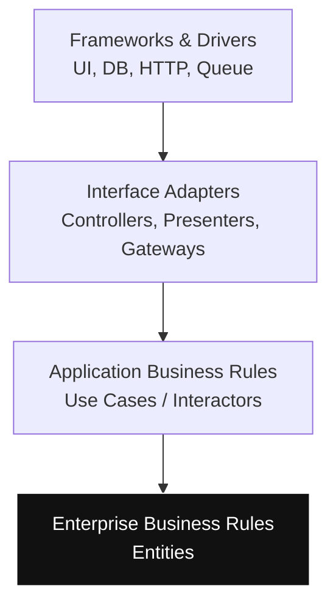

# Clean Architecture

> **Learning Path:** Architect's Developer Foundation
> **Section:** 1.3.2 — 3. Application architecture

**Clean Architecture**

### 1. The problem

What happens when business logic is entangled with frameworks, databases, and UIs?

A change to the database schema forces changes in controllers. A switch from REST to gRPC requires rewriting domain rules. Tests need a running database. Business rules become untestable, unreadable, and fragile.

The problem is not layers. It's **dependency direction**. Outer concerns change constantly; core business rules change slowly. When the core depends on the outside, everything is coupled.

### 2. Mental model

Clean Architecture is dependency inversion for software.

The business rules are the center. Everything else exists to serve them. Dependencies point inward, never outward.

Analogy: a house. The foundation and load-bearing walls are the business rules. Plumbing, electrical, and paint are frameworks and UI. You can rewire the house without moving walls. You cannot move walls without destroying plumbing.

### 3. How it works

Four concentric layers with strict dependency rules:

* **Entities** - Enterprise business rules. Pure logic, no frameworks.
* **Use Cases** - Application business rules. Orchestrates entities to fulfill a use case.
* **Interface Adapters** - Translates between use cases and the outside world. Controllers, presenters, gateways.
* **Frameworks & Drivers** - UI, DB, web server, message queue.

Dependencies only point inward.

The use case says *what* to do. Adapters say *how* to get data in and out. Frameworks are replaceable.

### 4. Architectural reasoning

**When it helps**
* Business rules are complex and long-lived
* Multiple interfaces need the same core logic: web, mobile, CLI, batch
* Testability of business rules without infrastructure is critical
* Team needs clear ownership boundaries

**When it hurts**
* Small scripts, prototypes, or CRUD apps where the cost outweighs benefit
* When the team treats it as folder structure without enforcing dependency direction

Alternatives: Layered Architecture is simpler but often allows leakage. Hexagonal / Ports and Adapters is essentially the same idea with different names. Transaction Script is fine for simple operations.

Decision rule: Use Clean Architecture when the cost of changing the core later exceeds the cost of extra indirection now.

### 5. Trade-offs and failure modes

* **Complexity & boilerplate.** You write interfaces and adapters. For simple apps this is overhead.
* **Learning curve.** Developers must respect dependency rules; one violation re-couples the system.
* **Performance.** Extra indirection can add latency, usually negligible vs DB/network.
* **Failure modes.** 
  - Leakage: DB entities leaking into use cases
  - Anemic domain: entities become dumb data bags, logic moves to use cases
  - Interface explosion: creating adapters for every tiny variation

Most common mistake: putting framework types in the core. If `User` imports `JpaRepository`, the dependency is reversed.

### 6. Example

E-commerce order placement.

Entity: `Order` enforces `canBePlaced()` - stock, payment validity, business invariants. No DB.

Use Case: `PlaceOrder` receives input DTO, loads `Order` via port `OrderRepository`, calls `order.place()`, saves via port, emits domain event. No HTTP, no SQL.

Interface Adapter: `PlaceOrderController` parses HTTP JSON, maps to DTO, calls `PlaceOrder`. `OrderRepositoryImpl` maps to PostgreSQL.

You can replace PostgreSQL with DynamoDB, or REST with gRPC, without touching `Order` or `PlaceOrder`. Tests run in memory, pure unit tests.

### 7. Reasoning challenge

You are architecting a payment reconciliation service.

Option A: Fast MVP, one team, one database, REST API only. 3 month deadline.
Option B: Enterprise platform, multiple payment providers, batch and real-time consumers, 5 year lifespan.

Where does Clean Architecture pay off, and where would you deliberately relax it? What boundary would you enforce first?

### 8. Key takeaway

* Clean Architecture exists to protect business rules from volatile frameworks and delivery mechanisms
* Dependency direction is inward: Frameworks → Adapters → Use Cases → Entities
* It buys testability and replaceability at the cost of indirection and discipline
* Apply it when the core is complex and long-lived; avoid it when the problem is trivial and short-lived
