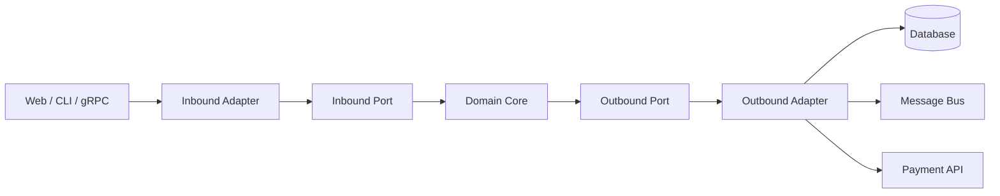

# Hexagonal architecture

> **Learning Path:** Architect's Developer Foundation
> **Section:** 1.3.3 — 3. Application architecture

**Hexagonal architecture**

### The problem

You have a working domain model for orders, payments, inventory. Over time it accumulates direct calls to `HttpServletRequest`, JPA repositories, Kafka producers, and a Stripe SDK. 

The constraint is not the code, it's change. You need to:
* test business rules without a database or HTTP server
* swap Postgres for a test double in CI
* expose the same logic via REST, gRPC, and a CLI
* replace Stripe with Adyen without touching domain rules

Layered architecture helps, but the domain still knows about the delivery mechanism. The problem is coupling direction: business logic depends on frameworks, not the other way around.

### Mental model

Think of the application as a hexagon. The business logic is the core. Everything outside is the environment.

Ports are the contracts the core uses to talk to the world. Adapters are the concrete implementations that plug into those ports.

The rule: core knows only about ports, never about adapters. Adapters depend on core, not vice versa.

Inbound ports = use cases: `CreateOrder`. Outbound ports = capabilities the core needs: `SendEvent`, `PersistOrder`, `ChargeCard`.

### How it works

1. **Domain core is pure.** Entities, value objects, domain services. No framework imports, no I/O.
2. **Ports are interfaces owned by core.** An outbound port is an interface like `OrderRepository`. An inbound port is an interface like `OrderApplicationService` that defines use cases.
3. **Adapters implement ports.** `JpaOrderRepository` implements `OrderRepository`. `RestOrderController` implements `OrderApplicationService`. Adapters handle translation: HTTP <-> DTO, DB <-> entity, SDK <-> domain model.
4. Dependency direction is enforced: Adapters -> Ports -> Core. Core has no dependency on the outside.

Testing becomes trivial: you can drive the core via its inbound port with in-memory fakes for outbound ports.

### Architectural reasoning

When it helps:
* Business logic is valuable and long-lived, delivery mechanisms are volatile.
* You need the same logic in multiple contexts: API, worker, batch.
* You want fast unit tests for domain rules without infrastructure.

Alternatives:
* **Layered / onion**: still tends to leak framework concerns into the inner layers. Hexagonal is stricter about dependency direction.
* **Clean architecture**: same idea, different packaging. Hexagonal is the implementation pattern.

Why choose it: it makes the *what* independent from the *how*. Changing transport, persistence, or third-party SDKs is an adapter change, not a core change.

### Trade-offs and failure modes

* **Indirection cost.** Every interaction crosses a port. For CRUD apps this is boilerplate with little value.
* **Over-abstraction.** Teams create ports for everything. You end up with `UserRepositoryPort`, `UserRepositoryAdapter`, `UserRepositoryImpl` for no reason.
* **Leakage.** Business rules creep into adapters. The tell is an adapter importing domain entities and mutating them.
* **Anemic domain.** If ports are just CRUD, you have a data pipe, not hexagonal architecture. The core must contain behavior.

The failure mode to watch: adapters become the real logic, core becomes anemic DTOs. That inverts the intent.

### Example

Payment service.

Core: `Order` aggregate with `canBePaid`, `applyPayment`. Ports: `PaymentGateway` outbound, `OrderPlaced` inbound event.

Adapters:
* Inbound: REST controller receives `POST /orders/{id}/pay`, maps to `PayOrder` use case, calls core.
* Outbound: `StripeAdapter` implements `PaymentGateway`. `OutboxAdapter` implements `DomainEventPublisher`.

You can test `PayOrder` by injecting a fake `PaymentGateway` that always succeeds/fails. You can replace Stripe with Adyen by writing a new adapter. The core never changes.

### Reasoning challenge

You inherit a monolith where `OrderService` directly calls Spring Data JPA, sends emails via JavaMail, and publishes to Kafka. New requirement: run the same order validation in a serverless function with no DB access, using DynamoDB instead of Postgres.

Do you refactor to hexagonal now, or write a thin wrapper around the existing service? What do you put in the core vs adapter, and what is the minimum viable port surface to unblock the serverless path?

### Key takeaway

* Isolate business logic from frameworks via ports and adapters; dependency points inward.
* Ports define the contract, adapters implement the environment. Core never knows about adapters.
* Choose it when domain stability > delivery volatility and you need testability and replaceability.
* Avoid it when it adds indirection without change risk; keep core rich, adapters thin.
