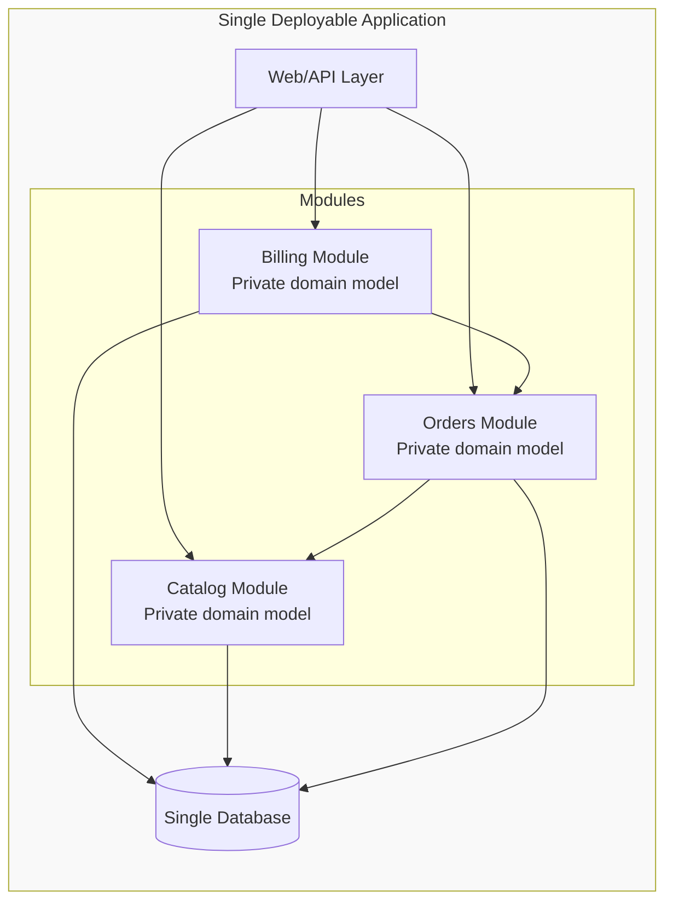

# Modular monolith

> **Learning Path:** Architect's Developer Foundation
> **Section:** 1.3.5 — 3. Application architecture

**The problem**

A successful application grows. A simple layered monolith works until the code base becomes a big ball of mud: changes in one feature break unrelated features, tests take minutes, onboarding is slow, and the team is constantly coordinating.

Microservices solve the coupling problem, but introduce new constraints: network latency, distributed transactions, independent deploy pipelines, observability, and a team that can operate them. For many products the operational cost is higher than the coupling cost.

Modular monolith is the answer when you need *logical separation without physical distribution*.

### Mental model

Think of a city with districts, not independent cities.

A modular monolith is one deployable application with enforced internal boundaries. Each module is a cohesive business capability with a private implementation and a published API. Modules can call each other, but only through well-defined interfaces, and dependencies are one-directional.

You get the developer experience of a monolith — one repo, one database, one deploy — with the architectural clarity of services.

No network calls between modules. Just in-process calls across module boundaries.

### How it works

Separation is enforced, not suggested.

* **Module boundary:** Each module has its own folder, domain model, and tests. Public API is explicit, internal code is private.
* **Dependency rules:** Tools like ArchUnit, import-linter, or a custom build check forbid cross-module imports except via the public API. No direct access to another module's internals.
* **Shared kernel minimal:** Common types live in a thin `common` module. No shared database tables, no direct entity access.
* **Single deploy unit:** One build artifact, one runtime, one database. Transactions stay local.

The key is discipline. The compiler won't stop you from cheating; the architecture tests will.

### Architectural reasoning

When it helps:
* Team size 5-20, one product, moderate complexity. You need faster delivery than microservices allow.
* You want to evolve toward microservices later without a rewrite. Modules are the natural extraction points.
* Operational maturity is low. You don't want to run 20 services on day one.

What it solves:
* Cognitive load. Developers work inside one module.
* Coupling. Changes are localized by boundary enforcement.
* Deployment risk. One atomic deploy with transactional consistency.

Alternatives:
* **Layered monolith:** Faster initially, collapses into a big ball of mud.
* **Microservices:** True physical isolation and independent scaling, at the cost of complexity.
* **Distributed monolith:** Microservices that share a database or synchronous calls — the worst of both.

Choose modular monolith when you need *organizational and logical boundaries now, and physical boundaries maybe later*.

### Trade-offs and failure modes

* **Scale is vertical.** You cannot scale Billing independently of Catalog. If one module is hot, you scale the whole app.
* **Boundary leakage is the failure mode.** Without enforcement, modules become coupled through shared entities, direct DB access, or circular dependencies. It silently becomes a monolith again.
* **Database coupling.** One database means schema changes affect all modules. Use module-private tables and anti-corruption layers for reads.
* **Blast radius.** A bug in one module can bring down the whole process. Good observability and module-level isolation in code mitigate but don't eliminate this.

The most important trade-off: simplicity of operations vs independence of scale and failure domains.

### Example

E-commerce platform.

Modules: Catalog, Orders, Inventory, Billing, Notifications.

Orders depends on Catalog for product validation and Inventory for stock reservation, but never accesses Catalog's database tables directly. It calls `catalog.getProduct(id)` and `inventory.reserve(sku, qty)`.

When the team grows, the Billing module can be extracted to a separate service with its own DB, because its public API and dependencies are already isolated. The rest of the app keeps working.

### Reasoning challenge

You have a 15-person team building a SaaS product. Monthly releases are fine today, but the Sales team wants Billing to scale independently next year because of heavy month-end processing. The rest of the product is relatively steady.

Do you start with microservices for Billing now, or build a modular monolith with a clean Billing module boundary? What do you monitor to know when extraction is justified?

### Key takeaway

* Modular monolith = one deployable app with enforced internal module boundaries.
* It trades physical independence for operational simplicity and faster delivery.
* Success depends on architectural tests that enforce dependency rules and module APIs.
* Design modules as future services. If you can't extract a module cleanly, the boundary is wrong.
* Extract to microservices only when you have proven need for independent deploy cadence, scaling, or team ownership — not as a default.
