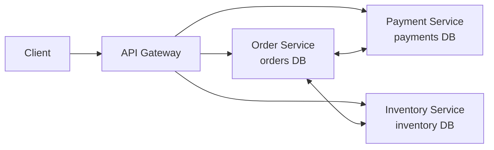

# Microservices

> **Learning Path:** Architect's Developer Foundation
> **Section:** 1.3.6 — 3. Application architecture

**The problem**

A monolith works until it doesn't. One deployable unit, one database, one team bottleneck.

Constraints appear:
* **Scale unevenly.** Checkout is hot at Black Friday, product catalog is not. You scale the whole monolith anyway.
* **Team scales poorly.** 50 engineers touching same repo = merge conflicts, risky deploys, slow feedback.
* **Change coupling.** A small pricing tweak requires testing and releasing billing, search, and UI together.
* **Technology lock-in.** One stack for everything, even when a different data model or language fits better.

You need independent deploy velocity and bounded scaling without rewriting everything.

**Mental model**

Microservices = a system composed of small, independently deployable services, each owning a business capability and its data, communicating over a network.

Think of it as Conway's Law made explicit: services map to teams, and teams own the lifecycle of their service.

Not "many services". It's services with clear boundaries.

**How it works**

Each service:
* Owns a bounded context and its data store. No shared DB.
* Exposes a stable interface, typically HTTP/gRPC.
* Is independently versioned and deployed.
* Is designed to fail independently.

The gateway is optional. The key is network boundaries replace in-process calls. Coordination happens via synchronous calls or asynchronous events.

**Architectural reasoning**

Microservices help when you need:
* **Organizational scale.** Teams can ship independently on their own cadence.
* **Heterogeneous scale.** Scale order service to 100 pods, catalog to 10.
* **Domain isolation.** Different business domains evolve at different rates.

Alternatives:
* **Modular monolith.** Clear module boundaries, one deployable. Gives most of the code organization benefits with far less operational complexity.
* **Service-oriented architecture / distributed monolith.** Looser coupling but often still shared data and tight coordination.

Choose microservices when the organizational and scaling constraints outweigh the operational cost. Choose modular monolith when you need faster delivery and simpler operations now.

**Trade-offs and failure modes**

* **Distributed complexity.** Network is unreliable. You trade simple function calls for latency, timeouts, retries, and partial failure.
* **Data consistency.** No ACID across services. You move to eventual consistency, sagas, outbox pattern. This is the hardest mental shift.
* **Observability cost.** You need tracing, metrics, logs correlated across services. Local debugging is gone.
* **Operational overhead.** Deploy pipelines, service mesh, discovery, secret management, resilience patterns.
* **Failure modes.** Cascading failures, thundering herd on retries, version skew, data drift between services.

Common anti-pattern: distributed monolith. Services chat synchronously in a tight loop, share a database, and deploy together. You get all the downsides, none of the benefits.

**Example**

E-commerce platform.

Order Service owns orders. Payment Service owns payments. Inventory Service owns stock.

Checkout flow:
1. Client -> API Gateway -> Order Service creates order in `pending`.
2. Order Service emits `OrderCreated` event.
3. Payment Service consumes event, charges card, emits `PaymentSucceeded`.
4. Order Service updates order, emits `OrderPaid`.
5. Inventory Service reserves stock.

If payment fails, Order Service compensates via saga. Each service can be written in different languages, scaled independently, and deployed by separate teams without coordinating a big release.

**Reasoning challenge**

You have a 5-year-old monolith, 3 teams, 2-week release cadence, and occasional outages during peak. Leadership wants microservices for "scalability and speed".

What do you ask before deciding? What is the real constraint: deployment frequency, scaling hot paths, team autonomy, or technology diversity? If you split now, what is the first bounded context you would extract and why?

**Key takeaway**

* Microservices solve organizational and scaling coupling, not just technical scaling.
* The boundary is the hard part: data ownership and consistency model.
* Start with a modular monolith; split when the cost of coupling is measurable.
* Distributed systems cost is operational: resilience, observability, and eventual consistency are mandatory, not optional.
