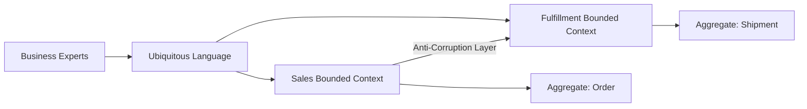

# Domain-Driven Design

> **Learning Path:** Architect's Developer Foundation
> **Section:** 1.3.7 — 3. Application architecture

**The problem**

When a domain is simple, CRUD maps to the business. When it gets complex — banking, insurance, logistics, trading — the code becomes a mirror of the database, not the business.

Developers use different words than business people. `Customer` means one thing in Sales and another in Support. Rules leak into controllers, services, and UI. The model becomes anemic: data bags with logic scattered everywhere. New features break old invariants because no one owns the concept.

The constraint is not technical, it is cognitive. You cannot fit a complex domain into one consistent model across a large team.

**Mental model**

Domain-Driven Design is modeling the software around the domain, not around tables or frameworks.

Think of the domain as a territory. DDD draws borders around places where a single, coherent language can be maintained. Inside a border, the model is rich and behavior-rich. Between borders, translation happens.

Ubiquitous Language is the shared vocabulary between developers and domain experts. Bounded Context is the border where that language is valid.

**How it works**

The essential mechanisms:

* **Ubiquitous Language.** One name = one meaning. If the business says `Order` means a legally binding commitment, code uses that meaning everywhere in that context.
* **Bounded Context.** A boundary with its own model. Sales, Fulfillment, Billing can each have an `Order` with different invariants.
* **Aggregate.** A cluster of entities and value objects with a single root that enforces invariants. All changes go through the root. Example: `MoneyTransfer` aggregate enforces `debit <= balance` and `currency matches`.
* **Translation layer.** Anti-Corruption Layer prevents one context's model from corrupting another.

Application services orchestrate use cases; domain services and repositories are implementation details. The domain model contains behavior, not just data.

**Architectural reasoning**

When it helps:
* Complex business rules that change often and must be correct.
* Large teams working on the same domain for months/years.
* Need for a shared mental model between tech and business.

It solves: divergence between business reality and code, anemic models, uncontrolled coupling across teams.

Alternatives:
* CRUD / Transaction Script. Fast to start, collapses under complexity.
* Anemic Domain Model. Easy to serialize, logic leaks to services.
* Single unified domain model. Works for small teams, fails at scale.

Choose DDD when the cost of misunderstanding the domain exceeds the cost of modeling it.

**Trade-offs and failure modes**

* Modeling cost is up front. You pay in design time to save in change cost later.
* Learning curve. Teams must learn to think in terms of invariants and boundaries.
* Over-modeling. Not every app needs aggregates. Internal tools and simple CRUD benefit more from speed.
* Failure modes to watch: Leaky bounded contexts — same name, different meaning with no translation. Big ball of mud context — one ubiquitous language that is actually 5. Anemic domain — entities are DTOs, logic lives in services.

**Example**

A bank transfer. In the Payments context, `Transfer` means debit source, credit destination, and finality rules. In the Accounting context, `Transfer` means journal entries with audit trail.

Two bounded contexts. Each has its own aggregate and ubiquitous language. An Anti-Corruption Layer translates a completed `Transfer` event from Payments into `JournalEntry` commands for Accounting. The invariant `balance >= 0` is enforced only inside the Payments aggregate, not duplicated.

**Reasoning challenge**

Your e-commerce platform has a Pricing team and a Promotions team. Pricing defines `Price` as base price + tax. Promotions defines `Price` as base price - discount + tax. Both teams ship independently.

Do you merge them into one `Price` model, keep two models with translation, or create a shared library? What breaks if you choose wrong?

**Key takeaway**

* Model the domain, not the database. Behavior lives in the domain.
* Ubiquitous Language reduces miscommunication between business and code.
* Bounded Contexts let teams scale without forcing one model everywhere.
* Aggregates protect invariants; use them as consistency boundaries.
* Pay modeling cost only where complexity and longevity justify it.
