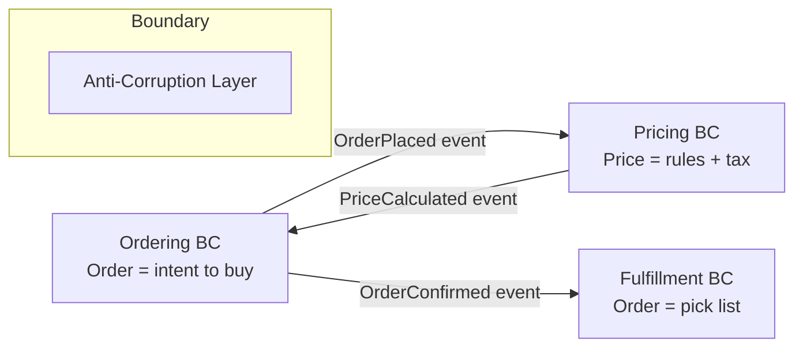

# Bounded contexts

> **Learning Path:** Architect's Developer Foundation
> **Section:** 1.3.8 — 3. Application architecture

### The problem

A growing domain model stops being shared. The same word means different things to different teams, and a single ubiquitous language collapses.

In a monolith, `Order` is one entity. With scale you get:
* The sales team cares about `Order` as a quote with discount rules and tax.
* The warehouse team cares about `Order` as pickable lines with weight and location.
* Finance cares about `Order` as an invoiceable document with audit trail.

If you force one model, you get either:
* A god model with nullable fields for every use case, or
* Constant merge conflicts and coupling as teams change the model for their own needs.

The constraint is organizational and linguistic: teams move at different speeds, own different subdomains, and need autonomy without breaking each other.

### Mental model

A bounded context is a boundary inside which a particular model and ubiquitous language are valid and consistent.

Think of it as a translation zone. Inside the boundary, terms have one meaning and one model. At the boundary, you explicitly translate.

It is not a service boundary, nor a module. It is a *semantic* boundary.

### How it works

A bounded context defines:
* **A subdomain** it owns, e.g. Ordering, Pricing, Fulfillment
* **A model** that is authoritative for that subdomain
* **A ubiquitous language** used by the team inside the boundary
* **Explicit interfaces** to other contexts: events, APIs, anti-corruption layers

Contexts interact only through contracts, never by sharing internal models.

The anti-corruption layer prevents leakage of one context's model into another.

### Architectural reasoning

Bounded contexts help when:
* The domain is large and has multiple subdomains with different rate of change
* Teams are organized around business capabilities
* Different parts of the system require different consistency and data stores

Alternatives:
* **Shared kernel**: small shared model for tightly coupled teams. Works for a short time, then drifts.
* **One big model**: works for small domains, fails under organizational scale.
* **Full service isolation**: services without semantic boundaries just push coupling to integration.

Choose bounded contexts when you need independent evolution of models and teams, and can pay for translation overhead.

### Trade-offs and failure modes

* **Translation cost.** Every cross-context interaction requires mapping. Do it implicitly and you get subtle bugs.
* **Duplication.** Same concept, e.g. Customer, exists in multiple contexts with different shape. That's intentional, but must be managed.
* **Context explosion.** Creating a context for every microservice. Contexts should map to business capabilities, not deployment units.
* **Leaky boundaries.** Reusing DB tables or internal libraries across contexts creates hidden coupling. The model looks separate but isn't.
* **Integration latency.** Eventual consistency between contexts is normal. If you need strong consistency across contexts, you probably have one context.

### Example

E-commerce platform.

**Ordering BC**: `Order` = customer intent, items, status = draft/pending/confirmed. Owns checkout flow. Uses Postgres.

**Pricing BC**: `Quote` = base price, promotions, tax jurisdiction. Owns pricing rules. Can be updated daily without redeploying Ordering.

**Fulfillment BC**: `Shipment` = pickable units, warehouse location, carrier. Owns picking.

Ordering publishes `OrderPlaced`. Pricing consumes it, emits `PriceCalculated`. Ordering applies it, then emits `OrderConfirmed`. Fulfillment consumes that.

If Pricing changes its discount model, only Pricing and the translation layer change. Ordering and Fulfillment are unaffected.

### Reasoning challenge

You have a single `User` entity used by Authentication, Billing, and Recommendations. 
* Auth needs email + password hash, fast reads.
* Billing needs legal name, tax ID, billing address, immutable audit.
* Recommendations needs pseudonymous ID and behavior profile, high write volume.

Do you keep one User model, split into three bounded contexts, or something else? What are the failure modes of each choice and where would you place the anti-corruption layer?

### Key takeaway

* Bounded contexts exist to contain meaning, not just code. They protect a team's model and language from erosion.
* Boundaries are semantic first, technical second. They enable independent evolution of subdomains.
* Cross-context integration is explicit translation, not shared models. Expect duplication and eventual consistency.
* Choose them when organizational scale and model divergence outweigh translation overhead.
