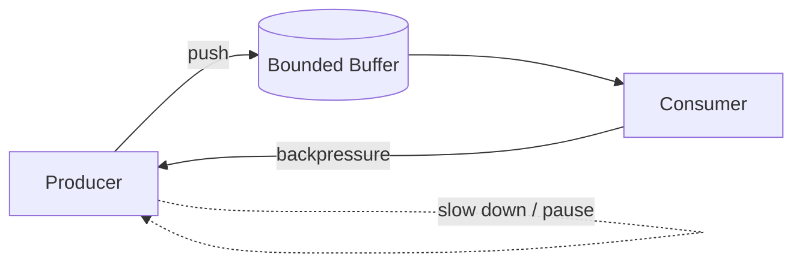

# Backpressure

> **Learning Path:** Distributed Systems
> **Section:** 2.1.10 — Core concepts

**Backpressure**

### 1. The problem

A fast producer sends work faster than a slow consumer can process it.

Without a control signal, one of three things happens:
* The consumer falls behind and the queue grows without bound → OOM / latency explosion
* The producer keeps pushing and the consumer is overwhelmed → errors, timeouts, data loss
* The system crashes and takes downstream services with it

The problem is not speed. It's a mismatch in rate between components in a pipeline. In distributed systems that mismatch is normal and permanent.

### 2. Mental model

Backpressure is a feedback signal from consumer to producer: *slow down, I can't keep up*.

Think of a water pipe with a narrow section. If the pump keeps pushing at full pressure, the pipe bursts. A pressure valve lets the downstream constrain the upstream.

In software: producer → channel/queue → consumer. Backpressure is the valve.

### 3. How it works

There are four basic mechanisms, often combined:

**Buffer then block/drop.** A bounded buffer absorbs bursts. When full, the producer must wait or the message is dropped/rejected.

**Pull-based flow control.** Consumer requests work when ready. Producer only sends on demand. This is credit-based flow control.

**Push with signalling.** Producer pushes, consumer sends backpressure signal: pause, reduce rate, or NACK. Reactive Streams uses `request(n)` for this.

**Rate limiting / shedding.** Producer caps its own output rate to the sustainable consumption rate.

The key is the feedback loop, not the specific implementation.

### 4. Architectural reasoning

Backpressure solves overload propagation.

When it helps:
* Producer and consumer are decoupled by network, queue, or service boundary
* Processing times vary and are non-deterministic
* You need durability over availability for the stream, or you need to protect a slow downstream

Alternatives and why you might not use them:
* **Unbounded buffer.** Simple, but hides the problem until it OOMs. Good for short-lived batch jobs, dangerous in services.
* **Drop on overflow.** Acceptable for telemetry/metrics where latest value matters more than completeness. Unacceptable for payments.
* **Synchronous blocking.** Couples fate; a slow consumer stalls the producer thread and can exhaust thread pools.

Decision rule: If the consumer is a scarce resource, let it control ingress. If the producer is the bottleneck, push is fine.

### 5. Trade-offs and failure modes

* **Latency vs throughput vs memory.** Buffering smooths bursts but adds latency and memory pressure. No buffer means low latency but high loss under load.
* **Blocking vs non-blocking.** Blocking preserves messages but can cause thread starvation and cascading latency. Non-blocking shedding preserves responsiveness but loses work.
* **Head-of-line blocking.** One slow consumer can stall a shared queue. Isolate with per-consumer partitions or separate queues.
* **Feedback loop instability.** Aggressive backpressure can cause oscillations: producer pauses → consumer drains → producer bursts → buffer fills again. Need smoothing, e.g., exponential backoff or token buckets.
* **Operational blindness.** Backpressure is invisible until it fails. You need metrics: queue depth, consumer lag, rejection rate, and producer rate.

### 6. Example

Order ingestion service → Kafka → Payment processor.

During peak, ingestion spikes to 10k orders/sec. Payment processor can sustain 2k/sec due to 3rd-party API limits.

Without backpressure, the Kafka topic grows unbounded, consumer lag grows, memory and cost rise, and eventually brokers OOM.

With backpressure: the payment processor reads in batches and uses `request(n)` to limit pull rate. When its internal processing queue reaches a high watermark, it stops polling Kafka. The ingestion service sees consumer lag rise and can shed non-critical events or apply client-side rate limiting. The system stays stable, latency stays bounded, and no data is lost.

If the business prefers availability over completeness for a specific stream, you can configure drop-oldest for that stream only, while keeping backpressure for payment events.

### 7. Reasoning challenge

You have a real-time fraud detection pipeline. Ingest service receives events at variable rate. Feature store lookup is 50ms p95 and can spike under load. You can buffer events in memory for up to 1 second.

Do you:
A. Allow unbounded in-memory buffer and backpressure the ingest service via blocking HTTP 429 when buffer is full
B. Use a bounded buffer and drop events when full
C. Add a separate queue with a dedicated consumer pool and let the queue grow

What matters most: detection latency SLA, false negative cost, and downstream cost. Which choice would you make and what metric would you alert on?

### 8. Key takeaway

* Backpressure is rate control from consumer to producer to prevent overload.
* Choose a mechanism based on what you can afford to lose: latency, throughput, or data.
* Bounded buffers + explicit feedback are safer than unbounded buffers.
* Monitor lag, queue depth, and rejection rate; backpressure failures are silent until they cascade.
