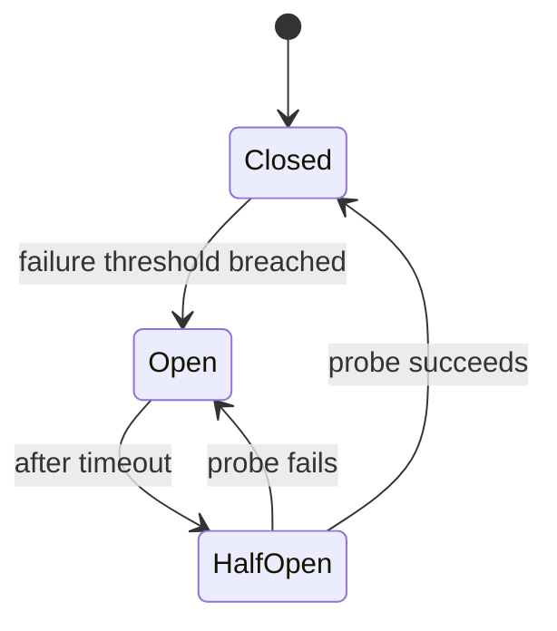

# Circuit breakers

> **Learning Path:** Distributed Systems
> **Section:** 2.1.11 — Core concepts

**Circuit breakers**

### 1. The problem

In a distributed system, Service A calls Service B. B becomes slow or starts erroring.

Without protection, A keeps sending requests. Threads in A block waiting for B. Connection pools fill. Latency rises. CPU is wasted on retries. Eventually A fails even though its own logic is fine.

This is cascading failure: a local fault becomes a system-wide outage because the caller never stops hammering the failing callee.

The constraint is not just reliability, it's resource containment. A has finite threads, connections, and latency budget. It cannot afford to wait indefinitely for B.

### 2. Mental model

An electrical circuit breaker stops current when a fault is detected to prevent fire. A software circuit breaker stops calls when a downstream dependency is unhealthy to prevent resource exhaustion.

It trades a controlled, fast failure for an uncontrolled slow death.

### 3. How it works

Three states, one threshold.

* **Closed:** Calls pass through. Failures are counted in a rolling window.
* **Open:** Calls are rejected immediately with a fallback/error. No traffic reaches B. This gives B time to recover and protects A's resources.
* **Half-Open:** After a timeout, a limited probe request is allowed. If it succeeds, the breaker closes. If it fails, it reopens.

The essential knobs are: failure threshold, volume threshold, window duration, and reset timeout. You need enough volume before you declare a failure, otherwise one blip trips the breaker.

### 4. Architectural reasoning

Use it when you have a synchronous dependency with limited resources and a cost to waiting.

It solves: thread pool exhaustion, latency amplification, retry storms, and cascading failures.

Alternatives and when they differ:
* **Timeouts** are mandatory but not sufficient. A timeout makes a slow call fail fast once, but repeated calls still pile up.
* **Retries with backoff** help transient errors but worsen overload if the service is down.
* **Bulkheads** isolate resources per dependency. Circuit breakers isolate at the call level. They compose well.
* **Rate limiting** protects the downstream. Circuit breaker protects the upstream.

Choose a circuit breaker when you can tolerate degraded behavior over total failure, and when the downstream has a non-zero recovery time.

### 5. Trade-offs and failure modes

* **False positives.** A brief spike trips the breaker and causes a self-inflicted outage. Requires tuning volume and window.
* **Masking.** Open state hides real problems. If the breaker stays open too long, you lose visibility. Need alerting on state changes.
* **Thundering herd on half-open.** If many instances probe at once, you can overload the recovering service. Probe rate must be limited.
* **State scope.** Per-instance state is simple but inconsistent across a fleet. Shared state is more accurate but adds a coordination dependency.
* **Fallback quality.** A circuit breaker forces you to define what "degraded" means. A bad fallback is worse than a slow call.

### 6. Example

Order service → Payment gateway.

Normal flow: Order calls Payment with 2s timeout. Circuit breaker configured: 50% errors in 60s window with minimum 20 calls trips open for 30s.

Gateway has a partial outage. Error rate climbs to 70%. Breaker opens. New orders immediately return `503 Payment unavailable, try later` and trigger a local fallback: queue order for async retry.

Order service stays responsive. Its thread pool stays healthy. Once the 30s reset passes, a single probe succeeds, breaker closes, traffic resumes gradually.

Without the breaker, Order threads would block on 2s timeouts, queue would grow, and Order itself would become unavailable despite its own health.

### 7. Reasoning challenge

You have a user profile read path with 99th percentile SLO of 200ms. The profile service is read-heavy, eventually consistent, and can be served from cache. It occasionally has latency spikes to 1s during deploys.

Do you put a circuit breaker on this read call? If yes, what fallback makes sense and what threshold would you avoid? If no, what protects you instead?

### 8. Key takeaway

* Circuit breakers exist to contain failure, not fix it. They buy time for recovery by failing fast.
* They are about resource protection in the caller, not healing the callee.
* Tuning is architectural: thresholds determine how quickly you degrade and how often you flail.
* Always pair with a meaningful fallback and observability on state transitions.
