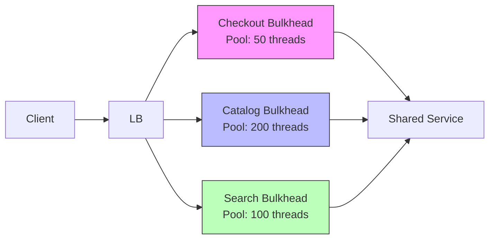

# Bulkheads

> **Learning Path:** Distributed Systems
> **Section:** 2.1.12 — Core concepts

### 1. The problem

A single shared resource will be exhausted by the fastest or loudest consumer.

In a distributed system you have multiple workloads sharing the same runtime: threads, connections, CPU, memory, disk I/O. Without boundaries, one workload spikes and consumes everything.

* A slow downstream API starts timing out, threads block waiting for it.
* A traffic spike on the catalog service starves the checkout service.
* A buggy batch job opens too many DB connections and kills the rest of the app.

The result is not just degraded performance for the noisy workload. It is **cascading failure**: one failure domain takes down unrelated domains because they share the same pool.

You need isolation, not just more capacity.

### 2. Mental model

A bulkhead is a physical compartment wall.

On a ship, bulkheads prevent a breach in one compartment from sinking the whole ship. In software, a bulkhead is an explicit boundary that isolates a failure domain so it can fail on its own without taking others with it.

Isolation is intentional fragmentation of resources: separate pools per workload, per tenant, per dependency.

### 3. How it works

Bulkheading is resource partitioning with enforced limits.

Instead of one global thread pool, connection pool, queue, or rate limit, you create multiple isolated partitions:

* **Thread / coroutine bulkhead:** separate executor pools per endpoint or dependency. Checkout gets its own pool, catalog gets its own.
* **Connection bulkhead:** separate DB connection pools per service or query class.
* **Request bulkhead:** separate rate limits / concurrency limits per customer tier or API route.
* **Circuit breaker + bulkhead:** bulkhead limits the blast radius, circuit breaker stops calls to a failing dependency.

The essential mechanism is **quota and rejection at the boundary**. When a bulkhead is saturated, it rejects or queues work locally instead of borrowing from neighbors.

A spike in Catalog can fill its 200 threads, but Checkout's 50 threads remain available.

### 4. Architectural reasoning

**When it helps**
* Multiple workloads share the same process / host / cluster and have different SLOs.
* You have known failure domains: external APIs, DBs, tenants.
* You need to protect critical paths from non-critical paths.

**What it solves**
* Prevents noisy neighbor.
* Contains latency and failure propagation.
* Makes capacity planning and SLOs observable per domain.

**Alternatives**
* Scale out globally: more capacity helps but does not prevent sharing. One spike still consumes all.
* Priority queues: helps ordering but does not stop starvation if the queue is unbounded.
* Timeouts / retries alone: reduces duration of harm but does not prevent resource exhaustion.

Choose bulkheads when you need *hard* isolation, not best-effort fairness.

### 5. Trade-offs and failure modes

* **Complexity and overhead.** More pools = more tuning, more metrics, more operational surface. Each bulkhead needs its own limits and alerting.
* **Resource fragmentation.** Partitioning means you can have idle capacity in one bulkhead while another is overloaded. You trade utilization for isolation.
* **Wrong sizing.** Too small = unnecessary rejections. Too large = no protection. Sizing requires load testing and SLO knowledge.
* **False sense of safety.** Bulkheads isolate threads but not shared downstream systems. If all bulkheads hit the same DB, you still have a shared bottleneck. Bulkheads must be placed at each dependency boundary.

Failure mode to watch: bulkhead saturation causes rapid rejections. Without backpressure and shedding policy, you get thundering herd or client retries amplifying the problem.

### 6. Example

E-commerce platform during a flash sale.

Checkout, catalog browsing, and recommendation are served by the same API fleet.

Without bulkheads, a recommendation service slowdown consumes all request threads. Checkout latency spikes, orders drop.

With bulkheads:
* Checkout gets dedicated thread pool 50, DB connections 20, strict timeout 500ms.
* Catalog gets pool 200, connections 80.
* Recommendations get pool 100 with circuit breaker to external ML service.

A recommendation outage exhausts only its bulkhead. Checkout continues to meet its SLO. The failure is observable and contained.

### 7. Reasoning challenge

You have a single API gateway handling two tenants on the same cluster: Tenant A is free tier with best-effort SLO, Tenant B is paid tier with 99.9% latency SLO.

Traffic from Tenant A spikes 10x. Do you:
A) Add more replicas for the whole service
B) Create a bulkhead per tenant with separate concurrency limits and queue
C) Increase global timeouts

Which protects Tenant B and why? What is the cost of your choice?

### 8. Key takeaway

* Bulkheads exist to **contain failure and prevent noisy neighbor** by isolating resources per workload, dependency, or tenant.
* Isolation is achieved via separate pools, limits, and explicit rejection at boundaries.
* Use bulkheads when SLOs differ and workloads share infrastructure; do not use them as a substitute for fixing the bottleneck.
* Key trade-offs: safety vs utilization, operational complexity vs cascading failure risk, local rejection vs global overload.
