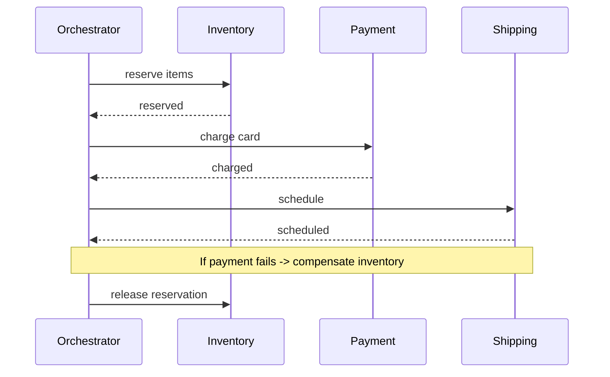

# Distributed transactions

> **Learning Path:** Distributed Systems
> **Section:** 2.1.14 — Core concepts

**Distributed transactions**

### 1. The problem

A single database transaction gives you atomicity: debit account A and credit account B either both happen or neither happens. That guarantee breaks when the two accounts live in different services with different databases.

You get a new constraint: **network boundaries**. There is no shared lock manager, no single log, and the network can partition or delay. You still need business-level atomicity — e.g. create order + reserve inventory + charge payment — but you cannot hold locks across services for seconds.

The problem is not "how to make a distributed lock". It is: *how to keep multiple local transactions consistent when you cannot make them one local transaction.*

### 2. Mental model

Think of it as coordinating independent actors who each commit locally, but the business operation must appear all-or-nothing.

You have two broad ways to think about it:
* **All-or-nothing now**: try to enforce atomic commit across services. Expensive and brittle.
* **All-or-nothing eventually**: make each step local and reversible, and define a compensation path for failures.

Distributed transactions are the set of patterns for getting the second one right.

### 3. How it works

**2PC, the classic approach.** Coordinator asks all participants to *prepare*, then *commit* or *abort*. It gives strong atomicity but requires all participants to stay available and locks resources until the decision. In microservices it creates a distributed lock and a single point of failure.

**Saga, the practical approach.** Break the business operation into a sequence of local transactions, each with a compensating action.

Choreography uses domain events between services. Orchestration uses a central coordinator. Both rely on idempotency and outbox pattern to avoid lost messages:

Service writes business event to its DB + outbox table in same local transaction, relay publishes it. This guarantees at-least-once delivery without dual writes.

### 4. Architectural reasoning

Use a distributed transaction pattern when:
* The business invariant spans >1 service/DB
* You can tolerate a short window of inconsistency
* Availability and partition tolerance matter more than immediate atomicity

Alternatives:
* **Monolith / shared DB**: gives ACID, kills scale and team autonomy.
* **Eventual consistency without compensation**: risks unrecoverable partial state.
* **Saga**: keeps services autonomous, embraces failure as normal.

Choose Saga when operations are long-running, involve human steps, or cross organizational boundaries. Choose 2PC only for short, critical, low-latency operations within a trusted cluster where you control all participants — e.g. internal storage systems.

### 5. Trade-offs and failure modes

* **Consistency vs availability.** Strong atomicity requires blocking and coordination. Saga gives availability at cost of temporary inconsistency.
* **Complexity moves to application.** You must design compensations for every step. What does "undo charge" mean? Some actions are not perfectly reversible — that is the real design constraint.
* **Failure modes you must handle:** duplicate messages, out-of-order events, compensation failure, long-running sagas leaving resources reserved.
* **Observability.** You need saga tracking, state visibility, and ability to manually intervene when automation can't compensate.

General principle: never assume a remote call succeeds. Design each step to be idempotent and each saga to be recoverable.

### 6. Example

E-commerce order placement:
1. Order service creates order `PENDING`
2. Inventory service reserves stock, emits `StockReserved`
3. Payment service charges card, emits `PaymentCaptured`
4. Shipping service schedules delivery

If payment fails, orchestrator triggers compensations: `ReleaseStock`. Customers see order failed, inventory is freed. The system is eventually consistent and never leaves money taken without stock.

### 7. Reasoning challenge

You need to transfer funds between two banks in different regions. The transfer must not be lost, and double credit must be impossible. Latency budget is <2s, and network partitions happen weekly.

Would you use 2PC, choreographed saga, or orchestrated saga? What is your failure window and how do you make compensation safe?

### 8. Key takeaway

* Distributed transactions exist because ACID does not cross network boundaries for free.
* Strong atomicity requires coordination and hurts availability; eventual atomicity via Saga trades immediate consistency for autonomy.
* Design for local transactions + compensations + reliable outbox delivery, not for distributed locks.
* The decision is about business risk tolerance for inconsistency windows, not about technology preference.
