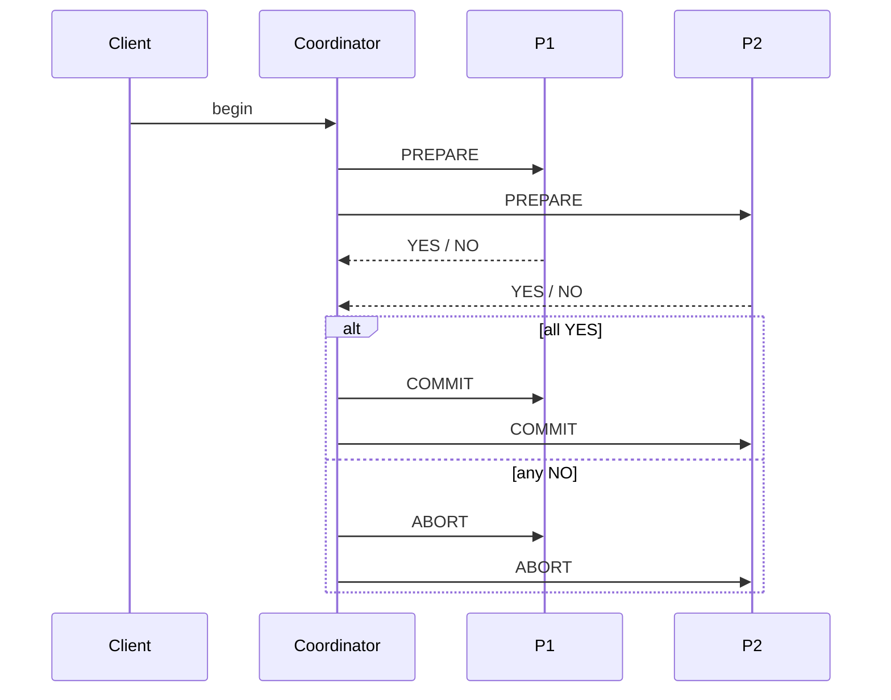

# Two-phase commit

> **Learning Path:** Distributed Systems
> **Section:** 2.1.15 — Core concepts

**Two-phase commit**

### 1. The problem
You need one logical transaction to atomically update two or more independent resources that cannot share a lock.

Example: debit account A in DB1 and credit account B in DB2. If the network drops after one write, you have money created or destroyed.

The constraint is distribution: no single writer, no shared storage, network is unreliable and participants can crash independently. You want all-or-nothing, not best effort.

### 2. Mental model
A coordinator acts as a wedding planner for a group reservation.

Phase 1 - Prepare: planner asks every venue “can you hold this date, and will you definitely hold it if I say go?” No one books yet, just votes.
Phase 2 - Commit/Abort: planner tells everyone the final decision. Once told, everyone commits to the same outcome.

Everyone must agree before anyone makes it irreversible.

### 3. How it works
Coordinator + N participants.

**Prepare:** Coordinator writes intent, participants lock resources and decide if they can commit. Vote YES if ready, NO if error.
**Commit/Abort:** If all YES, coordinator issues COMMIT. Participants make changes durable and release locks. If any NO or timeout, coordinator issues ABORT.

Participants must be able to persist their vote so they can recover after a crash.

### 4. Architectural reasoning
Use 2PC when you need strong atomicity across a small, bounded set of resources and can tolerate blocking.

It solves: distributed atomic commit without a shared database.
Alternatives:
* **Best effort / 1PC:** write one side, hope the other succeeds. Cheap, fast, inconsistent.
* **Saga:** local transactions with compensating actions. Available and partition-tolerant, eventual consistency.
* **Single writer:** consolidate data. Simplest, but defeats distribution.

Choose 2PC over Saga when the business cannot tolerate intermediate inconsistent states, e.g., financial settlement, inventory reservation at order time, or a cross-shard transfer where both sides must move together.

### 5. Trade-offs and failure modes
* **Availability vs consistency.** 2PC favors consistency. If coordinator or a participant is unreachable, everyone blocks waiting for decision. No partition tolerance.
* **Blocking.** A participant that voted YES must stay locked until coordinator decides. Coordinator crash = participants hang. Recovery requires timeouts, logs, and heuristics.
* **Latency.** Two round trips minimum, plus lock hold time. Scales poorly with participant count.
* **Coordinator is SPOF.** Must be highly available and durably log decisions. Participant crashes after PREPARE require careful recovery to avoid split brain.

In practice this means 2PC is for low-participant-count, critical paths, not for large, chatty microservice graphs.

### 6. Example
Order creation in an e-commerce monolith split for scale:
Order Service writes order to DB1, Inventory Service decrements stock in DB2, Payment Service authorizes in DB3.

With 2PC, the coordinator asks all three: can you persist? All vote YES, then coordinator commits. Customer either sees a complete order or nothing. If Inventory says NO, all abort and the customer gets a clean failure.

### 7. Reasoning challenge
You have three microservices, each with its own database, processing money transfers. SLO requires 99.99% availability and p99 latency <200ms. You also have a regulatory requirement for no double-spend.

Do you use 2PC? What would you change?

### 8. Key takeaway
* 2PC gives distributed atomic commit by separating voting from decision.
* It trades availability and latency for strong consistency and no partial updates.
* It blocks on failures and makes the coordinator a critical reliability point.
* Use it for small, critical, bounded transactions; prefer Saga/outbox for large, availability-sensitive systems.
