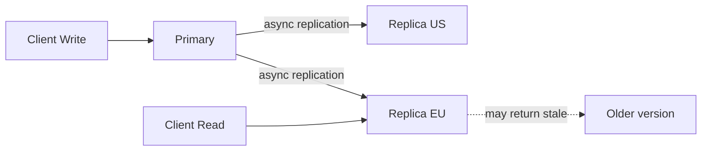

# Eventual consistency

> **Learning Path:** Distributed Systems
> **Section:** 2.1.17 — Core concepts

**Eventual consistency**

### The problem

You need a system that stays fast and available across regions, with replicas that can be written to and read from independently.

In a distributed system you have three forces: Consistency, Availability, Partition tolerance. The CAP theorem says you can only pick two under a network partition. Partitions happen. Always.

If you want availability and partition tolerance, you cannot guarantee that every replica sees every write immediately. You must accept that different nodes can temporarily disagree.

That is the problem eventual consistency solves: how to keep serving reads and writes when you cannot coordinate globally on every operation.

### Mental model

Think of a notebook copied to multiple desks. Someone updates the notebook on Desk A. A courier copies the change to Desks B and C, but it takes time and couriers can be delayed.

For a brief window, B and C show the old version. Eventually the courier arrives and they converge. No one is blocked waiting for the copy to finish.

Eventual consistency is that guarantee: if no new writes arrive, all replicas will eventually converge to the same state. Reads may be stale in the meantime.

### How it works

Writes go to one or more replicas, often a primary, and are propagated asynchronously to the rest.

There is no global lock on the read path. The read is served from the local replica instantly. Propagation happens in the background via logs, gossip, or anti-entropy repair.

Convergence relies on:
* **Monotonic updates** with versioning, timestamps, or CRDTs so later writes win
* **Anti-entropy** to reconcile divergent replicas
* **Idempotency** so replaying a write is safe

You do not wait for acknowledgment from all replicas before returning success.

### Architectural reasoning

When it helps:
* Read-heavy workloads where slight staleness is acceptable
* Global scale with high latency between regions
* Systems that need partition tolerance and high availability above strict freshness

What problem it solves: it removes coordination latency from the critical path. You trade immediate global agreement for availability and speed.

Alternatives:
* **Strong consistency** - wait for quorum/2PC before acknowledging. Correct but slower and less available under partitions.
* **Tunable consistency** - read your writes, read quorum, etc. More control but more complexity.

You choose eventual consistency when business cost of a stale read < cost of an unavailable write or increased latency.

### Trade-offs and failure modes

* **Stale reads.** A user updates their profile in US and immediately sees old data in EU. This is expected, not a bug.
* **Write conflicts.** Concurrent updates to the same key on different replicas can diverge. You need conflict resolution: last-write-wins by timestamp, vector clocks, or CRDT merge semantics.
* **Read anomalies.** Monotonic reads are not guaranteed unless you route clients. A client may see version 2 then 1.
* **Debugging difficulty.** The system is correct eventually, not immediately, so reproduction is harder.

The failure mode to watch: assuming eventual means fast. If replication lag grows to minutes, business invariants break. Monitor replication lag and design UX for it.

### Example

A product catalog for a global e-commerce site.

Writes are rare: a few hundred price updates per minute from a central team. Reads are millions per minute from edge caches.

Using eventual consistency, the write hits the primary in us-east-1 and returns instantly. Replicas in eu-west-1 and ap-south-1 catch up within ~500ms. A shopper in Germany sees a price that is at most half a second old. That's acceptable. The alternative - wait for global quorum - would add 200-300ms to every write and reduce availability during a transatlantic partition.

If a flash sale starts, the business accepts that some users see the old price for a brief window rather than making the site unavailable.

### Reasoning challenge

You are designing a banking transfer service.

Option A: account balance reads are eventually consistent across regions for low latency.
Option B: balance reads are strongly consistent, higher latency.

Which do you pick for the balance shown after a user initiates a transfer, and why? What would you do differently for the public leaderboard showing top spenders?

### Key takeaway

* Eventual consistency is a deliberate choice to favor availability and partition tolerance over immediate global consistency.
* It guarantees convergence, not freshness. Staleness window is a design parameter you must measure and bound.
* It shifts complexity from coordination to conflict resolution and client expectations.
* Use it when stale data is tolerable; avoid it where immediate correctness is a business invariant, like money movement.

Understand why it exists, and you will know when to use it and when to pay the cost of stronger guarantees.
