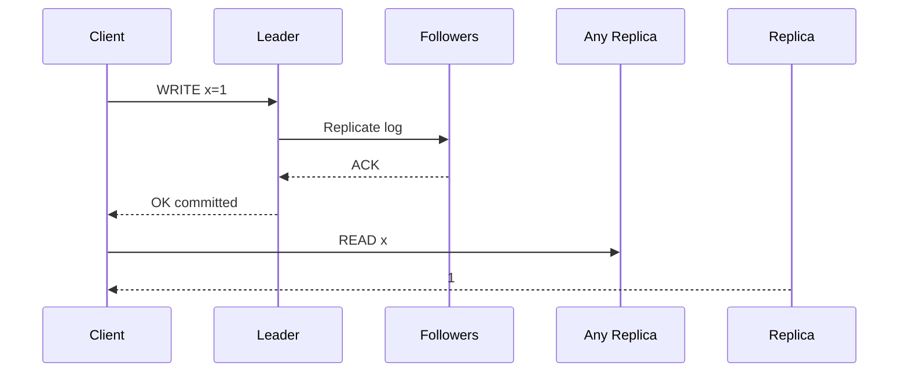

# Strong consistency

> **Learning Path:** Distributed Systems
> **Section:** 2.1.18 — Core concepts

**Strong consistency**

### 1. The problem

You have data replicated across multiple nodes for availability and scale. A client writes to node A, then immediately reads from node B. What should it see?

Without coordination, B may still have the old value. In a distributed system you get three forces: consistency, availability, partition tolerance. You cannot have all three. Strong consistency is the choice to prioritize a single, globally agreed order of operations even if it costs availability or latency.

The problem is not stale data. It is *conflicting truths* existing at the same time.

### 2. Mental model

Strong consistency means the system behaves as if there is one copy of the data, even though there are many.

If operation B starts after operation A finishes, every correct node will see A before B. No client ever observes an out-of-order or lost update.

Think of a single ledger, not eventually converging copies.

### 3. How it works

You need coordination before a write is considered complete.

The essential mechanisms are:
* **A total order.** A leader or consensus group agrees on the order of writes. Raft/Paxos are the common implementations.
* **Quorum.** A write is committed only after a majority of replicas acknowledge it. A read contacts a quorum to ensure it sees the latest committed value.
* **Synchronous replication.** The client waits for the write to be durable on enough replicas before getting an acknowledgement.

Reads can be served from followers, but only after they have caught up to the committed log. That is why the read path is more expensive.

### 4. Architectural reasoning

Use strong consistency when correctness requires a single truth at a point in time.

* Financial balances, account transfers, inventory reservation
* Primary keys and foreign key relationships
* Access control and permissions

Alternatives:
* **Eventual consistency** gives higher availability and lower latency, but allows temporary divergence. Good for feeds, analytics, search indexes.
* **Causal / session consistency** is a middle ground. It preserves user-local ordering but not global order.

The decision is not technical, it is business risk. How much is a double-spend or oversell worth?

### 5. Trade-offs and failure modes

* **Availability vs consistency.** Under a network partition, a strongly consistent system must stop accepting writes or become unavailable on the minority side. CAP in practice.
* **Latency.** Synchronous replication adds round trips. Cross-region writes become hundreds of milliseconds.
* **Throughput and hotspots.** A single leader serializes writes for a partition. You shard to scale, which increases complexity.
* **Failure modes to remember:** leader election pauses writes, slow followers drag the commit latency, clock skew breaks naive timestamp schemes. Clients see timeouts, not stale data.

Strong consistency does not mean no failures. It means failures are visible as unavailability rather than silent inconsistency.

### 6. Example

Inventory reservation for a flash sale.

Two clients try to buy the last item. With eventual consistency both may see stock=1 and both succeed, leading to oversell.

With strong consistency, the write path is:
1. Client A locks/reserves via leader
2. Leader replicates decrement to majority, commits
3. Client B's request is serialized after A and sees stock=0

The system may reject B or slow down under load, but it will never sell the same item twice.

### 7. Reasoning challenge

You are designing a global product catalog.

* Product price must be consistent for checkout.
* Product description and images can be stale for seconds.
* You have 3 regions, users are worldwide.

Where do you apply strong consistency and where do you relax it? What would break if you made the whole catalog strongly consistent?

### 8. Key takeaway

* Strong consistency = linearizable reads/writes as if one replica exists.
* It is achieved with coordination: leader + consensus or quorum writes/reads.
* Choose it when business correctness cannot tolerate temporary divergence.
* Pay for it with higher latency, lower availability under partitions, and write throughput limits.
* Design it narrowly. Apply strong consistency only to the data that requires a single truth, and use weaker models for the rest.
