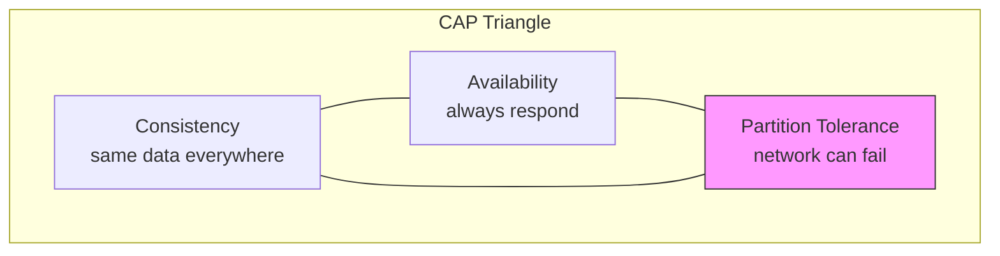

# CAP theorem

> **Learning Path:** Distributed Systems
> **Section:** 2.1.19 — Core concepts

**CAP theorem — Section 2.1.19 Core concepts**

### 1. The problem

You need data in multiple places for scale, latency, and fault tolerance. Replicas exist in different datacenters, so a write must propagate.

Then the network between them fails. This is not an edge case, it's inevitable at scale.

You now have three demands that conflict:

* **Consistency:** every read returns the most recent write
* **Availability:** every request receives a response, success or failure, without unbounded delay
* **Partition tolerance:** the system continues to operate despite network messages being dropped or delayed between nodes

You cannot satisfy all three when a partition occurs.

### 2. Mental model

Think of a distributed database as a team trying to keep a shared notebook in sync while sometimes losing phone signal.

If you insist on a single correct version of the notebook, you must stop taking requests from the side you can't reach to avoid divergence. You are consistent, partition tolerant, but unavailable.

If you insist on always answering, you must let each side accept writes while partitioned. You are available and partition tolerant, but you will diverge. You will need to reconcile later.

Partition tolerance is non-negotiable for real systems. The theorem is really a choice between **Consistency vs Availability under partition**.

### 3. How it works

The theorem forces an explicit decision on write propagation and read visibility during partitions.

* **CP systems** choose Consistency + Partition tolerance. On partition, a minority side stops accepting writes, or a leader is elected and followers are read-only. Reads are correct, writes may be rejected.
* **AP systems** choose Availability + Partition tolerance. On partition, both sides accept writes. Reads may return stale data. Conflict resolution is deferred to later via last-write-wins, vector clocks, CRDTs, or manual merge.

Consistency here means linearizable consistency, not eventual consistency. Availability means no blocking waits.

### 4. Architectural reasoning

When to choose which?

**Choose CP when the cost of a wrong answer > cost of unavailability.**

Examples: financial ledger, inventory reservation, seat booking, permission checks. A stale read can cause double-spend. Better to return error / timeout than a possibly wrong value.

**Choose AP when availability > perfect freshness.**

Examples: social feed, product catalog, user profile cache, analytics counters. Users prefer a slightly stale post over no feed. You can tolerate temporary divergence and reconcile later.

Alternatives you are implicitly rejecting:
* Centralize data to avoid partitions → you lose scale and fault tolerance.
* Synchronous global replication → you lose availability during latency spikes.

The decision is per data domain, not per system.

### 5. Trade-offs and failure modes

* **CP failure mode:** unavailability cascades. A network blip partitions the leader, writes stall. You need fast failure detection, leader election, and careful timeout tuning to avoid flapping.
* **AP failure mode:** divergence and conflict. You must design merge semantics up front. Last-write-wins loses data silently. CRDTs add complexity and storage cost.
* **Latency vs correctness:** CP often adds coordination latency. AP adds reconciliation complexity.
* **Observability:** In AP you must monitor divergence windows and conflict rates, not just uptime.

### 6. Example

Global e-commerce inventory.

CP approach: a single leader per region with synchronous replication to a majority quorum. A checkout read/write requires quorum acks. During a transatlantic partition, the minority region rejects checkouts. Customers get errors, but you never oversell.

AP approach: each region allows checkout locally and queues updates. During partition, both sides sell the last 10 items. Reconciliation later detects oversell and triggers compensating actions: refunds, backorder, customer comms.

The business decides which pain is acceptable.

### 7. Reasoning challenge

You are designing a global AI feature flag service used by 200 microservices. Flags must propagate within seconds. Network partitions between US and EU happen ~monthly for minutes.

Do you design it CP or AP? What do you do on read during partition, and what is the blast radius if you choose wrong?

### 8. Key takeaway

* CAP is not a pick-one-forever label; it's a partition-time choice between consistency and availability.
* Partition tolerance is mandatory at scale. The real decision is CP vs AP per data domain.
* Choose CP when correctness cost dominates. Choose AP when availability dominates.
* Design the failure mode explicitly: unavailability vs divergence and reconciliation.

You should leave knowing why the theorem exists, how it constrains replication, and what to sacrifice when the network splits.
