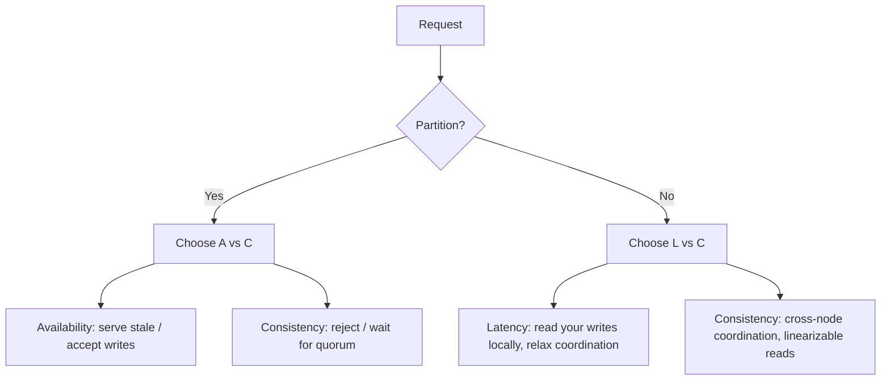

# PACELC

> **Learning Path:** Distributed Systems
> **Section:** 2.1.20 — Core concepts

**PACELC**

### 1. The problem

CAP tells you what to do *during* a network partition: you can have Consistency and Partition tolerance, or Availability and Partition tolerance. You cannot have all three.

The problem with CAP is it is silent about normal operation. Partitions are rare but painful. Most of the time the network is up. In that normal case, do you still pay the cost of strong consistency? CAP gives you no guidance, so teams default to vague "eventual consistency is fine" without reasoning about latency.

PACELC fixes that gap.

### 2. Mental model

PACELC = **P**artition tolerance is mandatory. **A**vailability vs **C**onsistency **E**lse **L**atency vs **C**onsistency.

Always be partition tolerant. Then you have two regimes:

* **If Partition:** choose Availability or Consistency
* **Else [no partition]:** choose Availability/Latency trade-off, i.e. Latency or Consistency

Think of it as two knobs, not one. Partition behavior and healthy-network behavior are independent decisions.

### 3. How it works

In practice:

* **P is non-negotiable.** Any distributed system across zones/regions must assume partitions.
* **During partition:** you must drop either Availability or Consistency. An AP system stays up and may diverge. A CP system stops accepting writes or reads that can't be made consistent.
* **When network is healthy:** you still have a choice. Strong consistency requires coordination = extra round trips = higher latency. Eventual consistency lets you read from the nearest replica with low latency.

PACELC makes the trade-off explicit in both regimes.

### 4. Architectural reasoning

When it helps: designing data stores, replication strategies, and service SLAs.

* **Choose CP during partition if** correctness is non-negotiable and you can tolerate unavailability. Example: financial ledger, inventory reservation, payment authorization. You would rather reject a request than create double spend.
* **Choose AP during partition if** uptime matters more than temporary divergence. Example: user profile reads, social feed, product catalog. Serve stale data, accept writes locally, reconcile later.
* **Else choose low Latency if** user experience is latency sensitive and slight staleness is acceptable. Read-your-writes not required globally. Example: recommendation feed, search suggestions.
* **Else choose Consistency if** you need fresh reads even in healthy network. Example: real-time trading price, seat booking confirmation.

Alternatives to pure choices: tunable consistency per operation, read/write quorums, CRDTs, or hybrid models like "CP during partition, low latency else".

### 5. Trade-offs and failure modes

* **Latency vs Consistency is a cost trade-off.** Strong consistency adds coordination RPCs, leader election, fencing. That increases p99 latency and reduces throughput.
* **AP during partition creates reconciliation debt.** You must design conflict resolution, vector clocks, last-write-wins with business semantics. Failures show up later as data anomalies, not as errors.
* **CP during partition creates availability cliffs.** A minority partition becomes unavailable. Clients see timeouts and retries. Failure mode is obvious but painful for users.
* **Mixing regimes across services is dangerous.** A CP service calling an AP service can violate end-to-end consistency guarantees. You must propagate the choice.

### 6. Example

A global e-commerce platform.

* **Cart service:** AP during partition, low latency else. Users can add items to cart locally. If a partition splits EU and US, EU keeps accepting writes. Reads may be slightly stale. Reconciliation merges carts later with last-write-wins per SKU.
* **Payment service:** CP during partition, consistency else. During partition, only the partition with quorum accepts payments. Latency is higher because every commit requires cross-region quorum, but no double charge can happen.

Same company, two different PACELC profiles, chosen by business risk.

### 7. Reasoning challenge

You are designing a globally distributed document store for a collaborative editor.

Users expect low latency typing, but also expect to see each other's edits quickly. Network partitions between regions happen ~ a few times per year.

Would you optimize for low latency or consistency in the else case, and AP or CP during partition? What failure mode are you accepting?

### 8. Key takeaway

* Partition tolerance is mandatory; the real decision is what you sacrifice when partitioned and when healthy.
* PACELC separates partition behavior from normal operation behavior.
* AP during partition = availability with divergence; CP during partition = consistency with unavailability.
* Else latency vs consistency: low latency means relaxed coordination; consistency means pay latency for coordination.
* Choose per data domain, not per company. Document the choice and its failure mode.
