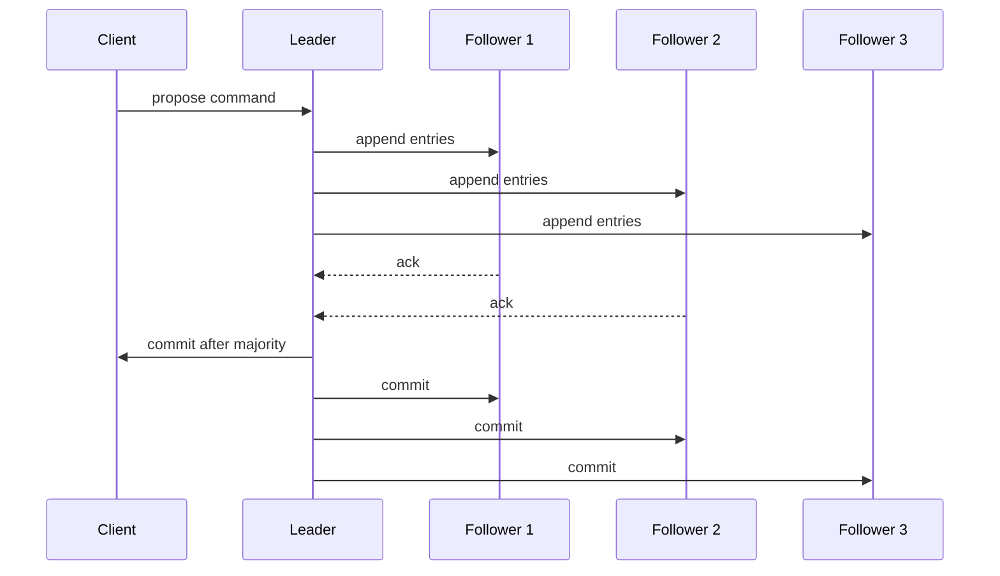

# Consensus

> **Learning Path:** Distributed Systems
> **Section:** 2.1.21 — Core concepts

**Consensus**

### 1. The problem

You have 5+ nodes spread across data centers. Each can crash, network links drop packets, clocks drift. You need them to agree on *one* value — the next entry in a log, the current leader, the account balance — and they must not pick different values.

Without agreement you get split-brain: two nodes accept conflicting writes, money is created, configuration diverges, and recovery becomes manual.

The constraint is not performance. It is safety under partial failure.

### 2. Mental model

Think of a committee that must sign a single document, even if members are in different rooms and some are temporarily unreachable.

Consensus is the protocol that lets the committee:
* **Safety:** never sign two different versions of the same document
* **Liveness:** eventually sign *some* version if a majority can talk

You cannot have both perfect safety and perfect liveness during a network partition. That's FLP and CAP in practice.

### 3. How it works

The essential mechanism is **majority quorum + state machine replication**.

1. **Propose.** A node proposes a value.
2. **Quorum.** The proposal is accepted only if a majority of nodes agree on it.
3. **Commit.** Once a majority has accepted, the value is committed and replicated to the rest.

To avoid chaos, most practical systems add a leader:

A leader serializes proposals, followers replicate the log. If the leader fails, a new leader is elected from the majority. Raft makes this explicit: election timeout → vote → leader → log replication → commit on majority.

The key invariant: **a value committed by a majority cannot be overwritten**, because any future majority overlaps with the previous one by at least one node.

### 4. Architectural reasoning

Use consensus when you need a single source of truth that survives node failures.

* **When it helps:** strongly consistent configuration store, replicated state machine, leader election, ordering of events across nodes.
* **What it solves:** prevents divergent state without manual reconciliation.
* **Alternatives:**
  * *Eventual consistency / CRDTs*: accept temporary divergence, converge later. Good for counters, sets, where conflicts are mergeable.
  * *Primary-backup without quorum*: faster but risks split-brain on partition.
  * *External coordination service*: lease manager, but still needs consensus underneath.

Choose consensus when correctness of order > raw availability. Choose eventual consistency when availability and partition tolerance matter more than immediate ordering.

### 5. Trade-offs and failure modes

* **Latency vs safety.** Every write needs a quorum round-trip. Consensus is 2-3 RTT minimum. You trade latency for safety.
* **Availability vs consistency.** During a network partition, the minority side must stop accepting writes to preserve safety. System becomes unavailable in one region.
* **Complexity and operability.** Leader election storms, log compaction, membership changes are hard. A bad failure mode is a flapping leader causing write stalls.
* **Scalability.** All writes go through leader. Read scalability needs lease reads or read quorums, which add risk.

Failure modes to design for: leader death mid-replication, clock skew causing premature election, network partition creating two majorities over time, and large log growth without snapshots.

### 6. Example

Kubernetes control plane uses etcd, a Raft-based store, for its state.

All API server writes go to the Raft leader. Followers replicate. If the leader AZ loses network, followers in the other AZ elect a new leader from the majority and continue. No two masters can accept conflicting pod specs. Reads can be served locally but writes are globally ordered.

Without consensus, two API servers could schedule the same pod twice.

### 7. Reasoning challenge

You run a payment ledger across 3 regions: US, EU, APAC with 3 nodes per region, 9 total.

A transatlantic link fails, splitting US+EU from APAC. You can still get a majority in the US+EU side. What should your consensus layer do for writes? What if you required a majority per region? What trade-off are you making?

### 8. Key takeaway

* Consensus exists to guarantee a single agreed-upon value despite crashes and partitions.
* Safety comes from majority quorums; liveness requires a leader and timeouts.
* It costs latency and availability during partitions. Use it only where strong ordering is non-negotiable.
* Design for leader failure, election storms, and log growth, not just happy path.
