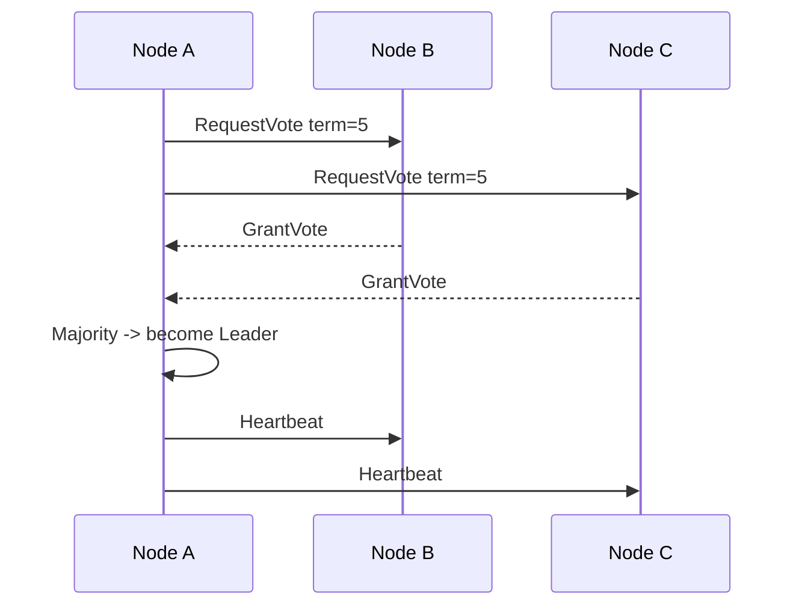

# Leader election

> **Learning Path:** Distributed Systems
> **Section:** 2.1.22 — Core concepts

**Leader election**

### 1. The problem

You have a replicated service with multiple nodes that must act as one. One node must be the writer, coordinator, or scheduler; the others follow.

Without a single authority you get:
* **Write conflicts:** two nodes accept writes, data diverges
* **Split work:** two schedulers assign the same job
* **Stale reads:** clients don’t know who is up to date

Now add reality: nodes crash, network partitions happen, clocks drift. The leader will die. The cluster must replace it *without human intervention* and without picking two leaders at once.

That is the problem leader election solves: **maintain exactly one active coordinator despite failures.**

### 2. Mental model

Think of a committee that must always have a chair. If the chair leaves the room, the remaining members must agree on a new chair, quickly, and they must not elect two chairs simultaneously.

The election is not about the best node, it is about **agreement on who is the one**.

### 3. How it works

The essential mechanism is a quorum-based vote tied to a monotonically increasing term/epoch.

1. **Trigger:** leader heartbeat stops, or a follower suspects leader failure.
2. **Candidate:** node increments its term, votes for itself.
3. **Vote:** asks a majority for votes. A node votes only once per term and only for up-to-date logs.
4. **Decision:** majority = leader. New leader starts heartbeats to stop others from starting elections.
5. **Safety:** higher term always wins. Old messages from a previous term are ignored.

That is the core of Raft and ZooKeeper. Bully algorithm is the naive version: highest ID wins. It works until partitions happen.

### 4. Architectural reasoning

**When it helps**
* Stateful replication: Raft for log replication, etcd, Consul
* Single-writer systems: Kafka controller, ZooKeeper ensemble
* Coordination: distributed locks, leader for shard assignment

**Alternatives**
* **Static leader:** no failover, simpler, cheaper. Acceptable for non-critical batch jobs.
* **Leaderless quorum writes:** e.g., Dynamo style with conflict resolution. No single coordinator, but you lose strong ordering.
* **External coordinator:** place election outside the service. Reduces coupling but adds dependency.

Choose election when you need **strong consistency + high availability** with automatic failover, and you can tolerate a brief leader gap.

### 5. Trade-offs and failure modes

* **Availability vs Safety:** You can elect quickly with small timeouts, but risk false failure detection and churn. Slow timeouts improve stability but increase failover latency.
* **Split brain:** Network partition can create two majorities if the quorum size is wrong. Safety requires *majority overlap*: `n = 2f +1` to tolerate f failures.
* **Flapping:** Multiple nodes start elections at once → repeated terms, no leader. Randomized backoff and pre-vote stabilizes this.
* **Leadership loss window:** During election, writes are unavailable. Your write SLA is `election timeout + vote round trip`.
* **Log divergence:** A new leader must have the most up-to-date state. Raft’s voting rule enforces this; naive election can promote a stale node.

Operability matters: election metrics, term number, last log index, and who voted for whom are the first things to check during an outage.

### 6. Example

Kafka controller election. A Kafka cluster has brokers. Only one controller assigns partitions, handles leader election for partitions, and processes metadata changes.

If the controller dies, the remaining brokers run an election via ZooKeeper. No controller = no partition rebalancing, no new leader assignment. The cluster stays read-only for metadata operations until a new controller is elected. The design trades a brief metadata freeze for guaranteed single-writer safety.

### 7. Reasoning challenge

You have 5 replicas in 3 availability zones, 2 nodes per zone. Network latency between zones is ~80ms, within zone ~2ms. You need sub-second failover.

Would you set election timeout to 150ms? What happens during a zone-wide network partition that isolates 2 nodes in one zone from the other 3? Who can elect a leader, and what do you do about the isolated nodes?

### 8. Key takeaway

* Leader election exists to guarantee **one active coordinator** in the face of failures, not to find the best node.
* Safety comes from **terms + majority quorum**. Availability comes from **fast failure detection + randomized backoff**.
* The critical architectural decision is **how long you can be leaderless** vs how often you risk false elections.
* Monitor election churn, term storms, and split-brain risk, not just node uptime.
