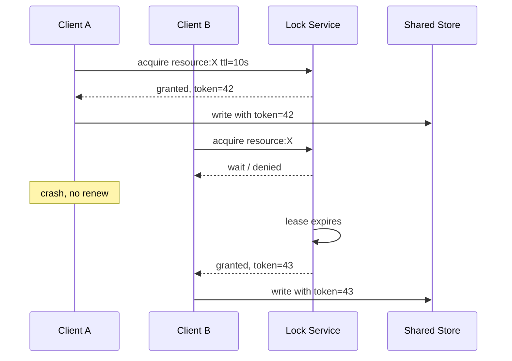

# Distributed locking

> **Learning Path:** Distributed Systems
> **Section:** 2.1.23 — Core concepts

## The problem

You have 10 instances of a service running behind a load balancer. They all need to mutate the same logical resource: decrement inventory, generate a report, process a payment for order 123.

Local `synchronized` or a single-node lock works only inside one process. Once you scale out, two instances can both think they own the critical section at the same time.

Constraints you cannot remove:
* Network is unreliable and slow
* Processes crash without notice
* Clocks are not perfectly synchronized
* You cannot rely on a single node being always up

Without coordination you get duplicate work, lost updates, and corrupted state.

## Mental model

A distributed lock is a distributed mutex with a lease.

It gives at most one client a right to proceed for a bounded time, and it survives process restarts. If the holder dies, the lease expires and someone else can take over.

Think of it as a numbered key at a coat check. You must present the same key to return the coat, otherwise the check refuses you.

## How it works

The essential mechanism is not fancy. Three operations:

**Acquire** - Client requests lock `resource:X` with its unique client id and a TTL. Lock service grants it only if no valid lease exists. On grant it returns a fencing token, a monotonically increasing number.

**Renew / Extend** - While holding the lock the client must periodically refresh the lease before TTL expires. This proves liveness.

**Release** - Explicit unlock, or implicit expiry when TTL lapses.

Correctness relies on two properties:
* **Mutual exclusion**: granted leases are unique
* **Fencing**: any operation performed under a lease is tagged with its fencing token. The data store rejects writes with an old token.

The lock service itself is a small consensus problem. In practice it is built on a strongly consistent store: etcd, ZooKeeper, Redis with Redlock, or a database with advisory locks.

## Architectural reasoning

Use a distributed lock when you need **exclusive access across processes** and you cannot serialize work by design.

When it helps:
* One writer at a time for a hot row/key, e.g. inventory decrement for a single SKU
* Preventing duplicate processing of the same message by multiple consumers
* Coordinating a critical maintenance job across a fleet

What it solves: it turns a race condition into a serialized critical section across nodes.

Alternatives to consider first:
* **Make the operation idempotent and commutative.** Often you don't need exclusion, you need exactly-once semantics.
* **Partition the resource.** Shard by key so different instances own disjoint sets. No lock needed.
* **Use a queue.** Single consumer per queue gives natural serialization without a lock.
* **Database row lock / serializable transaction.** If the contention is on DB data, let the DB be the lock.

Choose a distributed lock only when you cannot avoid shared mutable state and you cannot redesign around it.

## Trade-offs and failure modes

* **Availability vs safety.** If the lock service is down, you can either block all writers or proceed unsafely. Most systems choose to block.
* **Latency.** Acquire + renew adds RTT to every critical section. High contention creates a lock convoy.
* **Split brain / clock skew.** If TTL expires late or clocks drift, two clients can hold the lock. Use fencing tokens and rely on a single source of truth for ordering, not client clocks.
* **Deadlock.** Distributed deadlocks are hard to detect. Keep critical sections short, acquire locks in a global order, set timeouts.
* **Thundering herd.** When a lease expires, many clients race to acquire. Use jittered backoff and a short hold time.

The most dangerous failure is the **lost fencing token**: a stale client continues writing after its lease expired because the data store does not check tokens. Always check token on write.

## Example

E-commerce checkout with multiple pods. Two pods receive the same "reserve 1 unit of SKU-42" request due to retries.

Instead of both decrementing inventory, each pod tries to acquire `lock:inventory:SKU-42` with TTL 5s. Winner decrements, writes the new quantity with fencing token, and releases. Loser fails fast and returns "already processing". A background renewer keeps the lease alive while the transaction runs.

If the winner crashes mid-transaction, TTL expires, a new winner can safely take over.

## Reasoning challenge

You have a nightly report job that aggregates data from a shared table. It must run exactly once per day, even with autoscaling. Option A: a distributed lock with 30 min TTL. Option B: a queue with a single consumer and at-least-once delivery + idempotency.

Which do you pick, and what failure mode worries you most with your choice? What would change if the job must complete in <5 minutes but the fleet can scale to 200 instances?

## Key takeaway

* Distributed locks exist to serialize access to shared state across failure-prone nodes, not to improve performance.
* Correctness needs mutual exclusion + fencing tokens + lease renewal, not just a flag in Redis.
* Prefer redesigns that remove the need for a lock: partition, queue, idempotency, or let the database serialize.
* The real costs are latency, availability risk, and operational complexity. Keep critical sections tiny and always handle expiry.
