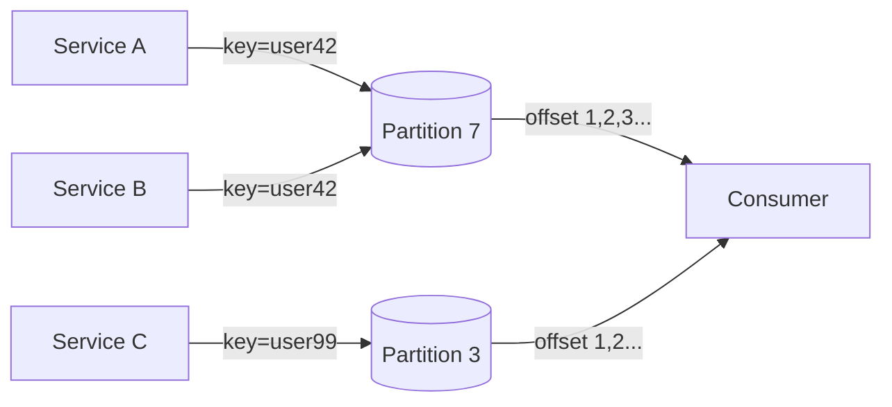

# Ordering

> **Learning Path:** Distributed Systems
> **Section:** 2.1.24 — Core concepts

### 1. The problem

What happens when multiple services produce events concurrently and you need to reconstruct what happened first?

In a single process you have a call stack. In a distributed system you have independent machines with independent clocks, network latency, and retries. Two events A and B can arrive at a consumer in a different order than they were generated. Replaying them in the wrong order corrupts state.

You need ordering not for curiosity, but for correctness: debit before credit, create before update, order placed before payment captured.

Constraints created the need:
* No global clock. Physical clocks drift and skew.
* Network is unreliable. Messages reorder, duplicate, and delay.
* Concurrency is the norm. Producers and consumers scale independently.

### 2. Mental model

Ordering is a guarantee about the sequence you are allowed to observe.

* **Per-key / partition order**: Events for the same key are processed in emit order. Different keys can be interleaved arbitrarily.
* **Causal order**: If A causally happened-before B, no consumer ever sees B before A.
* **Total order**: All participants agree on a single global sequence of all events.

You can only have strong ordering by sacrificing something: availability, latency, or scale.

### 3. How it works

Ordering is enforced by a coordination point, not by the network.

The essential mechanisms:
* **Monotonic sequence numbers per partition.** The broker assigns increasing offsets. Consumers track last offset. This gives per-key order if you hash by key to a fixed partition.
* **Logical clocks.** Lamport timestamps and vector clocks capture happens-before without relying on physical time. They prove causality but do not give total order.
* **Leader sequencer.** One node totally orders operations for a replicated state machine. All writes go through the leader, which assigns a term+index.

Implementation is simple: `append-only log` + `partition key` + `offset`.

Partition 7 guarantees order for user42. Partition 3 is independent.

### 4. Architectural reasoning

When does ordering help?
* State machines that must apply events deterministically: ledgers, inventory, workflow engines.
* Replay and audit: you need a reproducible history.

When does it hurt?
* You need global availability during partitions. Total order requires a leader; leader loss stalls writes.
* You need maximum throughput across keys. Strict total order serializes everything.

Alternatives:
* **Eventual consistency with commutative operations.** If ops commute, order does not matter. Use CRDTs.
* **Application-level idempotency + version checks.** Accept out-of-order delivery but reject stale updates with `if version > current`.
* **Physical timestamps with tolerance.** Acceptable for analytics, unacceptable for money movement.

Decision rule: define the minimum ordering guarantee the business invariant requires, then pay only for that.

### 5. Trade-offs and failure modes

* **Total order vs availability.** Total order needs consensus. Partition = unavailability. Per-partition order preserves availability.
* **Latency vs ordering.** Waiting for the next offset or leader ack adds latency.
* **Clock reliance.** Wall-clock ordering fails under skew. Logical clocks are safe but more complex to reason about.
* **Rebalancing breaks ordering.** Moving a partition to another broker can cause duplicates or gaps if offsets are not fenced.
* **Head-of-line blocking.** A slow consumer for one key stalls progress for that partition even if other partitions are healthy.

Failure mode to remember: a retry after a timeout can deliver the same event twice, and a late event can arrive after later events. Ordering guarantees must be paired with idempotency.

### 6. Example

Payments platform. `PaymentCreated`, `PaymentAuthorized`, `PaymentCaptured` must be processed in that order per paymentId.

Architecture: events are partitioned by `paymentId`. The event log assigns monotonic offsets per partition. Consumers process offsets sequentially and store `last_processed_offset`. On restart they resume from offset+1.

Cross-region replication uses a leader sequencer for the global ledger, giving total order for settlement. Non-critical analytics topics use per-partition order only.

If a consumer crashes mid-batch, it replays from last committed offset. Duplicates are idempotent via event id.

### 7. Reasoning challenge

You run an e-commerce service across two regions. Users can add items to cart in either region. You want cart totals to be correct, and you want low latency writes during network partitions.

Do you require total order of all cart events globally, causal order per user, or per-key order per user? What breaks if you pick the wrong one, and what do you give up?

### 8. Key takeaway

* Ordering is a business invariant, not a default. Define exactly what must be ordered and for which scope.
* Per-key/partition ordering gives you scale and availability; total order gives you simplicity at a cost.
* Never trust wall clocks for ordering. Use monotonic sequence numbers and logical causality.
* Ordering without idempotency is fragile. Design for duplicates and late arrivals.
