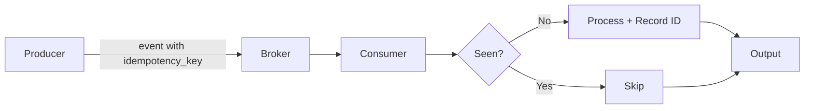

# Deduplication

> **Learning Path:** Distributed Systems
> **Section:** 2.1.25 — Core concepts

### 1. The problem

At-least-once delivery is the default in distributed systems. Networks drop, producers time out, consumers crash mid-processing, brokers rebalance partitions.

That means the same logical event can arrive 0, 1, or 3 times. If your system is not idempotent, you will:

* Charge a customer twice
* Create three user accounts for one signup
* Emit three downstream events from one

You cannot make the network perfectly reliable. You can make processing tolerant of duplicates.

### 2. Mental model

Deduplication is a bouncer with a short memory.

Each incoming message is checked against a set of "already seen" identifiers. If it’s on the list, drop it. If not, process it and add it to the list.

The memory is bounded in time and space. You only need to remember for as long as duplicates can arrive.

### 3. How it works

The essential mechanism is **identity + window**.

**Identity.** You need a stable fingerprint for the logical operation, not the transport envelope. Typically an idempotency key supplied by the producer: `request_id`, `event_id`, or a hash of `entity_id + operation + payload_version`.

**Window.** You store seen identities for a deduplication window. The window must be longer than the maximum time a duplicate can be delayed by retries and replays.

Implementation patterns:

* In-memory set / LRU for low latency, lost on restart
* Persistent store: DB unique constraint, Redis SETEX, DynamoDB conditional write
* Probabilistic: Bloom filter for high throughput with acceptable false positives

Flow:

Record ID *before* or *after* processing depends on your consistency needs. Record after successful processing gives at-least-once semantics; record before with a transactional outbox moves toward exactly-once.

### 4. Architectural reasoning

Deduplication solves: **how to get correct results under at-least-once delivery without paying for exactly-once transport**.

When it helps:
* Event streaming with Kafka, SNS/SQS, Pub/Sub where retries are normal
* HTTP webhooks where clients retry on timeout
* Microservices with saga / outbox patterns
* Any system where cost of duplicate > cost of dedup storage

Alternatives:
* **At-most-once**: drop duplicates by never retrying. Loses correctness.
* **Exactly-once messaging**: coordination heavy, brittle, often an illusion at scale
* **Idempotent writes only**: dedup at the write layer with natural keys. Works when the domain has a natural unique key.

Choose dedup when you control the producer enough to emit stable ids, and you can afford a bounded dedup store.

### 5. Trade-offs and failure modes

* **Window size vs storage/cost.** Longer window = fewer missed duplicates, more storage. Pick window based on max retry delay + consumer lag, not forever.
* **State loss.** If the dedup store is lost, you will re-process old events. Make it durable or accept a reprocessing window after incidents.
* **Clock skew and ordering.** Two different logical events can collide on a weak key. Use strong, business-meaningful keys, not `hash(payload)` alone.
* **Distributed consumers.** A local in-memory set misses duplicates across instances. Dedup must be shared or partitioned by key.
* **False positives with probabilistic structures.** Bloom filters never remove entries. Acceptable for best-effort, not for money.

The most dangerous failure: dedup silently stops working and you get silent duplicates. Monitor dedup hit rate and store health.

### 6. Example

Payment webhook processor.

Merchant sends `POST /payments` with `idempotency_key=req_abc123`. Network times out, merchant retries.

Consumer:
1. Check Redis `SETNX idempotency:req_abc123` with TTL 24h
2. If key exists -> return previous response, skip
3. If new -> process charge, write payment row, store key, return 200

Even if the webhook arrives 3 times in 5 minutes, the charge runs once. The 24h TTL covers retry storms and replay windows.

### 7. Reasoning challenge

You have an event pipeline with Kafka consumers that rebalance frequently and a 7-day business requirement to support event replays for disaster recovery.

Do you store dedup IDs for 7 days in Redis, or do you rely on the database's unique constraint on `event_id`? What changes if your throughput is 1M events/sec?

### 8. Key takeaway

* Deduplication exists because at-least-once delivery is cheap and reliable; exactly-once is not.
* You need a stable identity and a bounded memory window, not infinite history.
* Deduplication is a trade-off between correctness, latency, storage cost, and operational complexity.
* Design the dedup store for durability and observability; a silent dedup failure is worse than no dedup.
