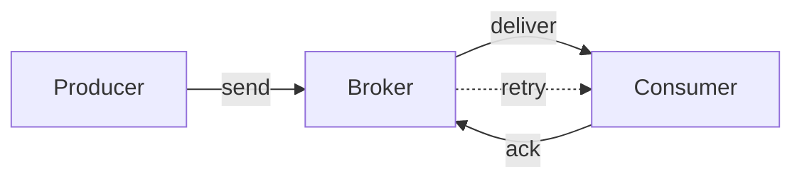

# Message delivery semantics

> **Learning Path:** Distributed Systems
> **Section:** 2.1.27 — Core concepts

### The problem

You need to move work between services with no shared memory. A producer emits an event, a broker holds it, a consumer processes it. The network drops packets, processes crash, clocks drift.

The question is not *can* you send a message, it's *how many times* will the consumer see it, and can you guarantee that.

Without an explicit contract you get silent data loss or duplicate side effects. A payment processed twice. An inventory decrement applied once then lost. A notification sent never.

### Mental model

Message delivery semantics is a contract about multiplicity, not timing.

* **At-most-once:** The broker promises to try once. If the send fails, the message is gone.
* **At-least-once:** The broker promises the consumer will see the message ≥1 times. Retries are allowed.
* **Exactly-once:** The consumer sees the message one time, logically. No loss, no duplicates.

Exactly-once is not a transport guarantee, it is an application guarantee built on at-least-once + idempotency + deduplication.

### How it works

The core mechanism is acknowledgement and retry.

At-most-once: Producer sends, no ack required or ack is best-effort. Broker drops on failure. Lowest latency, highest loss risk.

At-least-once: Broker persists message before ack to producer. Consumer must ack after processing. If ack is missing or consumer crashes, broker redelivers. Duplicates are expected.

Exactly-once: At-least-once delivery plus a deduplication key stored with processed messages. Consumer is idempotent: processing the same message twice yields the same state. The broker or consumer tracks message IDs to suppress replays.

Ordering is orthogonal. You can have at-least-once with or without ordering per partition.

### Architectural reasoning

When does this matter?

Choose at-most-once when loss is acceptable and retries cost more than the message. Telemetry, metrics, logs, clickstreams. You want low latency and high throughput, duplicates would be harmful but loss is fine.

Choose at-least-once when loss is unacceptable. Payments, order creation, inventory reservation, state changes. You can tolerate duplicates if your consumer is idempotent. This is the default for most durable queues.

Choose exactly-once semantics when duplicates are business-critical. Financial ledger posting, idempotent writes to external systems. You pay for it with state: dedupe store, transactional outbox, or exactly-once processing with two-phase commit.

Alternatives: synchronous RPC with retries and timeouts gives you at-least-once to the receiver but couples services. Persistent log with consumer offsets gives you replayability but pushes ordering and duplicate handling to the consumer.

### Trade-offs and failure modes

* **Latency vs durability.** Persist before ack adds latency. In-memory delivery is fast but volatile.
* **Complexity vs correctness.** At-least-once is cheap. Exactly-once requires idempotent consumers, unique message IDs, and durable dedupe storage. That storage becomes a new failure point.
* **Duplicates vs loss.** You can only pick one to tolerate. At-most-once risks loss. At-least-once risks duplicates.
* **Ordering.** Guaranteeing order per partition reduces parallelism. Global ordering kills scalability.

Common failures: consumer crashes after side effect but before ack → duplicate. Network partition causes producer to timeout and retry → duplicate. Broker loses unacked messages on crash → loss. Clock skew breaks dedupe windows.

### Example

Payment capture flow.

Producer: Payment Service emits `PaymentCaptured {payment_id, amount}`.

Broker: Kafka topic with retention and acks=all.

Consumer: Ledger Service.

At-least-once: Broker retries delivery if Ledger crashes. Ledger writes to DB inside a transaction that also records `processed_message_id`. On replay, the insert fails due to unique constraint, so the business effect runs once. That's idempotent exactly-once processing.

If Ledger were not idempotent and you used at-most-once, a broker crash after delivery but before consumer persistence would lose the payment.

### Reasoning challenge

You are designing an email notification service. Producer emits `UserSignedUp`. Consumer sends a welcome email via a third-party provider.

Loss is bad, a duplicate welcome email is annoying but not catastrophic. The email provider has no idempotency key.

Which semantics do you choose, and what do you build to make it safe? What changes if the consumer instead credits a $10 bonus to the user's account?

### Key takeaway

* Delivery semantics define how many times a message is observed, not when.
* At-most-once trades reliability for latency. At-least-once trades duplicates for durability.
* Exactly-once is an application property: at-least-once delivery + idempotent consumer + deduplication.
* Choose semantics from business cost of loss vs cost of duplicate, then design the consumer and storage to match.

You should be able to reason: given a failure mode and a business invariant, what guarantee do you need and what state must you keep.
