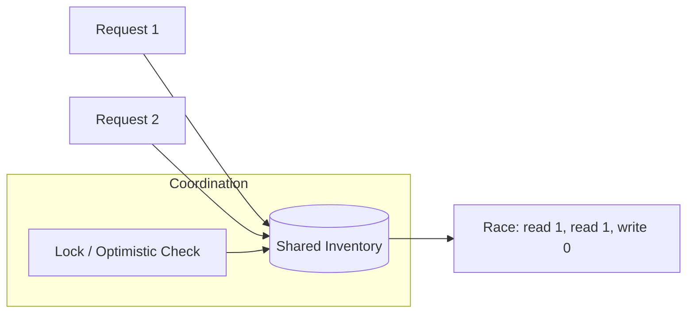

# Concurrency

> **Learning Path:** Distributed Systems
> **Section:** 2.1.3 — Core concepts

### 1. The problem

You need to do more work than one thread can do sequentially, and you need to do it with limited resources.

A single request is fast. A thousand requests at once are not. CPUs can execute, networks can transmit, disks can seek — but all of them spend time waiting. If you process requests one after another, you pay the wait cost serially.

The constraint is shared state. When work overlaps, two operations can read-modify-write the same data at the same time. The result is not wrong in isolation, it is wrong in combination.

Concurrency exists to utilize idle capacity. Correctness exists to prevent overlapping work from corrupting each other.

### 2. Mental model

Concurrency is overlapping execution, not necessarily parallel execution.

Think of a restaurant kitchen. One chef can cook sequentially. With multiple chefs, work overlaps. The problem is not the chefs, it is the shared counters, ovens, and plates. If two chefs grab the last pan, or read a recipe while another is editing it, you get mistakes.

The same happens in software. Threads, async tasks, or nodes in a distributed system are the chefs. Shared mutable state is the counter.

The core mental model: **interference**. Overlap creates interference on shared resources. Concurrency control is about defining who can use what, when, and how they coordinate.

### 3. How it works

Essentially three mechanisms, with different trade-offs:

* **Mutual exclusion** for shared memory. Locks, semaphores, compare-and-swap give one actor exclusive access to a critical section. It guarantees atomicity at the cost of contention.
* **Isolation** via ownership. Actor model, thread confinement, or immutable data means actors never share mutable state. Coordination happens via message passing, not direct access.
* **Ordering** for distributed work. Happens-before, vector clocks, and consensus protocols define a partial order of events when there is no global clock. You cannot prevent overlap, you can only define what order is acceptable.

In distributed systems there is no shared memory, only messages. Concurrency is therefore message-based coordination and the choice of consistency guarantees.

Without coordination, two concurrent reads see the same value and both succeed. With coordination you either serialize or detect conflict.

### 4. Architectural reasoning

Use concurrency when you need throughput or responsiveness and the work contains independent or I/O-bound parts.

* Choose concurrency for throughput: web servers handling thousands of connections. Async I/O lets one thread manage many connections while waiting on network.
* Choose parallelism for CPU-bound work: multiple cores processing different requests.
* Choose isolation over coordination when possible: separate services own their data, communicate via events. This removes shared mutable state and makes concurrency safe by design.

Alternatives exist. You can serialize everything with a single worker queue. It is simple and correct, but it caps throughput and creates a bottleneck. You can add locks everywhere. It works locally, but creates contention, deadlocks, and does not scale across nodes.

The architectural decision is: where is the shared state, and who owns it? If you can push state into isolated owners, you remove the need for distributed locks.

### 5. Trade-offs and failure modes

The few that matter for architects:

* **Correctness vs throughput.** More concurrency increases throughput until contention makes it worse. Lock contention, cache line bouncing, and coordination latency all reduce gains.
* **Complexity vs safety.** Shared mutable state is easy to write, hard to prove correct. Race conditions are non-deterministic and only appear under load.
* **Consistency vs availability.** In distributed concurrency you cannot have both perfect consistency and partition tolerance. You choose serializability, eventual consistency, or conflict-free replicated data types.

Common failure modes:

* **Race condition:** two operations interleave to produce an invalid state.
* **Deadlock:** A waits for B, B waits for A.
* **Livelock / starvation:** actors keep retrying and never make progress.
* **Non-deterministic bugs:** hard to reproduce, hard to test.

In distributed systems add clock skew and partial failures. A lock held by a crashed node must time out, which introduces split-brain risk.

### 6. Example

E-commerce order creation touches Inventory, Pricing, and Payment.

Naive design: three services update a shared Order document concurrently. Inventory decrements stock, Pricing applies a coupon, Payment confirms charge. Without coordination, you can oversell or charge twice.

Architectural decision: make Order an aggregate owned by one service. Inventory and Payment emit events. Order service processes events sequentially per order id, using optimistic concurrency with a version number. If two updates arrive concurrently, one fails and retries.

Throughput comes from processing different orders concurrently. Safety comes from serializing updates per order, not globally.

### 7. Reasoning challenge

You have a recommendation model serving personalization. Requests are read-heavy and latency-sensitive. Writes are model updates from training pipeline, large and infrequent.

Do you put a distributed lock around model weights during updates, or serve stale reads during update? What happens to latency and correctness under peak traffic?

### 8. Key takeaway

* Concurrency is about overlapping work and interference, not speed. Design for interference first.
* Prefer isolation and message passing over shared mutable state and locks. Ownership removes coordination.
* Correctness costs: contention, latency, and complexity. Measure where concurrency actually helps.
* In distributed systems, concurrency control is about ordering and consistency choices, not just threads.
