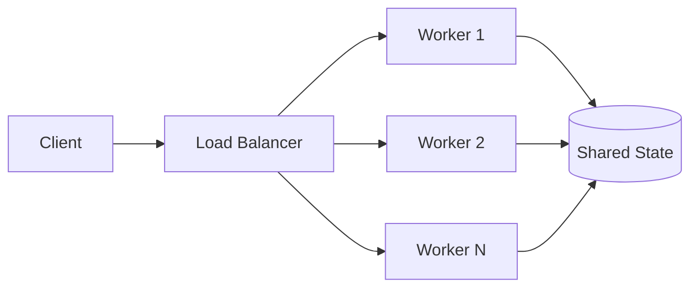

# Parallelism

> **Learning Path:** Distributed Systems
> **Section:** 2.1.4 — Core concepts

**Parallelism**

### The problem

A single execution thread can only do one thing at a time. When demand grows, or work is long, you hit a ceiling: latency rises, throughput stalls, and expensive hardware sits idle.

The constraint is not just CPU speed. It's that work arrives in parallel from the world, I/O takes time, and users expect both low latency and high throughput.

You can’t make a single core faster forever. You need to make work happen concurrently, and actually in parallel on multiple cores, machines, or network paths.

### Mental model

Think of an assembly line vs one craftsperson.

One craftsperson does step A then B then C. Fast for one item, slow for many.

An assembly line has multiple stations working at the same time on different items. The throughput is limited by the slowest station, not by the sum of their times.

Parallelism is the decision to split work so independent pieces execute at the same time.

### How it works

Parallelism requires two things: decomposition and independence.

Decomposition: break the problem into units of work that can run without each other.
Independence: those units must not require immediate coordination, or you pay a synchronization cost.

At the process level this is multiple threads/cores. At the system level it's multiple services, partitions, or nodes behind a load balancer.

The load balancer distributes independent requests. Workers run in parallel. Shared state creates the bottleneck.

### Architectural reasoning

Parallelism helps when:

* **Throughput matters more than single-request latency.** Processing 10k images per hour vs 1k.
* **Work is embarrassingly parallel.** Same operation on different data: map, batch scoring, report generation.
* **Requests are independent.** Multiple users, multiple orders, multiple events.

It does not help when work is inherently sequential. A single transaction with strict ordering, or a pipeline where step B needs the exact result of step A with no buffering, gains little.

Alternatives:
* **Vertical scaling:** bigger machine. Simple, hits a wall, single point of failure.
* **Caching / batching:** reduce work, not parallelize it.
* **Asynchronous processing:** decouple producer and consumer, still may be serial per consumer.

Choose parallelism when the work can be partitioned with minimal coordination cost, and the coordination cost is less than the gain from extra cores.

### Trade-offs and failure modes

* **Amdahl's law.** Speedup is limited by the serial fraction. 90% parallel work maxes at ~10x speedup, no matter how many cores you add.
* **Coordination overhead.** Locks, queues, consensus, and shared state add latency and complexity. Contention can make parallel slower than serial.
* **Consistency and ordering.** Parallel writers to the same row, partition, or aggregate create race conditions, lost updates, and non-deterministic results.
* **Failure blast radius.** More moving parts = more failure modes. One slow worker stalls a pipeline, uneven partitioning causes hot spots.
* **Observability cost.** Debugging a system that runs differently each time is harder. You need tracing, per-partition metrics, and backpressure.

Classic failures: deadlock from lock ordering, starvation from uneven load, and data skew where one partition gets 80% of work.

### Example

Order processing at scale.

Single service: validate → check inventory → price → charge → ship. 500ms per order, one thread.

Parallel design: validate and fraud check run in parallel, inventory and pricing run in parallel, then join results before charge.

Within each step, the batch of orders is sharded by `order_id % N` to N workers. Each worker is stateless, reads from a partitioned queue, writes to partitioned DB.

Throughput scales with N until the charge service, which must be serial per customer to avoid double charge, becomes the bottleneck.

### Reasoning challenge

You have an API that does: fetch user profile, fetch recommendations, fetch ads. Each call is 80ms, total 240ms serially. You can parallelize the three calls.

Your database can handle 5k QPS total. Current load is 3k RPS.

Do you parallelize all three per request? What do you watch for first?

### Key takeaway

* Parallelism is a throughput strategy, not a latency guarantee. It trades coordination complexity for more concurrent work.
* Only parallelize work that is independent enough that synchronization cost < parallel gain.
* The serial fraction dominates at scale. Identify and minimize it before adding more workers.
* Shared state is the enemy of parallelism. Partition data, design for idempotency, and expect failures per worker.
