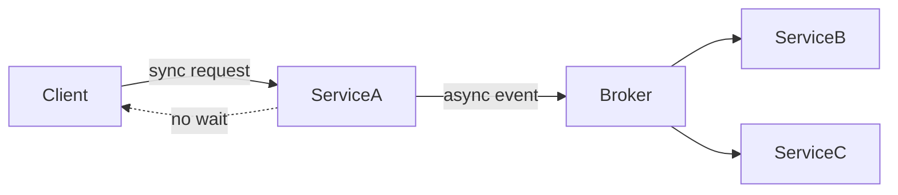

# Distributed communication

> **Learning Path:** Distributed Systems
> **Section:** 2.1.5 — Core concepts

## The problem

You have a working service. Now you need a second service on another machine to act on it.

The network is not a function call. It is partial, slow, and fails independently. You need a way to transfer intent between autonomous processes without assuming they are up at the same time, can talk directly, or share memory.

Distributed communication exists to make that transfer reliable enough to build systems on.

## Mental model

Think of processes as mailboxes with addresses, not as threads in the same process.

A message is a self-contained intent: who it is for, what to do, and the data needed to do it. The sender drops it off. The receiver picks it up when it can. The network, serialization, and delivery semantics are the postal service you choose.

The core decision is coupling over time and failure.

## How it works

Essentially four choices:

**Addressing and transport.** How do you find the receiver? Static address, service discovery, or logical topic. How do you move bytes? TCP for streams, QUIC/HTTP for request-response, or a broker for async.

**Synchronous vs asynchronous.** Synchronous = request-response, caller waits. Asynchronous = fire-and-forget or via a queue, caller continues.

**Pattern.** Point-to-point RPC: one caller, one callee. Publish-subscribe: one producer, many consumers of an event.

**Delivery semantics.** At-most-once, at-least-once, exactly-once. The last is an application-level property, not a transport guarantee. Ordering: per-partition order is cheap, global order is expensive.

The diagram shows temporal decoupling: ServiceA does not need ServiceB or ServiceC to be up now.

## Architectural reasoning

Choose synchronous RPC when you need an immediate answer and the caller and callee can tolerate tight coupling. It is simple and fast for single hops, but the caller inherits the callee's latency and availability.

Choose asynchronous messaging when you need resilience, independent scaling, and different processing speeds. Producers can outpace consumers, failures are buffered, and new consumers can be added without changing producers.

Publish-subscribe adds fan-out and replay. It solves the problem of many downstream systems needing the same event, like inventory, email, and analytics all needing an order placed event.

The decision is rarely technical, it is about ownership and failure boundaries.

## Trade-offs and failure modes

**Latency vs durability.** Synchronous is low latency, no durability. Queued is durable but adds latency and operational complexity.

**Coupling vs autonomy.** Direct RPC couples availability. Messaging decouples availability but couples to schema evolution and the broker as a critical dependency.

**Ordering and duplication.** At-least-once delivery means duplicates. You must design idempotent consumers. Ordering guarantees require partitioning keys and cost throughput.

**Failure modes you must design for:** network partitions, message loss, poison messages, consumer slowdown causing backlog, and schema drift between producer and consumer.

## Example

Order service in an e-commerce platform.

Placing an order triggers three downstream actions: reserve inventory, charge payment, send confirmation email. These have different SLAs and failure semantics.

Synchronous RPC to all three makes the checkout path fragile: if email is slow, checkout is slow. If inventory is down, you cannot checkout.

Instead, Order service emits `OrderPlaced` event to a durable log. Inventory, Billing, and Notification consume independently, retry on failure, and scale separately. Checkout returns quickly with at-least-once guarantee that work will continue.

## Reasoning challenge

You need to update user profile data and invalidate caches across 3 regions, plus trigger a nightly ML feature build. One team owns profile service, another owns cache, another owns ML.

Do you use synchronous RPC fan-out from profile service, or publish an event? What delivery semantics and ordering do you actually need? What breaks if the ML consumer is down for 2 hours?

## Key takeaway

* Distributed communication is about decoupling in time and failure, not just moving bytes.
* Synchronous RPC couples availability and latency; asynchronous messaging decouples them at the cost of complexity.
* Delivery semantics are a design choice: embrace at-least-once and make consumers idempotent.
* Choose the pattern for the problem: request-response for coordination, events for notification and fan-out.
